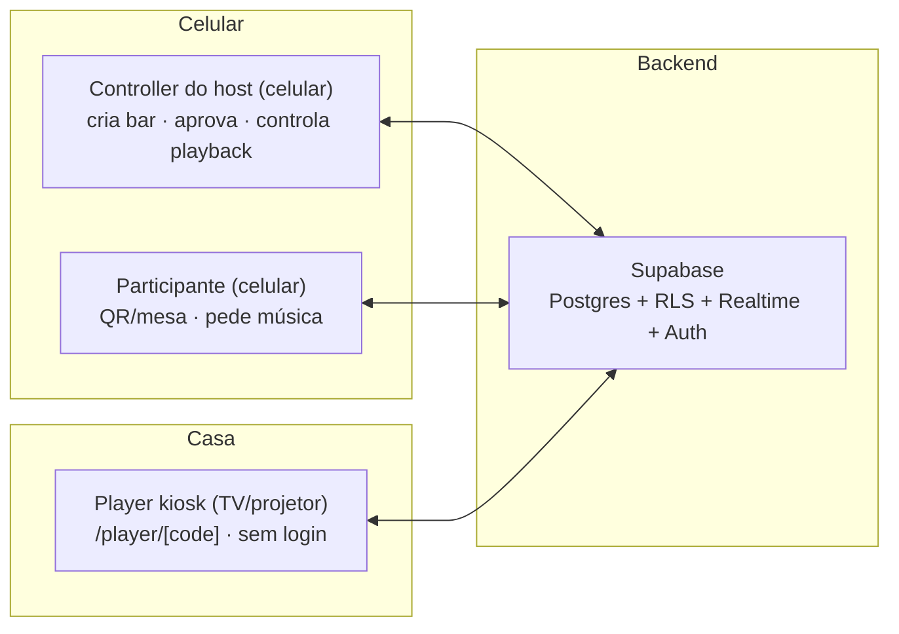

# 🎤 Karaokê Watch Party

Aplicação **mobile-first** para karaokê ao vivo em bares e restaurantes: o público adiciona músicas na fila **pelo próprio celular** (escaneando o QR da mesa) e a playlist toca numa tela compartilhada (TV/projetor), controlada pelo dono da casa pelo celular — sem tocar no dispositivo da TV.

> **Estado atual (2026-09-27):** Fases 0–8a concluídas — busca YouTube com cadeia de credenciais, fila em tempo real com aprovação/reordenação/troca de música, **player da TV por token de capacidade** (`/player/[codigo]`) com controle pelo celular do host, player acessível também pela **sessão do participante**, **pré-aprovação de 24h** e encerramento de sala. **379 testes** verdes. A Fase 8b acabou de corrigir três defeitos que só apareceram na TV/celular de verdade (teardown do player, CTA repetida, lista do participante parada) — **falta a validação manual** descrita em [`TESTING.md`](./TESTING.md) §3.9·ter. Detalhes no [`TODO.md`](./TODO.md) e no [`CHANGELOG.md`](./CHANGELOG.md) (versão atual `0.1.0`).

## Índice

- [Visão geral](#-visão-geral)
- [Funcionalidades](#-funcionalidades)
- [Stack](#-stack)
- [Arquitetura](#-arquitetura)
- [Começando](#-começando)
- [Login e acesso](#-login-e-acesso)
- [Testes](#-testes)
- [Roadmap](#-roadmap)
- [Documentação](#-documentação)
- [Changelog e versão](#-changelog-e-versão)
- [Licença](#-licença)

## 🚀 Visão geral

O karaokê de bar hoje é papel, disputa de voz e fila no olho. O objetivo é digitalizar a noite inteira:

- quem canta **escolhe a mesa**, escaneia o QR e pede música sem instalar nada;
- o host (dono da casa) **cria o bar** — com QR próprio e QR por mesa — e controla a fila, as aprovações e o playback;
- a **tela da casa** (modo quiosque) mostra a fila e o vídeo em tempo real, legível à distância;
- respeito à privacidade desde o dia 1 (**LGPD/GDPR**: consentimento antes de qualquer coleta).

## ✨ Funcionalidades

**Já implementadas (MVP):**

- **Acesso anônimo** — qualquer pessoa entra e pede música **sem criar conta**; criar bar exige login real.
- **Domínio bar → mesas → karaokê** — o host é 1 bar com `N` mesas (etiquetas); cada bar nasce com **1 karaokê** (fila + player próprios); "adicionar salas" fica desabilitado (multi-sala é futuro).
- **QR por bar e por mesa** — `?bar=ZEHBAR` e `?bar=ZEHBAR&mesa=3` para entrar **em 1 toque** com a mesa já selecionada; QR legado de sala (`?code=...`) continua funcionando.
- **Fluxo de entrada com preview** — digite o código ou escaneie → preview do bar (dono, modo de entrada, mesas) → escolha da mesa → `join_room`. Modo `open` entra direto; modo `approval` fica pendente até o host aprovar (Realtime).
- **Dashboard** — "Meu bar" (código + mesas + badge de karaokê) para o host e "Bares que frequento" para participantes, com contador de entradas pendentes.
- **Página do karaokê** — contexto "Bar · Mesa N"; o host vê o QR do bar e a grade de QRs das mesas (exportáveis em PNG).
- **Login ampliado** — OAuth GitHub (ativo), Google (configuração pendente), Spotify/Discord/Facebook/X prontos na camada; dev login e-mail/senha fora de produção.
- **Busca no YouTube com cota do dono** — cadeia chave do bar → OAuth da conta Google do host (cota do projeto dele; **Bearer** no backend) → OAuth do app → chave dev; cache compartilhado, rate limit e gate de presença física.
- **OAuth por-host gerenciável** — o host conecta a conta Google pelo `RoomSettings` e vê **"conectado à conta Google · desde …"** com botão **Remover conexão** (revoga o token na Google e apaga a linha).
- **Fila com dono sempre aprovado** — música pedida pelo **dono** da sala entra direto (mesmo em fila manual); participantes seguem o modo da sala.
- **Painel da fila do host** — aprovar/rejeitar/ remover pendências, reordenar (⬆/⬇ e drag-and-drop) e trocar a música de alguém mantendo posição e aprovação, tudo na própria página da sala.
- **Player da TV com token de capacidade** — `/player/<código>?token=…` **sem login**, com fila em fonte grande, QR quando não há nada tocando e avanço automático; o host controla play/pause/pular pelo celular (broadcast + poll de 5s como rede de segurança) e pode rotacionar o link da TV.
- **Player pelo celular, sem token** — participante e host entram em `/player/<código>` só com a sessão (host ou membro aprovado); adicionar música leva direto para lá. O token da TV **nunca** é exposto ao navegador do participante.
- **Pré-aprovação de 24h** — quem foi aprovado pelo host e é **autenticado** volta aprovado por 24h ao reconectar; usuário anônimo nunca é pré-aprovado; sair da sala volta a exigir aprovação. Toggle "Aprovação vale por 24h" aparece **ligado e travado** na config da sala (decisão de produto).
- **Encerrar sala (só o dono)** — RPC atômica: fecha a sala, **cancela/interrompe a fila** (estado `cancelled`) e **expulsa todos** os participantes; quem era membro vê "sala encerrada".

**Em construção / a seguir:** a auditoria de RLS e os não-funcionais da Fase 8 (rate limiting, retenção/LGPD, limpeza de itens antigos, latência realtime validada) e o roadmap de produto das Fases 9–15 ([`docs/produto/roadmap-experiencia.md`](./docs/produto/roadmap-experiencia.md)). Ver [Roadmap](#-roadmap).

## 🧱 Stack

| Camada        | Tecnologia                                                                                            |
| ------------- | ----------------------------------------------------------------------------------------------------- |
| Front/Back    | **Next.js 16** (App Router, TypeScript), Tailwind CSS + **shadcn/ui**, Zustand, react-hook-form + zod |
| Banco/Backend | **Supabase** (Postgres + Auth + Realtime + RLS) — free tier                                           |
| Vídeo         | **YouTube Data API v3** (busca) + **YouTube IFrame Player API** (playback)                            |
| QR            | `qrcode` (geração PNG) + `@zxing/browser` (leitura por câmera)                                        |
| Testes        | Vitest + React Testing Library + jsdom + **MSW** (Playwright e2e vem na Fase 6)                       |

## 🏗️ Arquitetura


```mermaid
flowchart LR
    subgraph Celular
        Host["Controller do host (celular)<br/>cria bar · aprova · controla playback"]
        Player2["Participante (celular)<br/>QR/mesa · pede música"]
    end
    subgraph Casa
        Kiosk["Player kiosk (TV/projetor)<br/>/player/[code] · sem login"]
    end
    subgraph Backend
        SB["Supabase<br/>Postgres + RLS + Realtime + Auth"]
    end
    Host <--> SB
    Player2 <--> SB
    Kiosk <--> SB
```

- **Controller** — app web no celular do host/participante: busca, fila, aprovações e controle de playback.
- **Player device** — rota pública `/player/[codigoDoKaraoke]` para navegador em modo quiosque na TV; sem overlays sobre o player do YouTube (TOS).
- **Backend de verdade no banco** — `position` da fila por advisory lock, status inicial derivado do modo da sala (sem auto-aprovação por INSERT), **multi-tenancy** (`room_id`/`bar_id` em toda tabela) e **RLS** validando ações de host e o isolamento entre salas; preview, entrada e criação de bar via RPCs `security definer`.

### Estrutura de pastas

```
src/
├─ app/            # rotas (App Router): /, /login, /entrar, /dashboard, /salas/[codigo]
├─ components/     # UI (bares, rooms, auth, shared)
├─ lib/            # server actions, helpers Supabase/SSR, domínio (bars·rooms), i18n
├─ stores/         # estado client (auth — Zustand)
├─ types/          # tipos de domínio (room, bar)
└─ test/           # setup do Vitest
supabase/
└─ migrations/     # SQL versionado (Fase 1 → 3.5)
scripts/           # seed, apply-sql, enable-anonymous-signins, oauth
docs/flows/        # fluxos do sistema, do usuário e banco de dados (Mermaid)
docs/engenharia/   # post-mortems e playbooks de verificação
```

## ▶️ Começando

Pré-requisitos: **Node 24+**, conta Supabase (projeto Cloud ou `supabase start` local).

1. Clone e instale as dependências:
   ```bash
   npm install
   ```
2. Configure o ambiente: copie `.env.example` para `.env.local` e preencha as chaves do Supabase (e as credenciais do Google Cloud, se for usar a busca):
   - `cp .env.example .env.local` (Windows: `copy .env.example .env.local`)
   - **Nunca commite o `.env.local`** (está no `.gitignore`).
3. (Opcional) Crie os dados de desenvolvimento:
   ```bash
   npm run seed        # 4 usuários + Bar 1 (ZEHBAR, 12 mesas) + Bar 2 (BARSEG, 6 mesas)
   ```
4. Rode:
   ```bash
   npm run dev
   ```

**Scripts disponíveis:**

| Script                             | O que faz                                                                   |
| ---------------------------------- | --------------------------------------------------------------------------- |
| `npm run dev`                      | dev server (Next 16)                                                        |
| `npm run build`                    | build de produção                                                           |
| `npm run lint`                     | ESLint                                                                      |
| `npm run typecheck`                | `tsc --noEmit`                                                              |
| `npm test`                         | Vitest (unit)                                                               |
| `npm run seed`                     | seed de dev no Supabase Cloud (⚠️ **apaga e recria** as salas de dev)       |
| `npm run sync:seed-users`          | renomeia/rotaciona as contas do seed por **id fixo** (sem apagar domínio)   |
| `npm run enable:manual-linking`    | liga `security.manual_linking_enabled`; use `-- --off` para desligar. Também exige `NEXT_PUBLIC_ENABLE_MANUAL_LINKING=1` para o botão aparecer |
| `npm run diagnose:queue`           | diagnostica as actions de moderação da fila e mostra o erro cru do banco    |
| `node scripts/apply-sql.mjs <sql>` | aplica migration manualmente (padrão do time; veja `README` do `scripts/`)  |

**Smokes de banco** (rodam contra o projeto do `.env.local`, pelo Management API — cada um tem o próprio roteiro e sai no relatório):

| Script                                                               | O que fixa                                                                                    | Mexe nos dados de dev?                             |
| -------------------------------------------------------------------- | --------------------------------------------------------------------------------------------- | -------------------------------------------------- |
| `node scripts/apply-sql.mjs scripts/smoke-playback.sql 100000`       | contrato do playback (Fases 6/7): token, claim, pausa, skip, rotação de token, sala encerrada | **sim** — precisa de `npm run seed` antes e depois |
| `node scripts/apply-sql.mjs scripts/smoke-player-session.sql 100000` | Fase 8a: token × sessão × anônimo × pré-aprovação de 24h, matriz do toggle, limpeza           | não — cria e apaga a sala `SMOKE8`                 |
| `node scripts/apply-sql.mjs scripts/smoke-dev-role.sql 20000`         | Fase 8b·quater (15/15): `is_dev()` por host, dev sem teto, teto de 1 bar/karaokê dos demais, não-host recusado, **auto-promoção bloqueada por RLS** e **os 5 casos de bypass** (INSERT/UPDATE direto no PostgREST) | não — `begin`/`rollback`, nada persiste            |

## 🔑 Login e acesso

- **Acesso anônimo:** botão "Continuar sem login" no `/login` → pode entrar no bar e pedir música; **não** pode criar bar (login real). Habilitação: Supabase Auth → _Allow anonymous sign-ins_ (espelhado em `supabase/config.toml`; o script `scripts/enable-anonymous-signins.mjs` configura via Management API).
- **Provedores OAuth** — configurados no projeto Supabase (credenciais no dashboard, não no `.env`); a lista exibida vive em `src/lib/auth/providers.ts`:

| Provedor                   | Status atual                                        |
| -------------------------- | --------------------------------------------------- |
| **GitHub**                 | ✅ Ativo                                            |
| **Google**                 | ⚙️ Configurar credenciais                           |
| **Spotify**                | 🔒 Desabilitado — Web API exige Spotify Premium     |
| **Discord / Facebook / X** | 🔒 Em breve (sem credenciais; app review para FB/X) |

Os usuários do **seed** são resolvidos **por id fixo**; as credenciais saem de env vars — defaults **públicos** (abaixo) no [`.env.example`](./.env.example), valores **pessoais** no `.env.local` (gitignored) e, para a nuvem, nas mesmas vars da Vercel. `npm run seed` apenas **cria** usuários faltantes (a senha vale **só** na criação — usuários existentes nunca têm a senha resetada).

| Variável                               | Default (documentado)                   | Função                                                             |
| -------------------------------------- | --------------------------------------- | ------------------------------------------------------------------ |
| `SEED_HOST_EMAIL`                      | `dono@exemplo.com`                      | conta do dono (host do `ZEHBAR` / `KARAOKE`)                       |
| `SEED_HOST2_EMAIL`                     | `betania@exemplo.com`                   | conta Betânia (host do `BARSEG` / `BAR2FO`)                        |
| `SEED_USER_EMAIL` / `SEED_USER2_EMAIL` | `ana@exemplo.com` / `bruno@exemplo.com` | participantes                                                      |
| `SEED_PASSWORD`                        | `senha123` (**pública**)                | senha aplicada **só na criação** do usuário                        |
| `SEED_HOST_USER_ID`                    | *(vazio)*                               | **opcional**: auth user id que assume o slot do dono (bar 1 + sala 1) no lugar do `…0001` fixo **e ganha o papel `dev`** (sem teto de bars/salas). A conta precisa já existir no Auth; em branco = comportamento antigo |
| `NEXT_PUBLIC_ENABLE_EMAIL_LOGIN`       | `0` (desligado)                         | habilita o form e-mail/senha **em produção** (com senhas privadas) |
| `NEXT_PUBLIC_ENABLE_MANUAL_LINKING`    | `0` (desligado)                         | mostra o botão "Vincular GitHub"; espelha `security_manual_linking_enabled`. Fail-closed |

**Papel `dev`** (Fase 8b·quater): quem está em `public.dev_accounts` pode criar **quantos bares e salas quiser**. Os demais hosts continuam com a regra do produto — **1 bar = 1 karaokê**, e essa regra mora no **banco**, não só na UI: `create_bar`/`create_room` recusam **e** há `BEFORE INSERT`/`BEFORE UPDATE` em `bars`/`rooms` (`20260930000036`) fechando o caminho do `INSERT`/`UPDATE` direto que o PostgREST permite — o RLS sozinho só checava `host_id`, então um cliente autenticado criava 2º bar, 2ª sala, sala em bar alheio e re-apontava o `bar_id` para o bar de outra pessoa. A tabela `dev_accounts` tem **RLS ligado e nenhuma policy**, então só o service role promove alguém. Contrato: `scripts/smoke-dev-role.sql` (**15/15**, incluindo os 5 casos de bypass).

**Login é OAuth-only; a senha é credencial de teste.** Quem entra pelo GitHub/Google **não** ganha senha automaticamente — **nenhuma senha é gerada nem enviada por e-mail** (e-mail é canal para *link* de uso único, não para credencial permanente; a recuperação é do próprio GitHub/Google). O item de menu **"Definir senha"** existe para o próprio usuário criar uma segunda porta, via `supabase.auth.updateUser({ password })`, e é **sempre visível** em conta não-anônima: o client **não consegue saber** se a conta já tem senha, porque o hash fica em `auth.users.encrypted_password` e nunca vai para o `user` do browser. A senha da conta do dono foi definida uma vez pela service role (`PUT /auth/v1/admin/users/{id}` com **só** `{ password }`, sem tocar em e-mail/metadata/identidades) porque `diagnose-queue-actions.mjs` precisa de uma sessão real de host — **ela é credencial local de teste, não um método de login do produto**; em produção o form depende de `NEXT_PUBLIC_ENABLE_EMAIL_LOGIN`. O e-mail que o OAuth devolve é o que permite **auto-link por e-mail verificado**: se um dia a conta entrar também pelo Google, cai no **mesmo** usuário, sem botão nenhum.

**Uma conta, dois métodos — desativado por padrão.** O botão "Vincular GitHub" (`linkIdentity`) exige `security_manual_linking_enabled=true` **e** `NEXT_PUBLIC_ENABLE_MANUAL_LINKING=1`, e hoje está **desligado** nos dois lados: ele é rota de account takeover (um OAuth cujo e-mail bate com uma conta existente assume a conta) e, com o e-mail do GitHub primário verificado, o auto-link por e-mail já resolve o mesmo caso. Para religar de propósito: `npm run enable:manual-linking` **e** a env; para desligar: `npm run enable:manual-linking -- --off` e a env em `0`.

**Acesso de desenvolvimento** (seção "Acesso de desenvolvimento" no `/login`): aparece sempre em `npm run dev`; em produção **só** com `NEXT_PUBLIC_ENABLE_EMAIL_LOGIN=1`. Use **apenas** com `SEED_PASSWORD` **privada**: a URL da Vercel é pública e a anon key roda no bundle — a `senha123` documentada (ou senha padrão) viva no projeto Cloud permitiria a qualquer um autenticar como host. Por isso, aplicar a rotina de 2026-09-28 **rotaciona as senhas no projeto Cloud**: ali `senha123` deixa de funcionar; valem os valores do `.env.local` / das envs da Vercel.

> **Credenciais de integração (dev):** a chave de busca `YOUTUBE_API_KEY` é **só de dev e não vai para produção** — ver `karaoke-watch-party-spec.md` §12/§13 e a tabela completa no fim deste arquivo.

> ⚠️ **O link da TV é uma credencial.** `/player/<código>?token=…` lê o estado da sala e a fila **sem login** — quem tiver o link, tem. Trate como senha: **nunca** cole em issue, chat, print ou documentação, e se precisar invalidar, use o botão **"gerar novo link"** do host (`rotate_player_token`, host-only), que troca o token na hora. Este repositório é público, e o histórico de commits também é: apagar o texto depois do push não desfaz nada. Guardado por `npm run scan:secrets` (ver [Testes](#-testes)) e pela lição em [`docs/engenharia/pos-mortem-smoke-playback.md`](./docs/engenharia/pos-mortem-smoke-playback.md) §3.11.

## 🧪 Testes

Estratégia, boas práticas e checklist funcional por fase em [`TESTING.md`](./TESTING.md).

- **Unitário / Integração:** Vitest + React Testing Library + jsdom (hoje **379 testes** verdes em 32 arquivos — inclui `src/lib/bars/qr.test.ts`, `src/lib/youtube/*`, a fila com a matriz de presença, o roundtrip OAuth authorize→callback, os Bearer de OAuth na rota de busca, as actions de moderação da fila e o player/pré-aprovação de 24h, o teardown do player e a resiliência da lista do participante). O duplo do YouTube (`src/test/fake-youtube.ts`) segue o **ciclo de vida real** da IFrame API — é o que pegou o crash de prontidão que 333 testes não pegaram.
- **Mock de rede:** **MSW** instalado (Fase 4) — mocka a YouTube Data API nas provas da rota `/api/youtube/search`; serviços externos nunca são chamados em teste.
- **E2E:** Playwright no pós-MVP-stable (player kiosk com YouTube IFrame Player API mockada).
- **Guarda de segredo:** `npm run scan:secrets` (e `-- --staged` antes do commit) falha se aparecer UUID fora dos arquivos de fixture, link de TV com `?token=…` ou formato de chave conhecida — o link da TV é credencial e o repo é público. Tokens de teste saem de `src/test/fake-player-token.ts`, nunca digitados no arquivo.
- **Banco/RLS:** validado via **smoke SQL** (`scripts/smoke-playback.sql`, `scripts/smoke-player-session.sql`) e e2e, não em unit; `npm run diagnose:queue` reproduz o erro cru de uma action de fila quando o sintoma é um botão que não faz nada.

> ⚠️ O pool do Vitest usa `threads` (não `forks`) por causa do caminho do workspace (`D:\BACK UP\...`) — ver CHANGELOG.

## 🗺️ Roadmap

Plano detalhado por fases (com checklist) no [`TODO.md`](./TODO.md). Linha do tempo atual:

| Fase                                                                                                                               | Status                                                                                                                                                                                                                                                                              |
| ---------------------------------------------------------------------------------------------------------------------------------- | ----------------------------------------------------------------------------------------------------------------------------------------------------------------------------------------------------------------------------------------------------------------------------------- |
| Fase 0 — Fundação / 1 — Banco+RLS / 2 — Auth / 3 — Salas                                                                           | ✅ Concluídas                                                                                                                                                                                                                                                                       |
| **3.5 — Bar/mesas/karaokês + acesso anônimo**                                                                                      | ✅ **Concluída (2026-09-23)**                                                                                                                                                                                                                                                       |
| **Fase 4 — Busca YouTube + fila end-to-end**                                                                                       | ✅ **Concluída (2026-09-23)**                                                                                                                                                                                                                                                       |
| Fase 5 — Fila: realtime, aprovação, confirmação, trocar música                                                                     | ✅ **Concluída (2026-09-26)**                                                                                                                                                                                                                                                       |
| Fase 6 — Player kiosk                                                                                                              | ✅ **Concluída (2026-09-27)**                                                                                                                                                                                                                                                       |
| Fase 7 — Controle do host pelo celular                                                                                             | ✅ **Concluída (2026-09-27)**                                                                                                                                                                                                                                                       |
| **Fase 8a — Fila/player no uso real + player por sessão + pré-aprovação de 24h**                                                   | ✅ **Concluída (2026-09-27)** — diagnose + 4 correções, segunda porta de autorização, toggle travado ON                                                                                                                                                                             |
| **Fase 8b — Defeitos achados na TV/celular de verdade**                                                                            | 🧪 **Correções prontas (2026-09-27), aguardando validação manual** — teardown do player, CTA repetida, lista do participante ao vivo, participante tira o próprio pedido; falta o roteiro em [`TESTING.md`](./TESTING.md) §3.9·ter e a semântica do "Parar" (`rooms.playback_held`) |
| Fase 8 — Não-funcionais, segurança, LGPD                                                                                           | ⏳ Próxima                                                                                                                                                                                                                                                                          |
| **Fases 9–15 — Entrada fora do raio, tela da mesa, perfil de karaokê, tempo/teste grátis, recompensas, pagamento + pedido no bar** | 📋 **Planejadas (registro 2026-09-25, sem implementação)** — detalhamento em [`docs/produto/roadmap-experiencia.md`](./docs/produto/roadmap-experiencia.md)                                                                                                                         |

Pendência aberta conhecida: **diagramas Mermaid de `docs/flows/*`** já foram sanitizados e validados em mermaid v10/v11 — falta confirmar a renderização no seu renderizador/preview. Registrado no `TODO.md`.

## 📚 Documentação

- [`karaoke-watch-party-spec.md`](./karaoke-watch-party-spec.md) — especificação técnica (arquitetura, segurança, UX, entidades, roadmap pós-MVP).
- [`MANIFEST.md`](./MANIFEST.md) — manifesto do produto: visão, princípios e a camada social futura (inclui a seção de Belas Artes construída a partir do histórico musical real).
- [`questionario-donos-estabelecimento.md`](./questionario-donos-estabelecimento.md) — questionário de validação (18 perguntas) com donos de estabelecimentos.
- [`karaoke-pesquisa-academica.md`](./karaoke-pesquisa-academica.md) — pesquisa acadêmica e de mercado que fundamenta o produto.
- [`TODO.md`](./TODO.md) — plano de implementação por fase (**estado recente**: Fases 3.5 a 8a concluídas, correções da 8b prontas aguardando validação manual; Fase 8 em seguida).
- [`CHANGELOG.md`](./CHANGELOG.md) — histórico por release (**versão atual `0.1.0`**).
- [`TESTING.md`](./TESTING.md) — estratégia de testes, checklist funcional e DoD.

### Fluxos do MVP (`docs/flows`)

Diagramas em **Mermaid** (rendezam no GitHub, VS Code + "Mermaid Preview", ou <https://mermaid.live>):

| Arquivo                                                                | Conteúdo                                                                                                                                                      |
| ---------------------------------------------------------------------- | ------------------------------------------------------------------------------------------------------------------------------------------------------------- |
| [`docs/flows/fluxos-do-sistema.md`](./docs/flows/fluxos-do-sistema.md) | Fluxos técnicos end-to-end: autenticação/sessão (incl. anônimo), ciclo de vida do bar/karaokê, fila, player e a proposta de trocar música mantendo a posição. |
| [`docs/flows/fluxos-do-usuario.md`](./docs/flows/fluxos-do-usuario.md) | Jornadas por persona: host, participante (entrada com mesa) e tela kiosk.                                                                                     |
| [`docs/flows/banco-de-dados.md`](./docs/flows/banco-de-dados.md)       | Modelo relacional (ERD), matriz de RLS, máquina de estados da fila e regras de `position`/status.                                                             |

_Nota de manutenção:_ todo diagrama reflete o **código real** (migrations, `src/proxy.ts`, helpers SSR) — sem virgula/parêntese no texto de arestas (limitação dos parsers mais antigos).

### Produto (roadmap)

- [`docs/produto/roadmap-experiencia.md`](./docs/produto/roadmap-experiencia.md) — **planejamento (sem código)** das Fases 9–15: entrada de gente fora do raio de presença sinalizada só para o dono, permissão "fora do raio vê mas não pede música", tela da mesa (colegas + músicas da mesa), perfil de karaokê com check de som/microfone, tempo de música com teste grátis/alarme/countdown de 30 s, recompensas (dias consecutivos + músicas por bar) e pagamento/pedido de comida via mesa contra o sistema que o bar já usa. Inclui **12 decisões em aberto (D1–D12)**.

### Engenharia (post-mortems e playbooks)

- [`docs/engenharia/pos-mortem-smoke-playback.md`](./docs/engenharia/pos-mortem-smoke-playback.md) — **post-mortem da validação do playback (Fases 6/7)**: por que a verificação do playback contra o Supabase remoto custou ~8 rodadas, as **6 armadilhas** de SQL/plumbing que quase mandaram a validação por água abaixo (ordem de avaliação de `jsonb_build_object`, `DO` que aborta inteiro, saída truncada do `apply-sql.mjs`, estado não previsível do banco de dev, material insuficiente no roteiro, smoke que suja os dados) e o **checklist para o próximo smoke**. Depois virou registro dos defeitos de **browser real** (§3.7 o duplo de teste mais permissivo que a IFrame API; §3.8 `destroy()` em cleanup passivo, com dois gatilhos; §3.9 CTA rearmada pelo poll; §3.10 lista do participante parada por `replica identity` + WebSocket dormindo). Lê antes de escrever verificação por script.

### Ciência de dados (roadmap)

- [`docs/ciencia-de-dados/segmentacao-sentimental.md`](./docs/ciencia-de-dados/segmentacao-sentimental.md) — camada PLN (embeddings SBERT + léxicos/ML, circumplexo valence-arousal, HDBSCAN) para classificar o ouvinte a partir de letras e metadados acústicos; nasce neste repo, vira o repo independente `karaoke-flow-data`.

## 📝 Changelog e versão

- Seguimos [Versionamento Semântico](https://semver.org/lang/pt-BR/) (`MAJOR.MINOR.PATCH`). **Versão atual: `0.1.0`** (em desenvolvimento, sem release publicado).
- Todo o histórico está em [`CHANGELOG.md`](./CHANGELOG.md); cada release recebe tag `v<versão>`.

## 🎤 Licença

MIT — veja o campo `license` em `package.json`. (Produto pessoal em desenvolvimento; o manifesto de visão está no [`MANIFEST.md`](./MANIFEST.md).)

---

### Apêndice — credenciais de integração (dev, Google Cloud)

Projeto Google Cloud `karaoke-flow-509317` (YouTube Data API v3):

| Uso                                       | Tipo            | Credencial                                                                                                                                                  | Onde fica                                                                                |
| ----------------------------------------- | --------------- | ----------------------------------------------------------------------------------------------------------------------------------------------------------- | ---------------------------------------------------------------------------------------- |
| Busca de músicas (default)                | API key         | `YOUTUBE_API_KEY` (só dev — **não vai para produção**)                                                                                                      | `.env.local` (não versionado)                                                            |
| Ferramentas dev / manifesto pessoal       | **Desktop app** | Client ID `555657479128-nou62soqjjneto0as5fcivck7ijlkeg9…` (público), OAuth YouTube `readonly`, redirect loopback `http://localhost`                        | `.env.local` (legado) + JSON gitignored                                                  |
| OAuth por-host (Fase 4)                   | **Web app**     | Client ID `555657479128-1qdqio5fd41o4tqbgs6t5o7l4qpbcb55…` — redirects `http://localhost:3000/auth/youtube/callback` e `http://localhost:8891/`             | `.env.local` (`YOUTUBE_OAUTH_CLIENT_ID/SECRET`) + `credentials/oauth/oauth-dev-web.json` |
| OAuth do app (fallback de busca — Fase 4) | conta dev       | `YOUTUBE_APP_REFRESH_TOKEN` **coletado** 2026-09-23 com `node scripts/youtube-app-oauth.mjs` (expira em 7 d enquanto o consent screen estiver em _Testing_) | `.env.local`                                                                             |

O Client ID é **público** e pode aparecer aqui; o **Client Secret nunca** (só `.env.local` e `credentials/`, ignorados pelo git).
