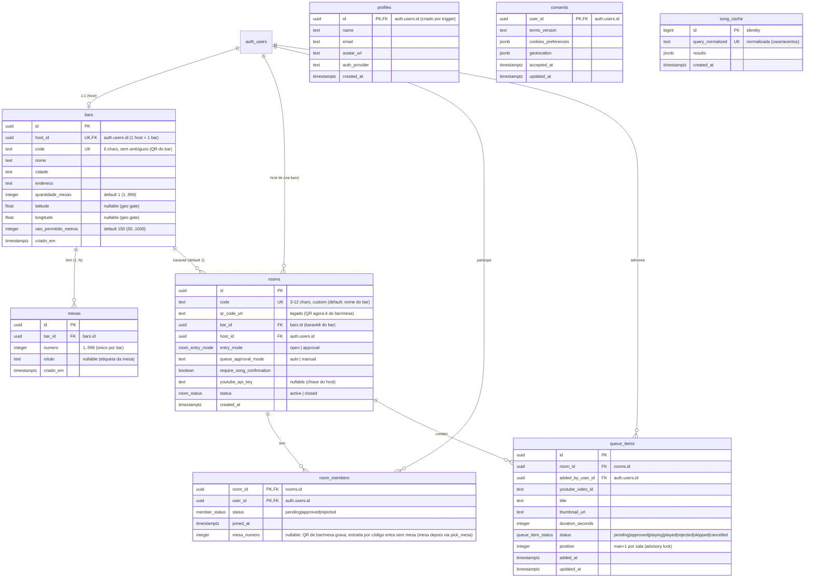
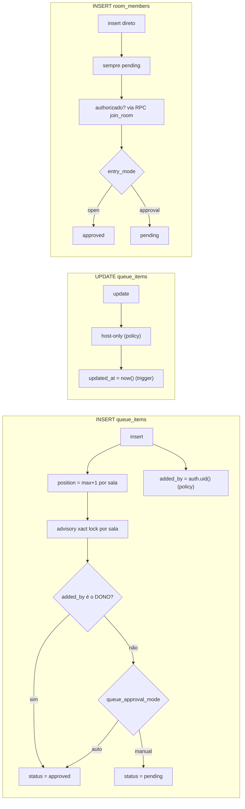
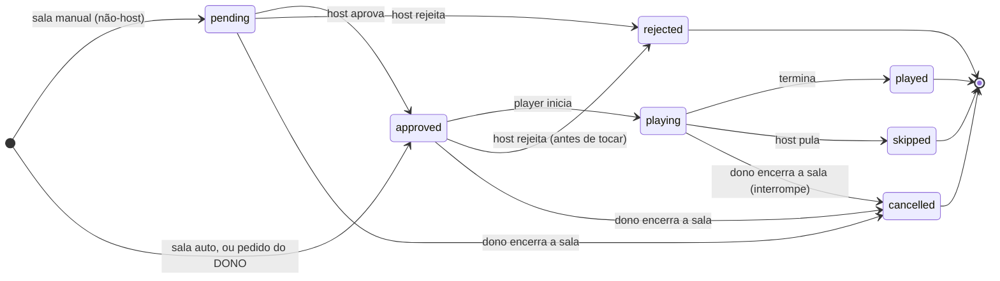
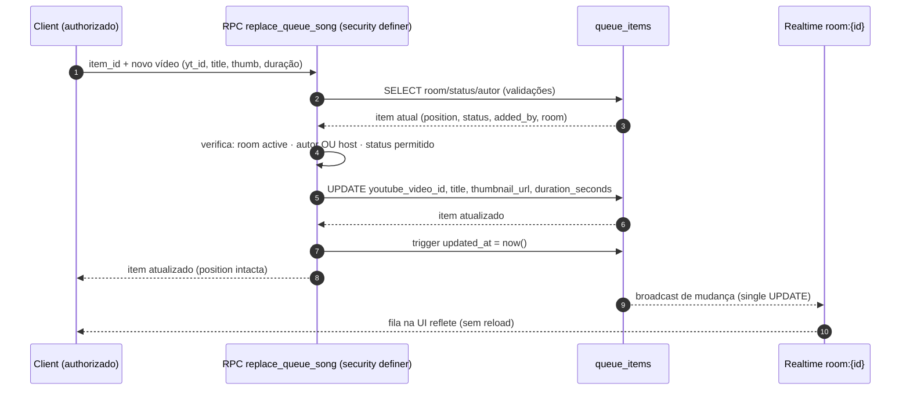
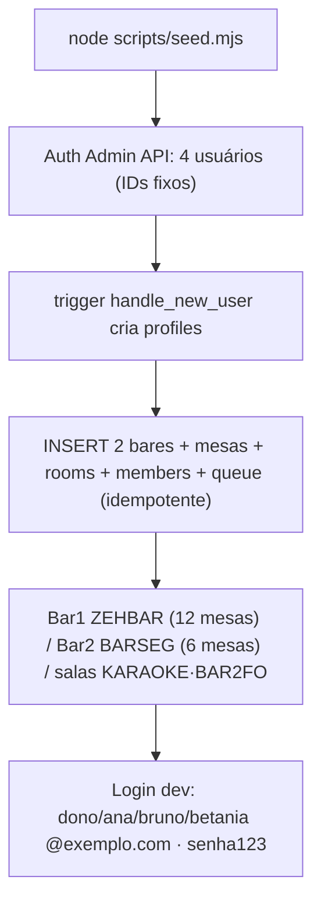

# Banco de dados

Modelo relacional, matriz de RLS e regras de integridade do MVP (reflete `supabase/migrations/*.sql` aplicadas no projeto cloud `kskoipyzqcacccepcqpc`).

---

## 1. Modelo relacional (ERD)

> `song_cache` (migration `20260921000006`) **não tem políticas RLS** — só o service role lê/escreve (cache da busca do YouTube).

> `consents` (migration `20260921000009`, spec §2.5/§13): registro de aceite LGPD/GDPR por usuário — RLS restrito ao próprio usuário (`consents_select_own`).

> `bars`/`mesas` (migrations `20260923000010`/`20260923000011`): o bar é o perfil-personificação do host (1:1 `host_id` único); mesas são etiquetas do bar (playlist = a da sala/karaokê). `rooms.bar_id` e `room_members.mesa_numero` são adicionados pela migration `20260923000012`; coords + raio de presença por `20260923000015`.
>
> **Código da sala configurável (migration `20260924000022`):** `rooms.code` aceita **3–12 alfanuméricos maiúsculos** (constraint), padrão por bar `KARAOKE`/`BAR2FO`; helpers RPC `unique_room_code`/`default_room_code`/`room_code_available` (checam colisão com `rooms.code` e `bars.code`); `create_bar` ganha `p_codigo` (default = nome do bar normalizado, fallback `KARAOKE`+sufixo); `join_room` tem `p_mesa` **opcional** (entrada por código entra sem mesa) e a nova RPC **`pick_mesa`** grava a mesa depois (só membro `approved` de sala `active`). A migration `20260924000021` corrige a ambiguidade `bar_id` no `get_entry_preview`. Seed: `KARAOK` → **`KARAOKE`**.

---

## 2. Regras de integridade no banco

---

## 3. Matriz de RLS

| Tabela         | SELECT                                                                  | INSERT                                               | UPDATE                            | DELETE                         |
| -------------- | ----------------------------------------------------------------------- | ---------------------------------------------------- | --------------------------------- | ------------------------------ |
| `bars`         | qualquer autenticado **incluindo anônimo** (`auth.uid() is not null`)   | host (`host_id = auth.uid()`)                        | host                              | host                           |
| `mesas`        | qualquer autenticado **incluindo anônimo**                              | — (só via RPC `create_bar`)                          | —                                 | —                              |
| `rooms`        | host ou membro aprovado da sala                                         | host (`host_id = auth.uid()`)                        | host                              | host                           |
| `room_members` | a própria participação **ou** tudo da sala (host precisa ver pendentes) | só self como `pending` (approved só via `join_room`) | host (aprovar/rejeitar)           | self **ou** host               |
| `queue_items`  | host ou membro aprovado da sala                                         | membro aprovado/host, adicionando para si            | **host-only**                     | host only                      |
| `profiles`     | via view `profiles_public` (id/name/avatar_url, sem email)              | trigger `handle_new_user` (ninguém insere direto)    | próprio profile                   | —                              |
| `consents`     | só o próprio usuário                                                    | próprio usuário (ou service role)                    | próprio usuário (ou service role) | —                              |
| `song_cache`   | sem política                                                            | sem política                                         | sem política                      | sem política (só service role) |

> **Anônimo (`is_anonymous`)**: lê `bars`/`mesas` (precisa ver código/QR e escolher mesa) — mas a RPC `create_bar` recusa sessão anônima; o anfitrião começa com sessão real.

### Pontos de atenção (segurança)

- **Host actions nunca relaxam na UI**: aprovar/reordenar/deletar fila e aprovar/rejeitar entrada são host-only no banco.
- **Status inicial da fila é derivado** (`queue_items_initial_status`): o client não escolhe; remove auto-aprovação por INSERT. Exceção: pedidos do **dono** entram `approved` sempre (não espera a própria aprovação).
- **Encerrar sala = RPC `close_room` (`security definer`)** (migration `20260923000019`): checa `is_host`, marca `rooms.status='closed'`, cancela a fila toda (`cancelled`, status terminal novo) e **expulsa todos** (`DELETE room_members`). Atômico — o client não ajusta essas peças separadamente.
- **Aprovação de entrada** só via RPC `join_room` (`security definer`) — INSERT direto sempre vira `pending`.
- **Preview / entrada e criação de bar são RPCs `security definer`** (`get_entry_preview`, `join_room`, `create_bar`) — o leitor não-membro não acessa `rooms`/`bars` por SELECT.
- **Multi-tenancy**: toda tabela de domínio tem `room_id`/`bar_id`; nada de assumir bar/sala única.

---

## 4. Máquina de estados da fila

---

## 5. Fluxo de DB da operação "trocar música" (Proposta — Fase 5)

Na proposta em discussão (atualização in place via RPC `replace_queue_song` — ver [`fluxos-do-sistema.md`](./fluxos-do-sistema.md) §5), **position não muda** e o `updated_at` é tocado pelo trigger. Diagrama:

---

## 6. Seed de dev (`npm run seed`)

> Usuários **não** são criados por SQL raw em `auth.users` (deixa o serviço Auth instável) — sempre Auth Admin API.

> O Bar 2 tem host próprio (`betania`, id `...0004`) porque **1 host = 1 bar** (`bars.host_id` único) — dono já é host do Bar 1.
