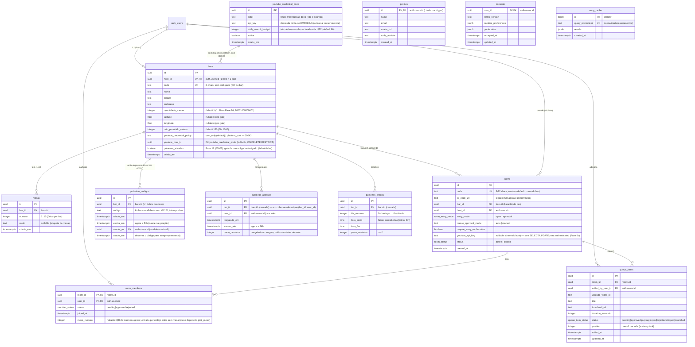
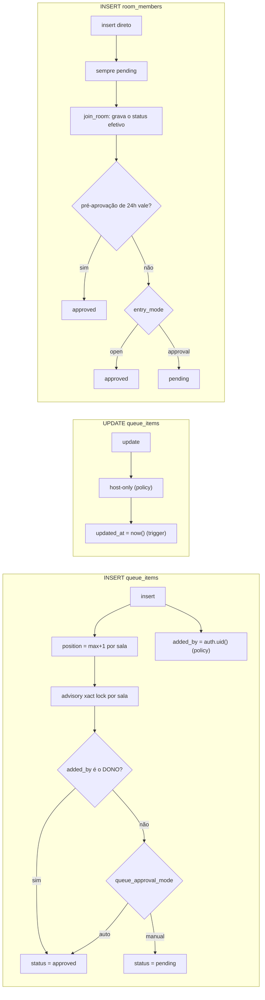
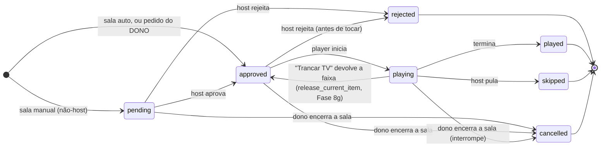
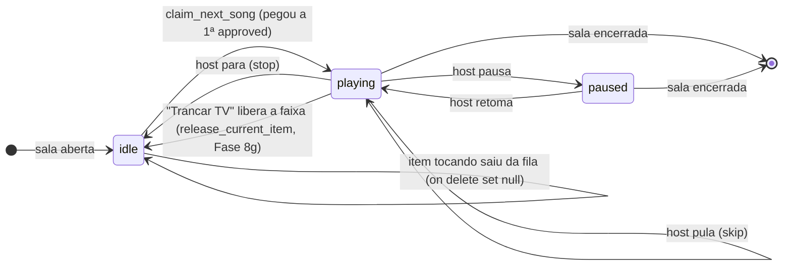
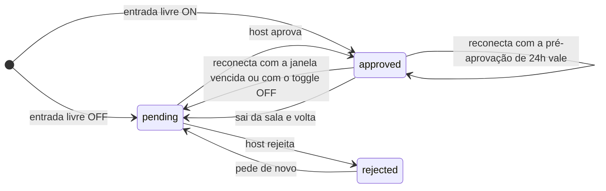
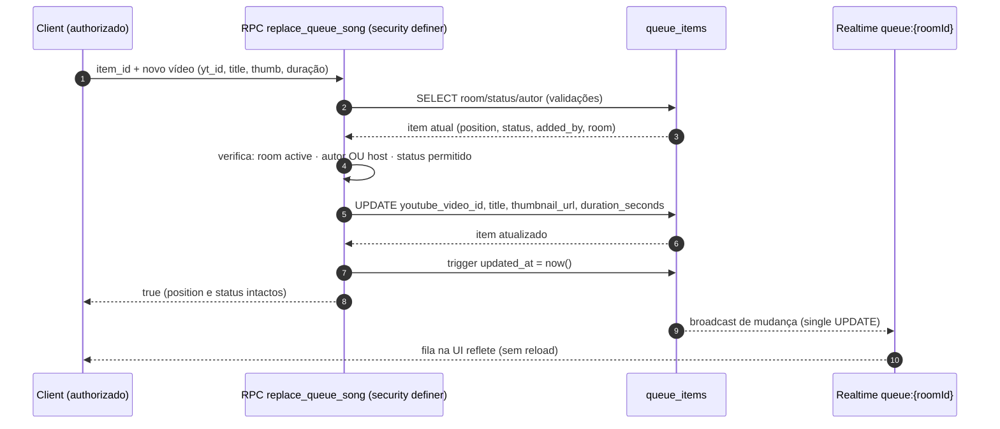
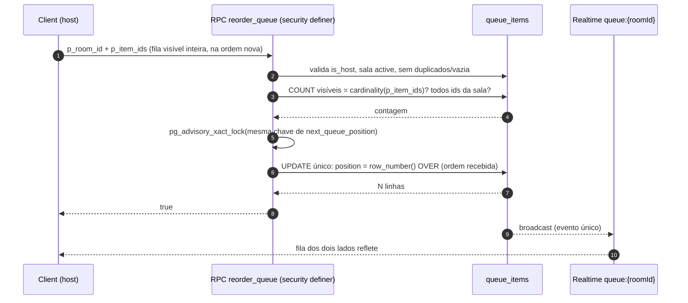

# Banco de dados

Modelo relacional, matriz de RLS e regras de integridade do MVP (reflete `supabase/migrations/*.sql` aplicadas no projeto cloud `kskoipyzqcacccepcqpc`).

---

## 1. Modelo relacional (ERD)

```mermaid
erDiagram
    auth_users ||--o| bars : "1:1 (host)"
    bars ||--o{ mesas : "tem (1..N)"
    bars ||--o{ rooms : "karaokê (default 1)"
    youtube_credential_pools ||--o{ bars : "pool da política platform_pool (00043)"
    bars ||--o{ pulseiras_codigos : "emite ingressos (Fase 18 / 00002)"
    bars ||--o{ pulseiras_acessos : "tem resgates"
    bars ||--o{ pulseiras_precos : "precifica"
    auth_users ||--o{ rooms : "host de (via bars)"
    auth_users ||--o{ room_members : "participa"
    auth_users ||--o{ queue_items : "adiciona"

    rooms ||--o{ room_members : "tem"
    rooms ||--o{ queue_items : "contém"
    rooms {
        uuid id PK
        text code UK "3-12 chars, custom (default: nome do bar)"
        text qr_code_url "legado (QR agora é do bar/mesa)"
        uuid bar_id FK "bars.id (karaokê do bar)"
        uuid host_id FK "auth.users.id"
        room_entry_mode entry_mode "open | approval"
        text queue_approval_mode "auto | manual"
        boolean require_song_confirmation
        text youtube_api_key "nullable (chave do host) — sem SELECT/UPDATE para authenticated (Fase 8c)"
        room_status status "active | closed"
        timestamptz created_at
    }

    room_members {
        uuid room_id PK,FK "rooms.id"
        uuid user_id PK,FK "auth.users.id"
        member_status status "pending|approved|rejected"
        timestamptz joined_at
        integer mesa_numero "nullable: QR de bar/mesa grava; entrada por código entra sem mesa (mesa depois via pick_mesa)"
    }

    bars {
        uuid id PK
        uuid host_id UK,FK "auth.users.id (1 host = 1 bar)"
        text code UK "6 chars, sem ambíguos (QR do bar)"
        text nome
        text cidade
        text endereco
        integer quantidade_mesas "default 1 (1..10 — Fase 16, 20261008000001)"
        float latitude "nullable (geo gate)"
        float longitude "nullable (geo gate)"
        integer raio_permitido_metros "default 150 (50..1000)"
        text youtube_credential_policy "own_only (default) | platform_pool — 00043"
        uuid youtube_pool_id "FK youtube_credential_pools (nullable, ON DELETE RESTRICT)"
        boolean pulseiras_ativadas "Fase 18 (00002): gate de cantar ligado/desligado (default false)"
        timestamptz criado_em
    }

    mesas {
        uuid id PK
        uuid bar_id FK "bars.id"
        integer numero "1..10 (único por bar)"
        text rotulo "nullable (etiqueta da mesa)"
        timestamptz criado_em
    }

    pulseiras_codigos {
        uuid id PK
        uuid bar_id FK "bars.id (on delete cascade)"
        text codigo "6 chars — alfabeto sem I/O/1/0, único por bar"
        timestamptz criado_em
        timestamptz expira_em "agora + 24h (nasce na geração)"
        uuid usado_por FK "auth.users.id (on delete set null)"
        timestamptz usado_em "desarma o código para sempre (sem reset)"
    }

    pulseiras_acessos {
        uuid id PK
        uuid bar_id FK "bars.id (cascade) — em cobertura do unique (bar_id, user_id)"
        uuid user_id FK "auth.users.id (cascade)"
        timestamptz resgatado_em
        timestamptz acesso_ate "agora + 24h"
        integer preco_centavos "congelado no resgate; null = sem faixa de valor"
    }

    pulseiras_precos {
        uuid id PK
        uuid bar_id FK "bars.id (cascade)"
        integer dia_semana "0=domingo … 6=sábado"
        time hora_inicio "faixas semiabertas [início, fim)"
        time hora_fim
        integer preco_centavos ">= 0"
    }

    queue_items {
        uuid id PK
        uuid room_id FK "rooms.id"
        uuid added_by_user_id FK "auth.users.id"
        text youtube_video_id
        text title
        text thumbnail_url
        integer duration_seconds
        queue_item_status status "pending|approved|playing|played|rejected|skipped|cancelled"
        integer position "max+1 por sala (advisory lock)"
        timestamptz added_at
        timestamptz updated_at
    }

    profiles {
        uuid id PK,FK "auth.users.id (criado por trigger)"
        text name
        text email
        text avatar_url
        text auth_provider
        timestamptz created_at
    }

    consents {
        uuid user_id PK,FK "auth.users.id"
        text terms_version
        jsonb cookies_preferences
        jsonb geolocation
        timestamptz accepted_at
        timestamptz updated_at
    }

    song_cache {
        bigint id PK "identity"
        text query_normalized UK "normalizada (case/acentos)"
        jsonb results
        timestamptz created_at
    }

    youtube_credential_pools {
        uuid id PK
        text label "rótulo mostrado ao dono (não é segredo)"
        text api_key "chave da conta de EMPRESA (nunca sai do service role)"
        integer daily_search_budget "teto de buscas não cacheadas/dia UTC (default 80)"
        boolean active
        timestamptz criado_em
    }
```

> `song_cache` (migration `20260921000006`) **não tem políticas RLS** — só o service role lê/escreve (cache da busca do YouTube).

> `consents` (migration `20260921000009`, spec §2.5/§13): registro de aceite LGPD/GDPR por usuário — RLS restrito ao próprio usuário (`consents_select_own`).

> `bars`/`mesas` (migrations `20260923000010`/`20260923000011`): o bar é o perfil-personificação do host (1:1 `host_id` único); mesas são etiquetas do bar (playlist = a da sala/karaokê). `rooms.bar_id` e `room_members.mesa_numero` são adicionados pela migration `20260923000012`; coords + raio de presença por `20260923000015`.
>
> **Código da sala configurável (migration `20260924000022`):** `rooms.code` aceita **3–12 alfanuméricos maiúsculos** (constraint), padrão por bar `KARAOKE`/`BAR2FO`; helpers RPC `unique_room_code`/`default_room_code`/`room_code_available` (checam colisão com `rooms.code` e `bars.code`); `create_bar` ganha `p_codigo` (default = nome do bar normalizado, fallback `KARAOKE`+sufixo); `join_room` tem `p_mesa` **opcional** (entrada por código entra sem mesa) e a nova RPC **`pick_mesa`** grava a mesa depois (só membro `approved` de sala `active`). A migration `20260924000021` corrige a ambiguidade `bar_id` no `get_entry_preview`. Seed: `KARAOK` → **`KARAOKE`**.
>
> **Fases 6/7 (playback — migrations `20260926000027`/`00028`):** `rooms.playback_status`, `rooms.current_item_id`, `rooms.current_item_started_at` e `rooms.player_token`; o estado do player é colunado, nunca adivinhado pelo cliente.
>
> **Fase 8c (migrations `20260930000038`/`00039`, auditoria de RLS):** `rooms.youtube_api_key` e `rooms.player_token` saem do alcance do papel `authenticated` por **ACL de coluna** (as outras 14 colunas continuam legíveis, pela view `rooms_public`, que é `security_invoker`); a leitura/escrita dos dois segredos passa por `admin_get_room_player_token`, `admin_get_room_youtube_api_key` e `admin_set_room_youtube_api_key` (`security definer`, `EXECUTE` só para `authenticated`/`service_role`); `bars` passa a ser legível só pelo próprio bar ou pelo bar de uma sala aprovada; `mesas` só pelo host; `room_members` só aceita `UPDATE (status)`. RLS decide por **linha**, então nenhum desses cuatro efeitos é possível por policy — daí ACL de coluna + RPC. Relatório: [`auditoria-rls.md`](../engenharia/auditoria-rls.md).
>
> **Fase 8a (migrations `20260927000029`/`00030`):** `rooms.pre_approval_24h` (boolean, **default true**) e `room_members.approved_at` (timestamptz, base da janela de 24h, mantida por trigger `room_members_sync_approved_at_trg`); funções `current_user_is_anonymous()`, `member_entry_state(p_room_id, p_user_id)` e as duas portas de `player_room_id(p_room_code, p_token)` — `get_player_state` e `claim_next_song` passam a aceitar `p_token` nulo (autorização pela sessão). A mesma migration **revogou** o `EXECUTE` de `PUBLIC` nessas duas RPCs e concedeu explicitamente a `anon`/`authenticated` (ver §2, "Playback é RPC").
>
> **Fase 8f (migration `20261005000043`, 2026-10-05):** política de credencial do YouTube **por bar** — `bars.youtube_credential_policy` (`own_only`, default, ou `platform_pool`) e `bars.youtube_pool_id` (FK **`ON DELETE RESTRICT`**, porque `SET NULL` anularia a invariante da trigger). A coerência policy↔pool mora na trigger `bars_guard_youtube_credential_policy` (`before insert or update`, mesmo padrão da `20260930000036`). A tabela `youtube_credential_pools` tem **RLS ligado e nenhuma policy** (só service role, como `song_cache` e `youtube_oauth_tokens`); a RPC dev-only `admin_youtube_credential_health(bar_id)` devolve rótulos, booleanos e contagens — **nunca** chave, token ou id de projeto. `daily_search_budget` é teto de **configuração**, não contador; rotação de chave do pool é manual. Detalhe em [`fluxos-do-sistema.md`](./fluxos-do-sistema.md) §3.1.1; smoke `scripts/smoke-youtube-credential.sql`.
>
> **Fase 8g (migration `20261005000044`, 2026-10-07):** RPC `release_current_item(p_room_code, p_token)` (`security definer`, mesma porta `player_room_id` de `claim_next_song`) — devolve a faixa presa em `playing` para **`approved` na mesma posição** e põe a sala em `idle`. Chamada pelo quiosque no "Trancar TV", **antes** de limpar o arm (que vive só no `localStorage` da TV): sem ela, a regra `KF001` bloqueava o cantor para sempre. Ver §2 e [`fluxos-do-sistema.md`](./fluxos-do-sistema.md) §4.4; smoke `scripts/smoke-release-current-item.sql` (11/11 no Cloud).
>
> **Fase 18 (migration `20261008000002`, 2026-10-08):** pulseira. `bars.pulseiras_ativadas` (**default false**; `create_bar` passou a exigir **10 argumentos, todos obrigatórios** — o Postgres recusa parâmetro sem default depois de um com default; o app passa todos por nome). `pulseiras_codigos` (os ingressos impressos): código de **6 chars** (alfabeto sem I/O/1/0) que expira em **24h** e `usado_em` desarma **para sempre** (decisão de produto: sem rota de reuso). `pulseiras_acessos`: **uma linha por `(bar_id, user_id)`** — acesso vigente bloqueia novo resgate (`JA_TEM_ACESSO`), expirado **renova** (`ON CONFLICT … DO UPDATE WHERE acesso_ate <= now()`); o `FOR UPDATE` na linha do código serializa dois resgates do mesmo ingresso. `pulseiras_precos`: faixas por `dia_semana` + hora **sem sobreposição por bar** — `EXCLUDE USING GIST` com `tsrange` ancorado em `1970-01-01` (**não existe `timerange` no PostgreSQL**); começa **vazia** (resgate sem faixa não cobra). RPCs `security definer`: **`gerar_pulseiras`** (host-only, 1–100 por lote num único INSERT) e **`resgatar_pulseira`** (autenticado; recusas `UNAUTHENTICATED`/`ANONYMOUS` — esta sem queimar o código —/`PULSEIRA_INATIVA`/`JA_TEM_ACESSO`/`CODIGO_INVALIDO`/`CODIGO_USADO`) e a leitura `preco_vigente` (calcula a faixa de agora em `America/Sao_Paulo`). O gate de cantar é a trigger `queue_items_exige_pulseira` (**`KF002`**): bar desligado devolve o insert ao normal; host da própria sala e `auth.uid()` nulo (service role/seed) passam direto. `get_entry_preview` e `member_entry_state` ganharam `pulseiras_ativadas`/`pulseira_exigida`/`tem_pulseira` — a `/entrar` monta o cartaz pela **preview**, não por SELECT de `bars`; para recriar a preview a migration precisou de `drop function` de `get_entry_preview` antes do `create or replace` (o PG recusa mudar o retorno — `42P13`). Smoke `scripts/smoke-pulseiras.sql` (31/31 no Cloud); roteiro em `TESTING.md` §3.19.

---

## 2. Regras de integridade no banco

```mermaid
flowchart LR
    subgraph INSERT queue_items
        A[insert] --> B["position = max+1 por sala"]
        B --> C["advisory xact lock por sala"]
        C --> C1{added_by é o DONO?}
        C1 -->|sim| E["status = approved"]
        C1 -->|não| D{queue_approval_mode}
        D -->|auto| E["status = approved"]
        D -->|manual| F["status = pending"]
        A --> G["added_by = auth.uid() (policy)"]
    end
    subgraph UPDATE queue_items
        H[update] --> I["host-only (policy)"]
        I --> J["updated_at = now() (trigger)"]
    end
    subgraph INSERT room_members
        K[insert direto] --> L["sempre pending"]
        L --> M["join_room: grava o status efetivo"]
        M --> N{pré-aprovação de 24h vale?}
        N -->|sim| Q[approved]
        N -->|não| O{entry_mode}
        O -->|open| P[approved]
        O -->|approval| R[pending]
    end
```

---

## 3. Matriz de RLS

| Tabela         | SELECT                                                                  | INSERT                                               | UPDATE                                                                                        | DELETE                         |
| -------------- | ----------------------------------------------------------------------- | ---------------------------------------------------- | --------------------------------------------------------------------------------------------- | ------------------------------ |
| `bars`         | qualquer autenticado **incluindo anônimo** (`auth.uid() is not null`)   | host (`host_id = auth.uid()`)                        | host                                                                                          | host                           |
| `mesas`        | qualquer autenticado **incluindo anônimo**                              | — (só via RPC `create_bar`)                          | — (só via RPC `update_bar_mesas`, Fase 16)                                                    | —                              |
| `pulseiras_codigos` | **só o dono do bar** (`is_bar_host` — o código é segredo de balcão) | — (só via RPC `gerar_pulseiras`, host-only) | — | — |
| `pulseiras_acessos` | o próprio resgate (`user_id = auth.uid()`) **ou** o host do bar (ocupação) | — (só via RPC `resgatar_pulseira`) | — | — |
| `pulseiras_precos` | qualquer autenticado (a `/entrar` mostra o cartaz) | — (só RPC host) | — (só RPC host) | — (só RPC host) |
| `rooms`        | host ou membro aprovado da sala                                         | host (`host_id = auth.uid()`)                        | host                                                                                          | host                           |
| `room_members` | a própria participação **ou** tudo da sala (host precisa ver pendentes) | só self como `pending` (approved só via `join_room`) | host (aprovar/rejeitar)                                                                       | self **ou** host               |
| `queue_items`  | host ou membro aprovado da sala                                         | membro aprovado/host, adicionando para si            | **host-only** (a troca de música é via RPC `replace_queue_song`; o playback também é via RPC) | host only                      |
| `profiles`     | via view `profiles_public` (invoker: anon/authenticated leem `id/name/avatar_url`, nunca email) | trigger `handle_new_user` (ninguém insere direto)    | próprio profile                                                                               | —                              |
| `consents`     | só o próprio usuário                                                    | próprio usuário (ou service role)                    | próprio usuário (ou service role)                                                             | —                              |
| `song_cache`   | sem política                                                            | sem política                                         | sem política                                                                                  | sem política (só service role) |
| `youtube_credential_pools` | sem política | sem política | sem política | sem política (só service role) |

> **Anônimo (`is_anonymous`)**: lê `bars`/`mesas` (precisa ver código/QR e escolher mesa) — mas a RPC `create_bar` recusa sessão anônima; o anfitrião começa com sessão real. **Nunca é pré-aprovado** por `member_entry_state`, mesmo aprovado por outro host antes (Fase 8a).
>
> **A TV não é participante**: o player da TV é um `anon` **sem nenhuma linha em `room_members`** e lê playback só por `get_player_state`/`claim_next_song` com o token de capacidade. Quem não tem o token não enxerga nem o título da fila.
>
> **O player tem duas portas** (Fase 8a, migration `00029`): com `p_token` é a TV; **sem token** é a sessão de quem está chamando (`auth.uid()` dentro da função = host da sala ou membro `approved`). O token errado **não** cai para a sessão — o quiosque precisa continuar avisando que o link morreu.
>
> **`profiles_public` é `security invoker`** (migration `00033`, Advisor lint 0010): as roles da API têm SELECT só nas colunas `id/name/avatar_url` de `profiles` — `email` é permission denied para `anon`/`authenticated`; a policy `profiles_select_public` (`using true`) mantém o comportamento antigo (nome/avatar de qualquer usuário), sem o bypass do owner que a view definer tinha. As RPCs `security definer` que leem a view rodam como postgres e não mudam.

### Pontos de atenção (segurança)

- **Host actions nunca relaxam na UI**: aprovar/reordenar/deletar fila e aprovar/rejeitar entrada são host-only no banco.
- **Status inicial da fila é derivado** (`queue_items_initial_status`): o client não escolhe; remove auto-aprovação por INSERT. Exceção: pedidos do **dono** entram `approved` sempre (não espera a própria aprovação).
- **Uma música ativa por participante, no banco** (migration `20261004000042`): trigger `before insert` em `queue_items` que apaga as ativas `pending`/`approved` do próprio participante e **recusa com `KF001`** quando há uma `playing` (trocar a que toca cortaria o áudio da TV; a vaga abre quando ela vira `played`). "Ativa" = `pending`+`approved`+`playing`, isto é, o que a fila mostra — **não é um estado novo**. O host é isento **na própria sala** (`is_host(room_id, …)`), então dono de uma e participante de outra recebe a regra. **Sem `security definer`**: o `delete` da substituição passa pela policy `queue_items_delete_own` (`20260927000031`), que já autoriza o autor sobre o próprio item nesses dois status — RLS real em vez de privilégio novo; sobrou ativa depois do `delete`? a trigger levanta `KF001` em vez de fingir que substituiu. Vale para o visitante sem login autenticado (usuário Supabase anônimo, `auth.uid()` estável **por navegador** — limpar os dados do site cria outra identidade).
- **Cantar exige pulseira, também no banco** (migration `20261008000002`, Fase 18): trigger `queue_items_exige_pulseira` (`before insert` em `queue_items`) consulta `bars.pulseiras_ativadas` e, com o bar ligado, exige `pulseiras_acessos` vigente do **pedinte** — recusa com **`KF002`**. Bar **desligado devolve o insert ao normal** (sem custo na sala sem o recurso). **Isentos:** o host **da própria sala** (`is_host`, mesmo espírito do `KF001`) e `auth.uid()` nulo (service role/seed/Management API). A porta de escrita do acesso é a RPC `resgatar_pulseira` (`security definer`): \(FOR UPDATE\) na linha do código + recusas por código no corpo (`ANONYMOUS` **não queima** o código, `CODIGO_USADO`/`CODIGO_INVALIDO`/`PULSEIRA_INATIVA`; expirado renova via `ON CONFLICT DO UPDATE WHERE acesso_ate <= now()`). Anônimo não é dono e não é host, então em bar ligado **ele não canta** — a UI só avisa ("pulseira exigida"); o adversário de verdade é a trigger.
- **Encerrar sala = RPC `close_room` (`security definer`)** (migration `20260923000019`): checa `is_host`, marca `rooms.status='closed'`, cancela a fila toda (`cancelled`, status terminal novo) e **expulsa todos** (`DELETE room_members`). Atômico — o client não ajusta essas peças separadamente.
- **Reordenar a fila = RPC `reorder_queue` (`security definer`)** (migration `20260926000025`): o UPDATE de `position` do host é feito dentro da função, sob advisory lock com a **mesma chave de `next_queue_position`**, e só com a **fila visível inteira** (`playing`+`approved`+`pending`) — sem unique em `(room_id, position)`, uma lista parcial criaria posições repetidas. Rewrite único com `row_number()` 1..N (realtime sem tempestade de eventos).
- **Trocar a música = RPC `replace_queue_song` (`security definer`)** (migration `20260926000026`): o **autor do item ou o host** reescreve só vídeo/título/thumb/duração; `position` e `status` ficam intactos (D2) e o item precisa estar `pending`/`approved` (D3). Existe porque a policy de UPDATE é host-only — o client não ganha UPDATE direto.
- **Playback é RPC, nunca policy** (migration `20260926000027`): a TV é **anônima** e não entra em `rooms`/`queue_items` por RLS (ela nem é membro), então leitura, avanço, controle, rotação de token e **liberação da faixa presa** são `get_player_state`, `claim_next_song`, `set_playback`, `rotate_player_token` e `release_current_item` (Fase 8g, `20261005000044`) — todas `security definer`. **ACL medida ao vivo em 2026-10-07 (a "correção de doc" de 02/10 não se sustenta para todas):** são **45** funções em `public` (a nota antiga citava 40), das quais **15** estão sem `EXECUTE` para `PUBLIC` — as cinco `admin_*` fechadas (`20260930000039` × 3, `admin_room_occupancy` da `00040`, `admin_youtube_credential_health` da `00043`) e dez de playback/entrada (inclusive as triggers `queue_items_one_active_per_participant` e `rooms_sync_playback`), entre elas `get_player_state` e `claim_next_song`, que a **`20260927000029` (27/09) revogou de `PUBLIC`** e concedeu explicitamente a `anon`/`authenticated`, e `release_current_item`, que nasce com o mesmo par `revoke`/`grant`. As outras **30** herdam o `PUBLIC` do `CREATE FUNCTION` — entre elas **`set_playback` e `rotate_player_token`**, que `anon` executa. Em **qualquer** dos dois casos o que barra é o **código** dentro da função: `is_host`, o token de capacidade e a checagem de `status` — segurança real defendida por `if`, não por ACL, a mesma forma de "parede que a gente acredita estar no banco" que a auditoria da Fase 8c caçou (F7); fechar as que faltam por ACL exige inventário de quem chama o quê. **O token de capacidade (`rooms.player_token`) é a autorização da rota pública**: sem ele a leitura devolve `{ok: false}` e nada mais. `set_playback` exige `auth.uid() = rooms.host_id` e devolve `false` (não levanta exceção) para quem não é host.
- **A entrada em `playing` tem dono único: `claim_next_song`** (chamada pelo player, com a **mesma chave de advisory lock** de `next_queue_position`), e ela **exige que o item esteja `approved`**. `set_playback('play')` também promove, mas só quando não há item tocando — nunca troca o que está no ar. O `rooms.playback_status`/`current_item_id` é a fonte da verdade do que está tocando, e o trigger `rooms_sync_playback` mantém a invariante (item atual tem que estar `playing`; sem item, sala `idle` e âncora nula) — inclusive quando o item sai da fila pelo `on delete set null`.
- **`claim_next_song` é idempotente por item** (migration `20260926000028`): o player manda o id do item que acabou; o banco só terminaliza se ainda for o item atual e devolve `already_advanced: true` quando for outro. Sem esse terceiro argumento, dois claims simultâneos (evento `ENDED` do player + poll) pulavam a música em reprodução.
- **A saída da faixa presa = RPC `release_current_item`** (migration `20261005000044`, Fase 8g): com o quiosque trancado nada termina a faixa (`onEnded` não dispara com o stage desmontado e os guards de claim estão desarmados), então o item ficaria `playing` para sempre e a trigger `KF001` bloquearia o cantor. A RPC — chamada pelo **próprio quiosque** no "Trancar TV", antes de limpar o arm (que vive só no `localStorage`, `player-arm.ts`) — resolve a sala pela mesma porta `player_room_id` (token da TV **ou** sessão; forasteiro não libera, token errado não cai para a sessão), sob o **mesmo advisory lock** do playback, devolve o item para **`approved` na mesma posição** (`played` seria mentira, `skipped` roubaria a vez) e põe a sala em `idle`; sem faixa no ar, `released: false`. **`claim_next_song` não foi tocado** — ele só roda com a TV armada. Falha do RPC não impede o travar; a sala encerrada recusa. Smoke `scripts/smoke-release-current-item.sql` (11/11 no Cloud, 2026-10-07); detalhe em [`fluxos-do-sistema.md`](./fluxos-do-sistema.md) §4.4.
- **Aprovação de entrada** só via RPC `join_room` (`security definer`) — INSERT direto sempre vira `pending`.
- **Pré-aprovação de 24h é regra do banco, não da UI** (migration `20260927000030`): `member_entry_state` devolve o status efetivo (`status`, `mesa_numero`, `pre_approval`, `approved_at`) e é a **única** cópia da regra — o `join_room` grava o que ela devolve e o app lê a mesma função (preview, tela de espera, página da sala). A janela nasce em `room_members.approved_at`, escrita por trigger **só quando o status muda para `approved`** (reaprovar não renova; sair de `approved` zera). Toggle da sala: `rooms.pre_approval_24h` (**default ON**; a UI o mostra ligado e travado, decisão de produto, mas o banco respeita ON e OFF). **Anônimo nunca é pré-aprovado** (`current_user_is_anonymous`). `p_user` só é aceito para o próprio usuário ou pelo service role.
- **Preview / entrada e criação de bar são RPCs `security definer`** (`get_entry_preview`, `join_room`, `create_bar`) — o leitor não-membro não acessa `rooms`/`bars` por SELECT.
- **Política de credencial do YouTube por bar = trigger, não `if` de TypeScript** (migration `20261005000043`, Fase 8f): `bars.youtube_credential_policy` (`own_only` default = o bar banca a própria credencial; `platform_pool` = chave de conta de empresa com teto diário) e `bars.youtube_pool_id`. A coerência mora na trigger `bars_guard_youtube_credential_policy` (`before insert or update`): `own_only` com pool apontado e `platform_pool` sem pool **ativo** são recusados na escrita — mesma razão da `20260930000036`: regra que RLS não expressa não sobrevive a uma chamada direta pelo PostgREST. A política fica em `bars` (e não em `rooms`) de propósito: a **chave** é coluna da sala, a **política** é decisão do dono do bar. O FK do pool é `ON DELETE RESTRICT` — `SET NULL` deixaria o bar no estado que o trigger recusa, alcançado por fora dele. `youtube_credential_pools` tem RLS ligado e **nenhuma policy** (só service role lê chave), e `admin_youtube_credential_health` (dev-only) nunca devolve segredo. Limites declarados: `daily_search_budget` é teto de configuração, não contador; rotação de chave do pool é manual. Smoke `scripts/smoke-youtube-credential.sql` (precisa de Postgres).
- **Multi-tenancy**: toda tabela de domínio tem `room_id`/`bar_id`; nada de assumir bar/sala única.

---

## 4. Máquina de estados da fila

```mermaid
stateDiagram-v2
    direction LR
    [*] --> pending: sala manual (não-host)
    [*] --> approved: sala auto, ou pedido do DONO
    pending --> approved: host aprova
    pending --> rejected: host rejeita
    approved --> playing: player inicia
    approved --> rejected: host rejeita (antes de tocar)
    playing --> played: termina
    playing --> skipped: host pula
    playing --> approved: "Trancar TV" devolve a faixa (release_current_item, Fase 8g)
    pending --> cancelled: dono encerra a sala
    approved --> cancelled: dono encerra a sala
    playing --> cancelled: dono encerra a sala (interrompe)
    rejected --> [*]
    played --> [*]
    skipped --> [*]
    cancelled --> [*]
```

---

## 4.1 Máquina de estados do playback (Fases 6/7 — implementado)

```mermaid
stateDiagram-v2
    direction LR
    [*] --> idle: sala aberta
    idle --> playing: claim_next_song (pegou a 1ª approved)
    playing --> paused: host pausa
    paused --> playing: host retoma
    playing --> playing: a música termina (claim com p_finished_item_id)
    playing --> playing: host pula (skip)
    playing --> idle: host para (stop)
    playing --> idle: "Trancar TV" libera a faixa (release_current_item, Fase 8g)
    idle --> idle: item tocando saiu da fila (on delete set null)
    playing --> [*]: sala encerrada
    paused --> [*]: sala encerrada
```

> `playback_status` é **derivado do item atual**, não do contrário: o trigger `rooms_sync_playback` é quem reconcilia, e o painel do host nunca escreve `rooms.playback_status` direto.

---

## 4.2 Estado efetivo de entrada (Fase 8a — implementado)

```mermaid
stateDiagram-v2
    direction LR
    [*] --> pending: entrada livre OFF
    [*] --> approved: entrada livre ON
    pending --> approved: host aprova
    pending --> rejected: host rejeita
    rejected --> pending: pede de novo
    approved --> approved: reconecta com a pré-aprovação de 24h vale
    approved --> pending: reconecta com a janela vencida ou com o toggle OFF
    approved --> pending: sai da sala e volta
```

> `room_members.status` é o que o banco gravou da última vez; o que vale **agora** é o retorno de `member_entry_state`. Os dois divergem de propósito quando a janela de 24h vence: a linha continua `approved` (ninguém apaga linha por tempo) e o acesso efetivo volta a ser o da regra da sala. Com **entrada livre ON**, o vencimento não muda nada — a sala já aprova todo mundo.
>
> `approved --> pending: sai da sala e volta` acontece porque `leave_room` **apaga** a linha: quem volta é tratado como primeira entrada, e pré-aprovação exige linha. O ciclo de reconectar (sem sair) é o que a janela de 24h cobre.
>
> A self-loop `approved --> approved` **não renova** `approved_at`: a janela nasce na transição para `approved` e o trigger zera quando o status sai. Se renovasse a cada entrada, a pré-aprovação seria eternal.

---

## 5. Fluxo de DB das operações de fila do host (Fase 5, Blocos C/D — implementado)

Duas RPCs `security definer` complementam a RLS de `queue_items` (que é host-only no UPDATE) sem relaxar nenhuma policy. Detalhe de decisão em [`fluxos-do-sistema.md`](./fluxos-do-sistema.md) §3.4 e §5.

| RPC                                                                                               | Quem              | O que reescreve                                                           | O que **não** muda             | Erro                                                                                                                                          |
| ------------------------------------------------------------------------------------------------- | ----------------- | ------------------------------------------------------------------------- | ------------------------------ | --------------------------------------------------------------------------------------------------------------------------------------------- |
| `reorder_queue(p_room_id, p_item_ids)`                                                            | host              | `position` de **toda** a fila visível, em um UPDATE (`row_number()` 1..N) | `status`                       | `false` (não host) · exceção "fila desatualizada" (lista parcial/divergente) · "itens duplicados" · "sala encerrada"                          |
| `replace_queue_song(p_item_id, p_youtube_video_id, p_title, p_thumbnail_url, p_duration_seconds)` | autor **ou** host | `youtube_video_id`, `title`, `thumbnail_url`, `duration_seconds`          | **`position` e `status`** (D2) | `false` (item inexistente / não autorizado) · exceção "esta música já saiu da fila" (D3) · "vídeo/título/duração inválido" · "sala encerrada" |

### 5.1 Trocar música (`replace_queue_song`)

Atualização in place: **position não muda** e o `updated_at` é tocado pelo trigger. Diagrama:

```mermaid
sequenceDiagram
    autonumber
    participant C as Client (authorizado)
    participant R as RPC replace_queue_song (security definer)
    participant DB as queue_items
    participant RT as Realtime queue:{roomId}

    C->>R: item_id + novo vídeo (yt_id, title, thumb, duração)
    R->>DB: SELECT room/status/autor (validações)
    DB-->>R: item atual (position, status, added_by, room)
    R->>R: verifica: room active · autor OU host · status permitido
    R->>DB: UPDATE youtube_video_id, title, thumbnail_url, duration_seconds
    DB-->>R: item atualizado
    R->>DB: trigger updated_at = now()
    R-->>C: true (position e status intactos)
    DB-->>RT: broadcast de mudança (single UPDATE)
    RT-->>C: fila na UI reflete (sem reload)
```

### 5.2 Reordenar (`reorder_queue`)

```mermaid
sequenceDiagram
    autonumber
    participant C as Client (host)
    participant R as RPC reorder_queue (security definer)
    participant DB as queue_items
    participant RT as Realtime queue:{roomId}

    C->>R: p_room_id + p_item_ids (fila visível inteira, na ordem nova)
    R->>DB: valida is_host, sala active, sem duplicados/vazia
    R->>DB: COUNT visíveis = cardinality(p_item_ids)? todos ids da sala?
    DB-->>R: contagem
    R->>R: pg_advisory_xact_lock(mesma chave de next_queue_position)
    R->>DB: UPDATE único: position = row_number() OVER (ordem recebida)
    DB-->>R: N linhas
    R-->>C: true
    DB-->>RT: broadcast (evento único)
    RT-->>C: fila dos dois lados reflete
```

> O lock é **transacional** (`pg_advisory_xact_lock`) e usa a chave de `next_queue_position`, então um `INSERT` concorrente não consegue arrancar uma posição no meio do reorden. Não há unique em `(room_id, position)`: a garantia de contiguidade vem do contrato "a lista é a fila inteira" + validação no banco, não de constraint.

---

## 6. Seed de dev (`npm run seed`)

```mermaid
flowchart TD
    A["node scripts/seed.mjs"] --> B["Auth Admin API: 4 usuários (IDs fixos)"]
    B --> C["trigger handle_new_user cria profiles"]
    C --> D["INSERT 2 bares + mesas + rooms + members + queue (idempotente)"]
    D --> E["Bar1 ZEHBAR (10 mesas) / Bar2 BARSEG (6 mesas) / salas KARAOKE·BAR2FO"]
    E --> F["Login dev: usuários do seed · e-mails/senha de SEED_* no .env.local (defaults públicos @exemplo.com · senha123)"]
```

> Usuários **não** são criados por SQL raw em `auth.users` (deixa o serviço Auth instável) — sempre Auth Admin API.

> Os usuários são resolvidos **pelo ID fixo**, não pelo e-mail (que pode ter sido personalizado via `SEED_*`); a senha (default `senha123`) só vale na **criação**. Cruzamento de identidade (senha local + GitHub na nuvem = mesma conta): ver README "Login e acesso" e TESTING §3.1 — exige `linkIdentity` e `security_manual_linking_enabled=true`.

> O Bar 2 tem host próprio (`betania`, id `...0004`) porque **1 host = 1 bar** (`bars.host_id` único) — dono já é host do Bar 1.
