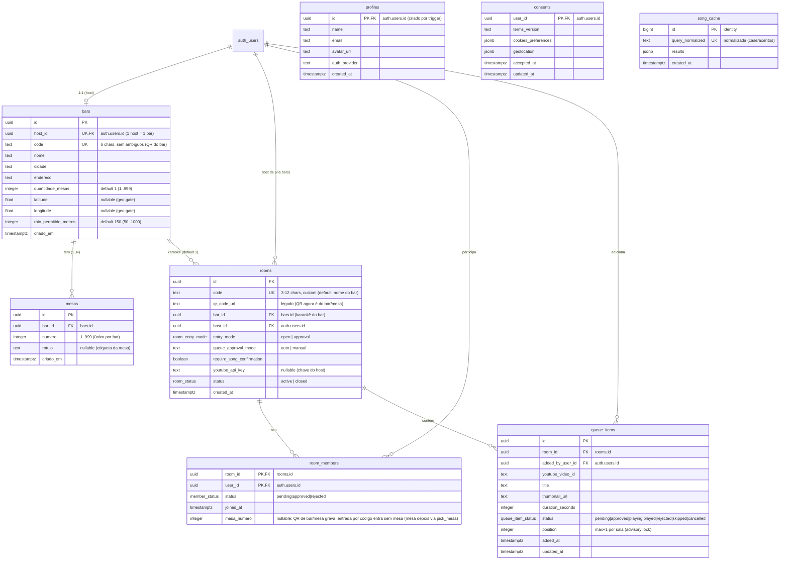
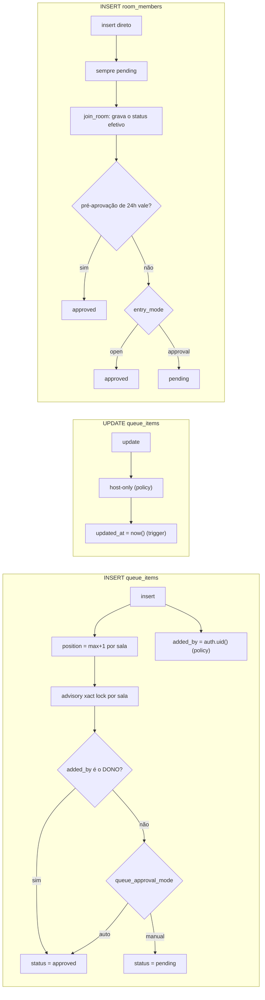
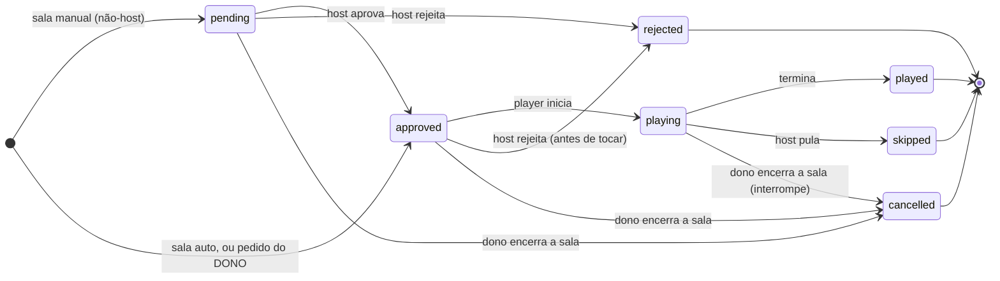
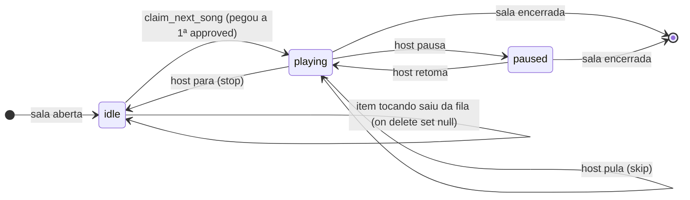
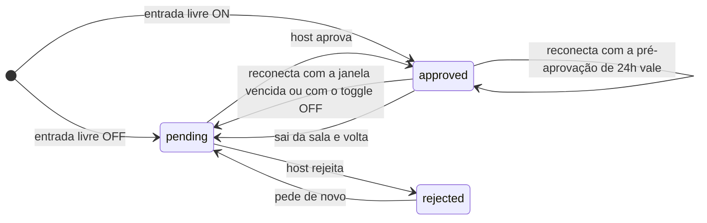
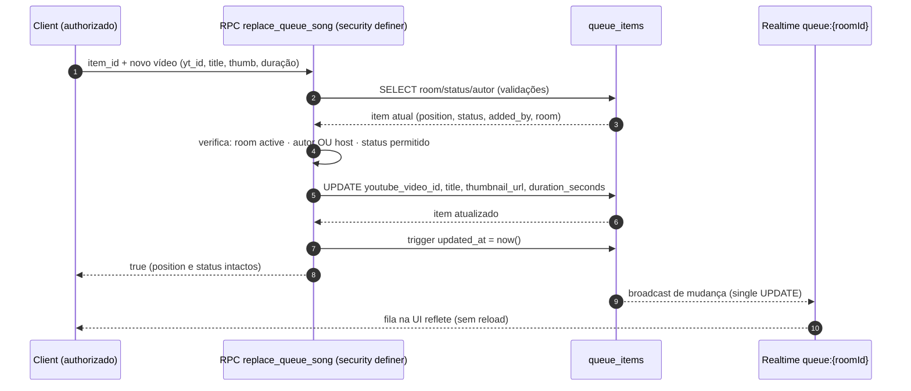
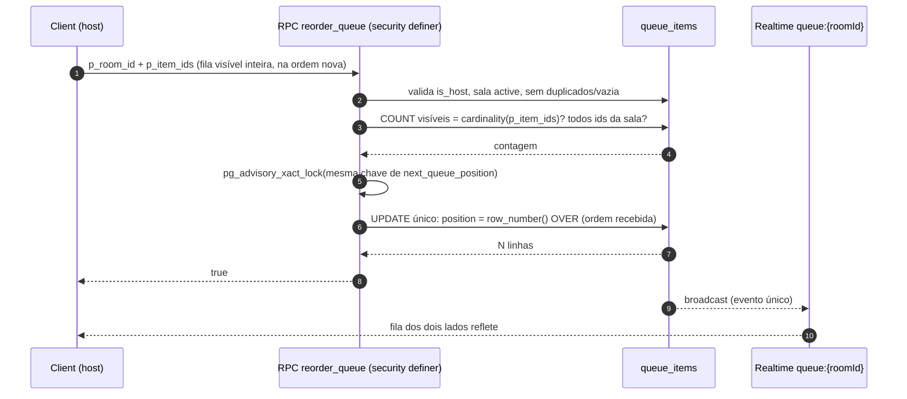
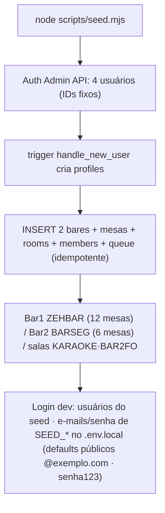

# Banco de dados

Modelo relacional, matriz de RLS e regras de integridade do MVP (reflete `supabase/migrations/*.sql` aplicadas no projeto cloud `kskoipyzqcacccepcqpc`).

---

## 1. Modelo relacional (ERD)

```mermaid
erDiagram
    auth_users ||--o| bars : "1:1 (host)"
    bars ||--o{ mesas : "tem (1..N)"
    bars ||--o{ rooms : "karaokê (default 1)"
    auth_users ||--o{ rooms : "host de (via bars)"
    auth_users ||--o{ room_members : "participa"
    auth_users ||--o{ queue_items : "adiciona"

    rooms ||--o{ room_members : "tem"
    rooms ||--o{ queue_items : "contém"
    rooms {
        uuid id PK
        text code UK "3-12 chars, custom (default: nome do bar)"
        text qr_code_url "legado (QR agora é do bar/mesa)"
        uuid bar_id FK "bars.id (karaokê do bar)"
        uuid host_id FK "auth.users.id"
        room_entry_mode entry_mode "open | approval"
        text queue_approval_mode "auto | manual"
        boolean require_song_confirmation
        text youtube_api_key "nullable (chave do host)"
        room_status status "active | closed"
        timestamptz created_at
    }

    room_members {
        uuid room_id PK,FK "rooms.id"
        uuid user_id PK,FK "auth.users.id"
        member_status status "pending|approved|rejected"
        timestamptz joined_at
        integer mesa_numero "nullable: QR de bar/mesa grava; entrada por código entra sem mesa (mesa depois via pick_mesa)"
    }

    bars {
        uuid id PK
        uuid host_id UK,FK "auth.users.id (1 host = 1 bar)"
        text code UK "6 chars, sem ambíguos (QR do bar)"
        text nome
        text cidade
        text endereco
        integer quantidade_mesas "default 1 (1..999)"
        float latitude "nullable (geo gate)"
        float longitude "nullable (geo gate)"
        integer raio_permitido_metros "default 150 (50..1000)"
        timestamptz criado_em
    }

    mesas {
        uuid id PK
        uuid bar_id FK "bars.id"
        integer numero "1..999 (único por bar)"
        text rotulo "nullable (etiqueta da mesa)"
        timestamptz criado_em
    }

    queue_items {
        uuid id PK
        uuid room_id FK "rooms.id"
        uuid added_by_user_id FK "auth.users.id"
        text youtube_video_id
        text title
        text thumbnail_url
        integer duration_seconds
        queue_item_status status "pending|approved|playing|played|rejected|skipped|cancelled"
        integer position "max+1 por sala (advisory lock)"
        timestamptz added_at
        timestamptz updated_at
    }

    profiles {
        uuid id PK,FK "auth.users.id (criado por trigger)"
        text name
        text email
        text avatar_url
        text auth_provider
        timestamptz created_at
    }

    consents {
        uuid user_id PK,FK "auth.users.id"
        text terms_version
        jsonb cookies_preferences
        jsonb geolocation
        timestamptz accepted_at
        timestamptz updated_at
    }

    song_cache {
        bigint id PK "identity"
        text query_normalized UK "normalizada (case/acentos)"
        jsonb results
        timestamptz created_at
    }
```

> `song_cache` (migration `20260921000006`) **não tem políticas RLS** — só o service role lê/escreve (cache da busca do YouTube).

> `consents` (migration `20260921000009`, spec §2.5/§13): registro de aceite LGPD/GDPR por usuário — RLS restrito ao próprio usuário (`consents_select_own`).

> `bars`/`mesas` (migrations `20260923000010`/`20260923000011`): o bar é o perfil-personificação do host (1:1 `host_id` único); mesas são etiquetas do bar (playlist = a da sala/karaokê). `rooms.bar_id` e `room_members.mesa_numero` são adicionados pela migration `20260923000012`; coords + raio de presença por `20260923000015`.
>
> **Código da sala configurável (migration `20260924000022`):** `rooms.code` aceita **3–12 alfanuméricos maiúsculos** (constraint), padrão por bar `KARAOKE`/`BAR2FO`; helpers RPC `unique_room_code`/`default_room_code`/`room_code_available` (checam colisão com `rooms.code` e `bars.code`); `create_bar` ganha `p_codigo` (default = nome do bar normalizado, fallback `KARAOKE`+sufixo); `join_room` tem `p_mesa` **opcional** (entrada por código entra sem mesa) e a nova RPC **`pick_mesa`** grava a mesa depois (só membro `approved` de sala `active`). A migration `20260924000021` corrige a ambiguidade `bar_id` no `get_entry_preview`. Seed: `KARAOK` → **`KARAOKE`**.
>
> **Fases 6/7 (playback — migrations `20260926000027`/`00028`):** `rooms.playback_status`, `rooms.current_item_id`, `rooms.current_item_started_at` e `rooms.player_token`; o estado do player é colunado, nunca adivinhado pelo cliente.
>
> **Fase 8a (migrations `20260927000029`/`00030`):** `rooms.pre_approval_24h` (boolean, **default true**) e `room_members.approved_at` (timestamptz, base da janela de 24h, mantida por trigger `room_members_sync_approved_at_trg`); funções `current_user_is_anonymous()`, `member_entry_state(p_room_id, p_user_id)` e as duas portas de `player_room_id(p_room_code, p_token)` — `get_player_state` e `claim_next_song` passam a aceitar `p_token` nulo (autorização pela sessão).

---

## 2. Regras de integridade no banco

```mermaid
flowchart LR
    subgraph INSERT queue_items
        A[insert] --> B["position = max+1 por sala"]
        B --> C["advisory xact lock por sala"]
        C --> C1{added_by é o DONO?}
        C1 -->|sim| E["status = approved"]
        C1 -->|não| D{queue_approval_mode}
        D -->|auto| E["status = approved"]
        D -->|manual| F["status = pending"]
        A --> G["added_by = auth.uid() (policy)"]
    end
    subgraph UPDATE queue_items
        H[update] --> I["host-only (policy)"]
        I --> J["updated_at = now() (trigger)"]
    end
    subgraph INSERT room_members
        K[insert direto] --> L["sempre pending"]
        L --> M["join_room: grava o status efetivo"]
        M --> N{pré-aprovação de 24h vale?}
        N -->|sim| Q[approved]
        N -->|não| O{entry_mode}
        O -->|open| P[approved]
        O -->|approval| R[pending]
    end
```

---

## 3. Matriz de RLS

| Tabela         | SELECT                                                                  | INSERT                                               | UPDATE                                                                                        | DELETE                         |
| -------------- | ----------------------------------------------------------------------- | ---------------------------------------------------- | --------------------------------------------------------------------------------------------- | ------------------------------ |
| `bars`         | qualquer autenticado **incluindo anônimo** (`auth.uid() is not null`)   | host (`host_id = auth.uid()`)                        | host                                                                                          | host                           |
| `mesas`        | qualquer autenticado **incluindo anônimo**                              | — (só via RPC `create_bar`)                          | —                                                                                             | —                              |
| `rooms`        | host ou membro aprovado da sala                                         | host (`host_id = auth.uid()`)                        | host                                                                                          | host                           |
| `room_members` | a própria participação **ou** tudo da sala (host precisa ver pendentes) | só self como `pending` (approved só via `join_room`) | host (aprovar/rejeitar)                                                                       | self **ou** host               |
| `queue_items`  | host ou membro aprovado da sala                                         | membro aprovado/host, adicionando para si            | **host-only** (a troca de música é via RPC `replace_queue_song`; o playback também é via RPC) | host only                      |
| `profiles`     | via view `profiles_public` (invoker: anon/authenticated leem `id/name/avatar_url`, nunca email) | trigger `handle_new_user` (ninguém insere direto)    | próprio profile                                                                               | —                              |
| `consents`     | só o próprio usuário                                                    | próprio usuário (ou service role)                    | próprio usuário (ou service role)                                                             | —                              |
| `song_cache`   | sem política                                                            | sem política                                         | sem política                                                                                  | sem política (só service role) |

> **Anônimo (`is_anonymous`)**: lê `bars`/`mesas` (precisa ver código/QR e escolher mesa) — mas a RPC `create_bar` recusa sessão anônima; o anfitrião começa com sessão real. **Nunca é pré-aprovado** por `member_entry_state`, mesmo aprovado por outro host antes (Fase 8a).
>
> **A TV não é participante**: o player da TV é um `anon` **sem nenhuma linha em `room_members`** e lê playback só por `get_player_state`/`claim_next_song` com o token de capacidade. Quem não tem o token não enxerga nem o título da fila.
>
> **O player tem duas portas** (Fase 8a, migration `00029`): com `p_token` é a TV; **sem token** é a sessão de quem está chamando (`auth.uid()` dentro da função = host da sala ou membro `approved`). O token errado **não** cai para a sessão — o quiosque precisa continuar avisando que o link morreu.
>
> **`profiles_public` é `security invoker`** (migration `00033`, Advisor lint 0010): as roles da API têm SELECT só nas colunas `id/name/avatar_url` de `profiles` — `email` é permission denied para `anon`/`authenticated`; a policy `profiles_select_public` (`using true`) mantém o comportamento antigo (nome/avatar de qualquer usuário), sem o bypass do owner que a view definer tinha. As RPCs `security definer` que leem a view rodam como postgres e não mudam.

### Pontos de atenção (segurança)

- **Host actions nunca relaxam na UI**: aprovar/reordenar/deletar fila e aprovar/rejeitar entrada são host-only no banco.
- **Status inicial da fila é derivado** (`queue_items_initial_status`): o client não escolhe; remove auto-aprovação por INSERT. Exceção: pedidos do **dono** entram `approved` sempre (não espera a própria aprovação).
- **Encerrar sala = RPC `close_room` (`security definer`)** (migration `20260923000019`): checa `is_host`, marca `rooms.status='closed'`, cancela a fila toda (`cancelled`, status terminal novo) e **expulsa todos** (`DELETE room_members`). Atômico — o client não ajusta essas peças separadamente.
- **Reordenar a fila = RPC `reorder_queue` (`security definer`)** (migration `20260926000025`): o UPDATE de `position` do host é feito dentro da função, sob advisory lock com a **mesma chave de `next_queue_position`**, e só com a **fila visível inteira** (`playing`+`approved`+`pending`) — sem unique em `(room_id, position)`, uma lista parcial criaria posições repetidas. Rewrite único com `row_number()` 1..N (realtime sem tempestade de eventos).
- **Trocar a música = RPC `replace_queue_song` (`security definer`)** (migration `20260926000026`): o **autor do item ou o host** reescreve só vídeo/título/thumb/duração; `position` e `status` ficam intactos (D2) e o item precisa estar `pending`/`approved` (D3). Existe porque a policy de UPDATE é host-only — o client não ganha UPDATE direto.
- **Playback é RPC, nunca policy** (migration `20260926000027`): a TV é **anônima** e não entra em `rooms`/`queue_items` por RLS (ela nem é membro), então leitura, avanço, controle e rotação de token são `get_player_state`, `claim_next_song`, `set_playback` e `rotate_player_token` — todas `security definer` com `revoke … from public` e `grant` explícito. **O token de capacidade (`rooms.player_token`) é a autorização da rota pública**: sem ele a leitura devolve `{ok: false}` e nada mais. `set_playback` exige `auth.uid() = rooms.host_id` e devolve `false` (não levanta exceção) para quem não é host.
- **A entrada em `playing` tem dono único: `claim_next_song`** (chamada pelo player, com a **mesma chave de advisory lock** de `next_queue_position`), e ela **exige que o item esteja `approved`**. `set_playback('play')` também promove, mas só quando não há item tocando — nunca troca o que está no ar. O `rooms.playback_status`/`current_item_id` é a fonte da verdade do que está tocando, e o trigger `rooms_sync_playback` mantém a invariante (item atual tem que estar `playing`; sem item, sala `idle` e âncora nula) — inclusive quando o item sai da fila pelo `on delete set null`.
- **`claim_next_song` é idempotente por item** (migration `20260926000028`): o player manda o id do item que acabou; o banco só terminaliza se ainda for o item atual e devolve `already_advanced: true` quando for outro. Sem esse terceiro argumento, dois claims simultâneos (evento `ENDED` do player + poll) pulavam a música em reprodução.
- **Aprovação de entrada** só via RPC `join_room` (`security definer`) — INSERT direto sempre vira `pending`.
- **Pré-aprovação de 24h é regra do banco, não da UI** (migration `20260927000030`): `member_entry_state` devolve o status efetivo (`status`, `mesa_numero`, `pre_approval`, `approved_at`) e é a **única** cópia da regra — o `join_room` grava o que ela devolve e o app lê a mesma função (preview, tela de espera, página da sala). A janela nasce em `room_members.approved_at`, escrita por trigger **só quando o status muda para `approved`** (reaprovar não renova; sair de `approved` zera). Toggle da sala: `rooms.pre_approval_24h` (**default ON**; a UI o mostra ligado e travado, decisão de produto, mas o banco respeita ON e OFF). **Anônimo nunca é pré-aprovado** (`current_user_is_anonymous`). `p_user` só é aceito para o próprio usuário ou pelo service role.
- **Preview / entrada e criação de bar são RPCs `security definer`** (`get_entry_preview`, `join_room`, `create_bar`) — o leitor não-membro não acessa `rooms`/`bars` por SELECT.
- **Multi-tenancy**: toda tabela de domínio tem `room_id`/`bar_id`; nada de assumir bar/sala única.

---

## 4. Máquina de estados da fila

```mermaid
stateDiagram-v2
    direction LR
    [*] --> pending: sala manual (não-host)
    [*] --> approved: sala auto, ou pedido do DONO
    pending --> approved: host aprova
    pending --> rejected: host rejeita
    approved --> playing: player inicia
    approved --> rejected: host rejeita (antes de tocar)
    playing --> played: termina
    playing --> skipped: host pula
    pending --> cancelled: dono encerra a sala
    approved --> cancelled: dono encerra a sala
    playing --> cancelled: dono encerra a sala (interrompe)
    rejected --> [*]
    played --> [*]
    skipped --> [*]
    cancelled --> [*]
```

---

## 4.1 Máquina de estados do playback (Fases 6/7 — implementado)

```mermaid
stateDiagram-v2
    direction LR
    [*] --> idle: sala aberta
    idle --> playing: claim_next_song (pegou a 1ª approved)
    playing --> paused: host pausa
    paused --> playing: host retoma
    playing --> playing: a música termina (claim com p_finished_item_id)
    playing --> playing: host pula (skip)
    playing --> idle: host para (stop)
    idle --> idle: item tocando saiu da fila (on delete set null)
    playing --> [*]: sala encerrada
    paused --> [*]: sala encerrada
```

> `playback_status` é **derivado do item atual**, não do contrário: o trigger `rooms_sync_playback` é quem reconcilia, e o painel do host nunca escreve `rooms.playback_status` direto.

---

## 4.2 Estado efetivo de entrada (Fase 8a — implementado)

```mermaid
stateDiagram-v2
    direction LR
    [*] --> pending: entrada livre OFF
    [*] --> approved: entrada livre ON
    pending --> approved: host aprova
    pending --> rejected: host rejeita
    rejected --> pending: pede de novo
    approved --> approved: reconecta com a pré-aprovação de 24h vale
    approved --> pending: reconecta com a janela vencida ou com o toggle OFF
    approved --> pending: sai da sala e volta
```

> `room_members.status` é o que o banco gravou da última vez; o que vale **agora** é o retorno de `member_entry_state`. Os dois divergem de propósito quando a janela de 24h vence: a linha continua `approved` (ninguém apaga linha por tempo) e o acesso efetivo volta a ser o da regra da sala. Com **entrada livre ON**, o vencimento não muda nada — a sala já aprova todo mundo.
>
> `approved --> pending: sai da sala e volta` acontece porque `leave_room` **apaga** a linha: quem volta é tratado como primeira entrada, e pré-aprovação exige linha. O ciclo de reconectar (sem sair) é o que a janela de 24h cobre.
>
> A self-loop `approved --> approved` **não renova** `approved_at`: a janela nasce na transição para `approved` e o trigger zera quando o status sai. Se renovasse a cada entrada, a pré-aprovação seria eternal.

---

## 5. Fluxo de DB das operações de fila do host (Fase 5, Blocos C/D — implementado)

Duas RPCs `security definer` complementam a RLS de `queue_items` (que é host-only no UPDATE) sem relaxar nenhuma policy. Detalhe de decisão em [`fluxos-do-sistema.md`](./fluxos-do-sistema.md) §3.4 e §5.

| RPC                                                                                               | Quem              | O que reescreve                                                           | O que **não** muda             | Erro                                                                                                                                          |
| ------------------------------------------------------------------------------------------------- | ----------------- | ------------------------------------------------------------------------- | ------------------------------ | --------------------------------------------------------------------------------------------------------------------------------------------- |
| `reorder_queue(p_room_id, p_item_ids)`                                                            | host              | `position` de **toda** a fila visível, em um UPDATE (`row_number()` 1..N) | `status`                       | `false` (não host) · exceção "fila desatualizada" (lista parcial/divergente) · "itens duplicados" · "sala encerrada"                          |
| `replace_queue_song(p_item_id, p_youtube_video_id, p_title, p_thumbnail_url, p_duration_seconds)` | autor **ou** host | `youtube_video_id`, `title`, `thumbnail_url`, `duration_seconds`          | **`position` e `status`** (D2) | `false` (item inexistente / não autorizado) · exceção "esta música já saiu da fila" (D3) · "vídeo/título/duração inválido" · "sala encerrada" |

### 5.1 Trocar música (`replace_queue_song`)

Atualização in place: **position não muda** e o `updated_at` é tocado pelo trigger. Diagrama:

```mermaid
sequenceDiagram
    autonumber
    participant C as Client (authorizado)
    participant R as RPC replace_queue_song (security definer)
    participant DB as queue_items
    participant RT as Realtime queue:{roomId}

    C->>R: item_id + novo vídeo (yt_id, title, thumb, duração)
    R->>DB: SELECT room/status/autor (validações)
    DB-->>R: item atual (position, status, added_by, room)
    R->>R: verifica: room active · autor OU host · status permitido
    R->>DB: UPDATE youtube_video_id, title, thumbnail_url, duration_seconds
    DB-->>R: item atualizado
    R->>DB: trigger updated_at = now()
    R-->>C: true (position e status intactos)
    DB-->>RT: broadcast de mudança (single UPDATE)
    RT-->>C: fila na UI reflete (sem reload)
```

### 5.2 Reordenar (`reorder_queue`)

```mermaid
sequenceDiagram
    autonumber
    participant C as Client (host)
    participant R as RPC reorder_queue (security definer)
    participant DB as queue_items
    participant RT as Realtime queue:{roomId}

    C->>R: p_room_id + p_item_ids (fila visível inteira, na ordem nova)
    R->>DB: valida is_host, sala active, sem duplicados/vazia
    R->>DB: COUNT visíveis = cardinality(p_item_ids)? todos ids da sala?
    DB-->>R: contagem
    R->>R: pg_advisory_xact_lock(mesma chave de next_queue_position)
    R->>DB: UPDATE único: position = row_number() OVER (ordem recebida)
    DB-->>R: N linhas
    R-->>C: true
    DB-->>RT: broadcast (evento único)
    RT-->>C: fila dos dois lados reflete
```

> O lock é **transacional** (`pg_advisory_xact_lock`) e usa a chave de `next_queue_position`, então um `INSERT` concorrente não consegue arrancar uma posição no meio do reorden. Não há unique em `(room_id, position)`: a garantia de contiguidade vem do contrato "a lista é a fila inteira" + validação no banco, não de constraint.

---

## 6. Seed de dev (`npm run seed`)

```mermaid
flowchart TD
    A["node scripts/seed.mjs"] --> B["Auth Admin API: 4 usuários (IDs fixos)"]
    B --> C["trigger handle_new_user cria profiles"]
    C --> D["INSERT 2 bares + mesas + rooms + members + queue (idempotente)"]
    D --> E["Bar1 ZEHBAR (12 mesas) / Bar2 BARSEG (6 mesas) / salas KARAOKE·BAR2FO"]
    E --> F["Login dev: usuários do seed · e-mails/senha de SEED_* no .env.local (defaults públicos @exemplo.com · senha123)"]
```

> Usuários **não** são criados por SQL raw em `auth.users` (deixa o serviço Auth instável) — sempre Auth Admin API.

> Os usuários são resolvidos **pelo ID fixo**, não pelo e-mail (que pode ter sido personalizado via `SEED_*`); a senha (default `senha123`) só vale na **criação**. Cruzamento de identidade (senha local + GitHub na nuvem = mesma conta): ver README "Login e acesso" e TESTING §3.1 — exige `linkIdentity` e `security_manual_linking_enabled=true`.

> O Bar 2 tem host próprio (`betania`, id `...0004`) porque **1 host = 1 bar** (`bars.host_id` único) — dono já é host do Bar 1.
