# Fluxos do sistema

Fluxos técnicos end-to-end no estado atual do MVP (Fases 1–3.5 **e Fase 4 — busca + fila** concluídas) + propostas.

---

## 1. Autenticação e sessão

### 1.1 Login OAuth (Google/GitHub)

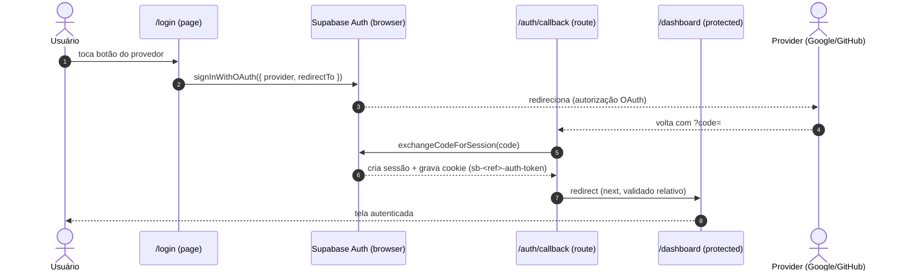

### 1.2 Acesso anônimo (visitante sem conta)

Fase 3.5 habilita **anonymous sign-ins** (Management API `AuthConfig.external_anonymous_users_enabled` + `supabase/config.toml`), para a galera pedir música pelo QR **sem criar conta**. Anônimo **não** cria bar (RPC `create_bar` recusa `is_anonymous`); host exige login real.

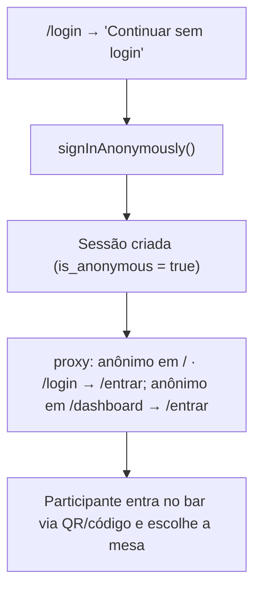

### 1.3 Login dev (e-mail/senha — somente `NODE_ENV=development`)

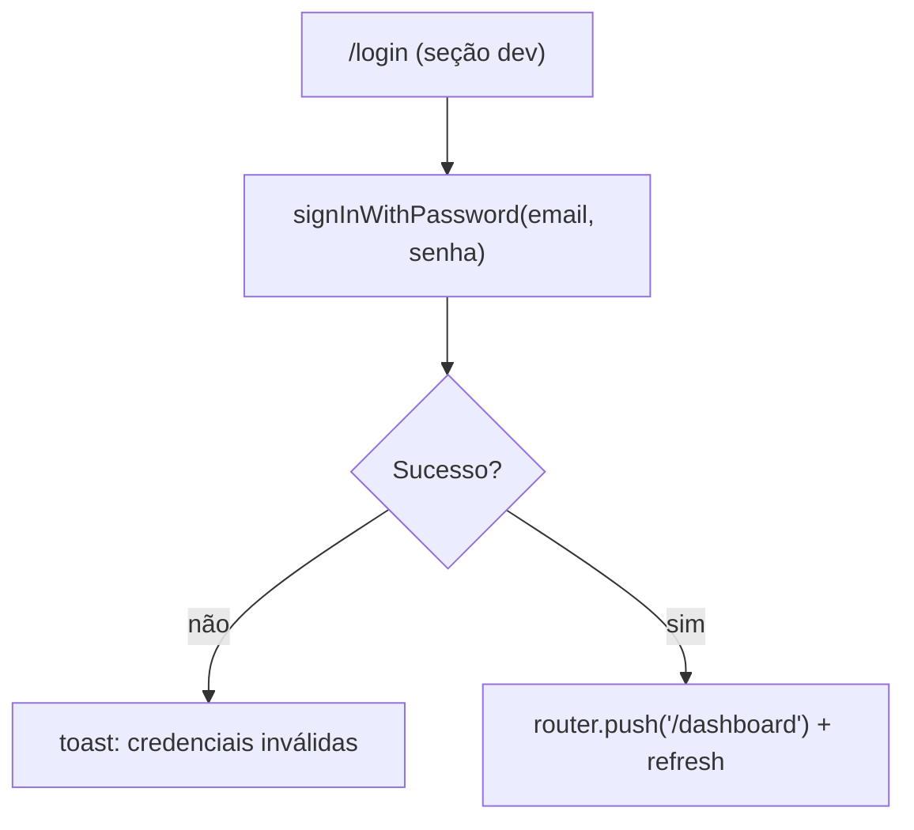

### 1.4 Manutenção de sessão (proxy)

Em Next 16 o middleware chama-se `proxy` (`src/proxy.ts`). Roda em toda request, renova o token e delega o controle de rota.

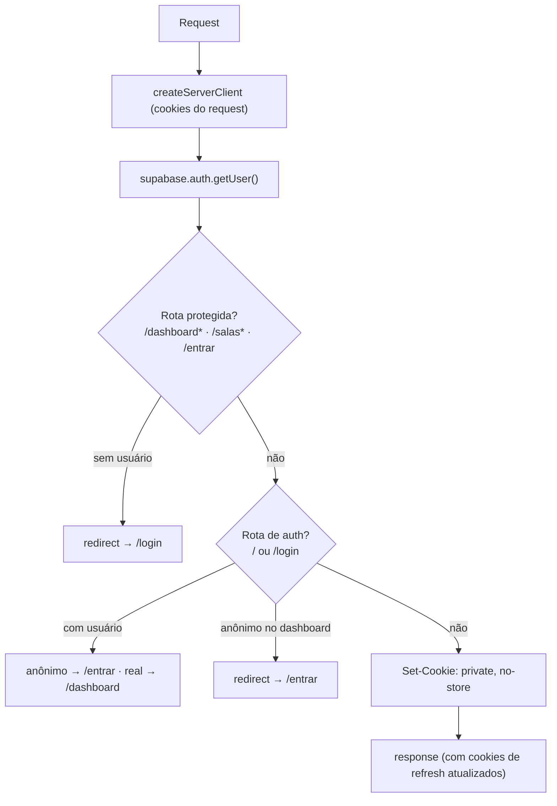

### 1.5 Logout

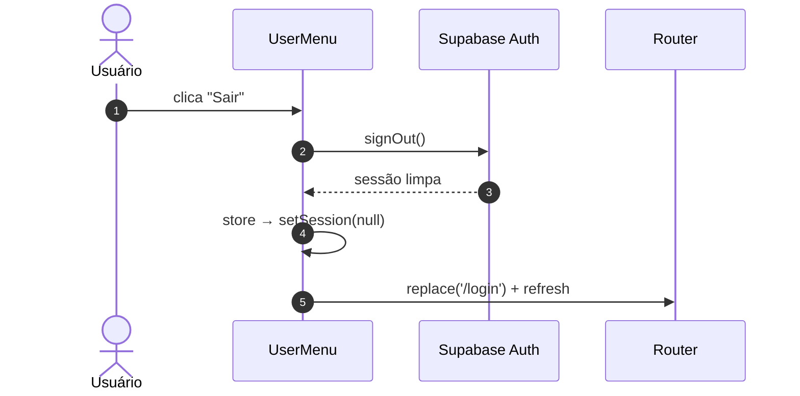

### 1.5 Sincronização da store (client)

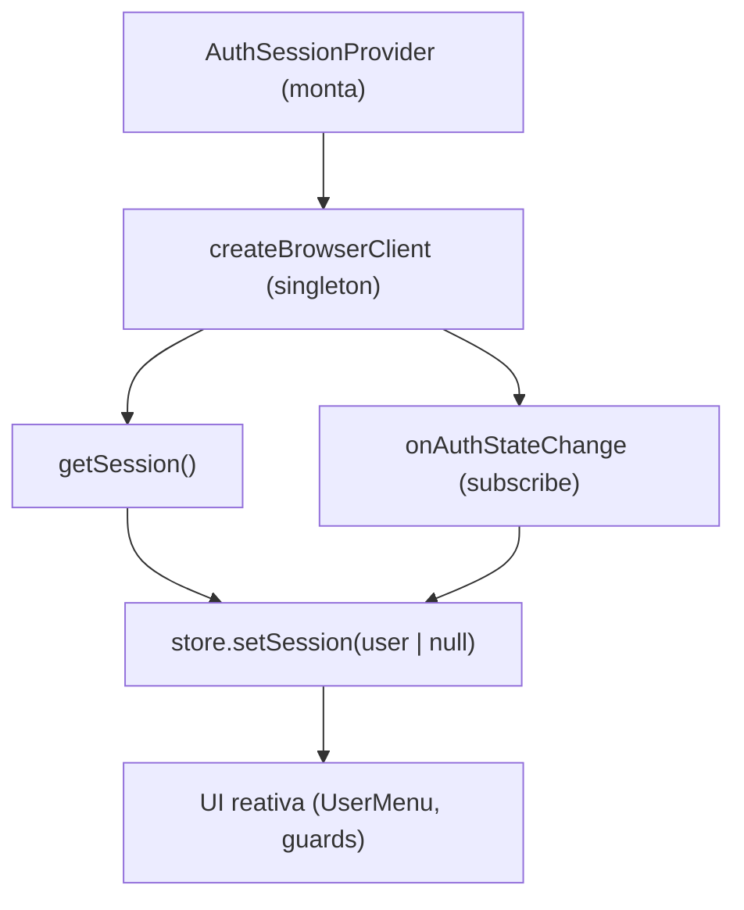

---

## 2. Ciclo de vida do bar e do karaokê

### 2.1 Criar bar (vira perfil + mesas + karaokê único)

Fase 3.5: **1 host = 1 bar** (`bars.host_id` único), que por padrão tem **1 karaokê** (`rooms.bar_id`; multi-sala desabilitado na UI — affordance "Adicionar sala" desabilitada). O QR/código do bar já resolve direto para o karaokê único ativo.

Requisito presença (2026-09-23): o cadastro também registra a **localização física** (geocode Nominatim com fallback GPS do dispositivo) e o **raio de presença** (`raio_permitido_metros`, default 150 m) — base do gate de presença (§2.2 e §2.2.1).

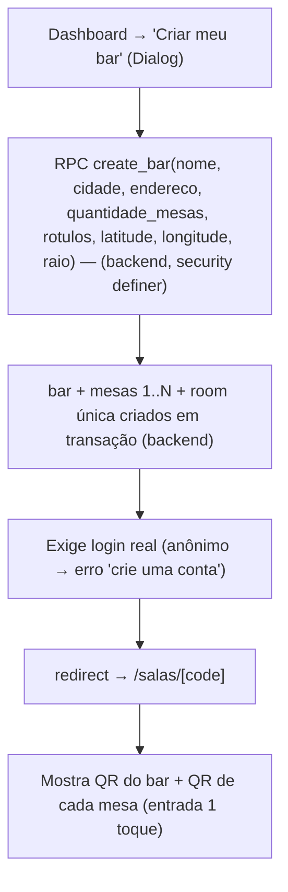

### 2.2 Entrar no bar (código/QR) — preview unificada + RPC `join_room` com mesa

A RPC `get_room_preview` **foi substituída** pela `get_entry_preview(p_code, p_mesa)` (migration `20260923000013`): `p_code` aceita **código de bar** **ou** código de room (QR legado de sala); o karaokê é a **única sala ativa do bar**.

**Gate de presença física** (requisito 2026-09-23): antes de `join_room`, o servidor lê o cookie `kf-geo` (geo do participante coletada sob consentimento §2.5) e compara com as coordenadas do bar (haversine ≤ `raio_permitido_metros`). **Participante fora do raio/sem geo → bloqueado** (banner + CTA "Permitir localização"); **host isento**; sem geo o participante mantém only-view (não entra).

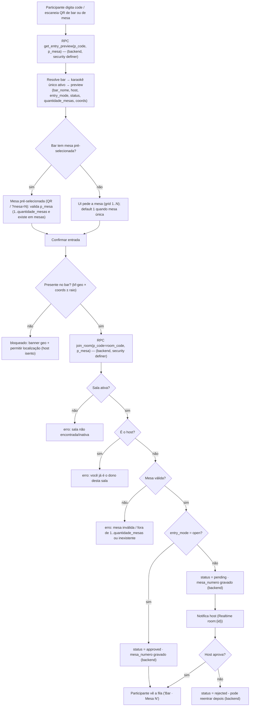

Regra de reentrada (migration `20260921000004`): `rejected` pode reentrar (RPC atualiza), mas `approved`/`pending` existentes **não** são rebaixados. O `mesa_numero` é atualizado no reentrar (`coalesce(excluded.mesa_numero, ...)`).

### 2.3 Fechar/sair

```mermaid
flowchart TD
    A["Host: Fechar sala (botão, confirm modal)"] --> B["RPC close_room(room_id) — (backend, security definer)"]
    B --> B1{É o host? (is_host)}
    B1 -->|não| B2["erro: só o dono pode encerrar a sala"]
    B1 -->|sim| C["rooms.status = closed"]
    C --> D["queue_items pendentes/approved/playing → cancelled (fila cancelada e interrompida)"]
    C --> E["DELETE room_members (todos expulsos)"]
    D --> F["Realtime → fila some da tela; participantes veem 'sala encerrada'"]
    A2["Participante: Sair"] --> G["DELETE room_members (self) (backend)"]
```

---

## 3. Fila (regras de banco)

### 3.1 Adicionar música

**Matriz de presença física (Fase 4):** antes do `INSERT`, a server action `addSongToQueueAction` revalida **membro aprovado/pendente** e a **presença** do participante (`kf-geo` × coords do bar ± raio) — mesmos códigos da busca: `GEO_UNAVAILABLE` (bar sem coords ou geo ausente) / `OUTSIDE_BAR` (fora do raio); **host isento**.

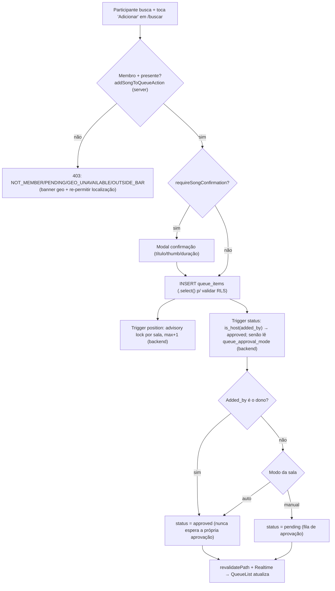

## 3.1.1 Busca de música no YouTube (Fase 4 — implementado)

Rota `/api/youtube/search` consumida pelo `SongSearch` (rota filha `/salas/[codigo]/buscar`). Credencial é resolvida **apenas no servidor** (service role); cache `song_cache` compartilhado entre karaokês; rate limit independente da cota da Google.

```mermaid
sequenceDiagram
    autonumber
    actor P as Participante (mobile)
    participant S as SongSearch (client)
    participant R as /api/youtube/search (server)
    participant DB as Supabase (RLS + service role)
    participant YT as YouTube Data API v3

    P->>S: digita (debounce 500ms + AbortController)
    S->>R: GET /api/youtube/search?room=CODE&q=...
    R->>DB: auth → rooms + bars (coords/raio) + membership (RLS)
    alt não membro / pendente
        R-->>S: 403 (NOT_MEMBER / PENDING)
    else participante
        R->>DB: presença: kf-geo × coords (host isento)
        alt fora do raio / sem geo
            R-->>S: 403 (OUTSIDE_BAR / GEO_UNAVAILABLE, geoRequired)
        end
    end
    R->>R: rate limit ip:userId 60/h
    alt estourou
        R-->>S: 429 + Retry-After
    end
    R->>DB: song_cache (query normalizada em bucket)
    alt cache fresco
        R-->>S: 200 { results, cached: true }
    else cache miss
        R->>R: credencial: chave do bar → OAuth host → OAuth app → dev
        R->>YT: search.list (safeSearch=strict, videoEmbeddable) + videos.list (duração)<br/>OAuth (app/host) via `Authorization: Bearer`; API key via `?key=`
        YT-->>R: itens
        R->>DB: song_cache.upsert (TTL 7d)
        R-->>S: 200 { results, cached: false, source }
    end
    S-->>P: lista (thumbnail + título + duração) + "Adicionar à fila"
```

**OAuth por-host:** bloco "Conta do YouTube" no `RoomSettings` (mostra "conectado à conta Google + data" quando há token, com botão "Remover conexão" que **revoga na Google** e apaga a linha) → `/auth/youtube/authorize` (estado nonce em cookie httpOnly, `access_type=offline&prompt=consent`) → Google → `/auth/youtube/callback` (exchange → `youtube_oauth_tokens`, **sem policies — service role**) → redirect à sala. Fallback do app: `scripts/youtube-app-oauth.mjs` (loopback) coleta o `YOUTUBE_APP_REFRESH_TOKEN` para o `.env.local`.

### 3.2 Aprovação (host)

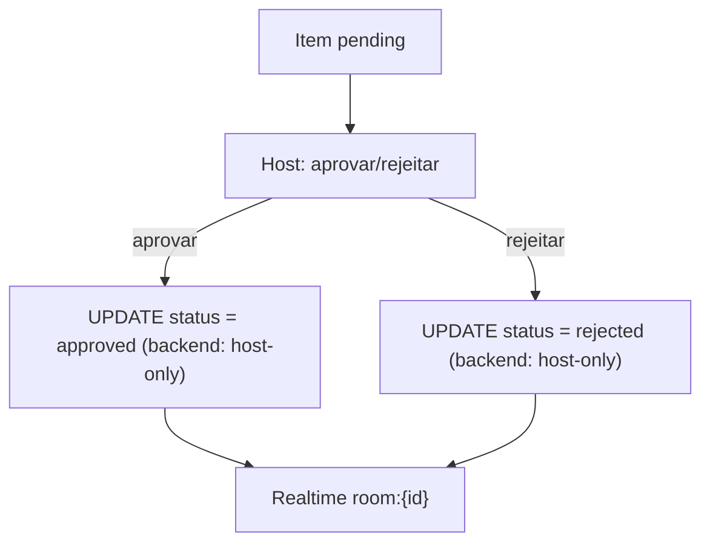

### 3.3 Reprodução e transições

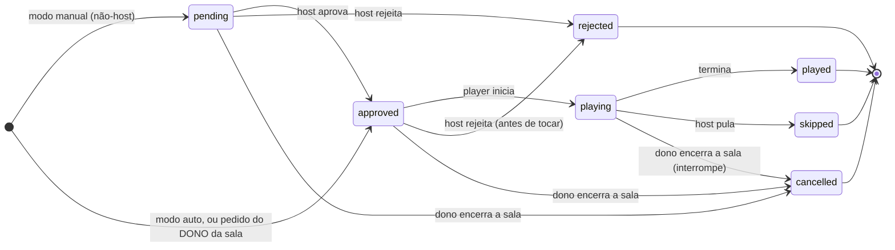

> A operação de **trocar música** (ver §5) mantém o item no mesmo estado de status em que está (com re-regra opcional conforme decisão de produto) — não cria um estado novo.

---

## 4. Player device (tela `/player/[codigoDaSala]`)

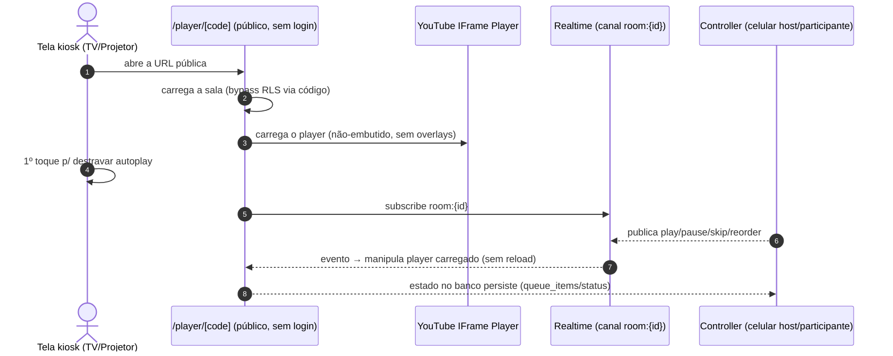

> Latência alvo < 2s entre ação no controller e reflexo na tela (Fase 6).

---

## 5. Proposta — Trocar a própria música mantendo a posição na fila

> Registrado no `TODO.md` (Fase 5). Decisões de fluxo **em aberto** (ver questões ao final).

### Contexto

Cada item da fila é uma linha de `queue_items` com `position` atribuído no banco. **Reordenar** (host, Fase 5) apenas reescreve `position`. **Trocar a música** é substituir o conteúdo de um item **sem mover a posição** — ex.: pedi "Aleatório" mas coloquei a versão errada, ou mudei de ideia antes de tocar.

### 5.1 Opções de implementação

| Opção                                                  | O que é                                                                                 | Prós                                                                                        | Contras                                                                                                | Veredito                   |
| ------------------------------------------------------ | --------------------------------------------------------------------------------------- | ------------------------------------------------------------------------------------------- | ------------------------------------------------------------------------------------------------------ | -------------------------- |
| **A — UPDATE in place via RPC `replace_queue_song`**   | Mantém a mesma linha (`id`, `position`, `status`) e só troca vídeo/título/thumb/duração | Posição garantida; atômico; Realtime é um único UPDATE; sem furo de histórico de `position` | Sobrescreve a música original (sem histórico); precisa de RPC + policy nova                            | **Recomendada para o MVP** |
| **B — DELETE + INSERT na mesma posição**               | Apaga o item e recria naquela posição (reajustando as demais)                           | "Histórico" do slot preservado (novo id)                                                    | `id` novo quebra a referência de "tocando agora" e o Realtime; 2 operações; risco de corrida           | Não recomendada            |
| **C — Normalizar `songs` e referenciar por `song_id`** | Tabela de catálogo; trocar = trocar FK                                                  | Modelo "correto" p/ futuro/catálogo                                                         | Retrabalho grande; mesma música por 2 pessoas vira 1 linha (perde "quem pediu o quê"); overkill no MVP | Roadmap                    |

**Decisão assumida: Opção A (RPC `security definer`), com regras de negócio fechadas com o PO:**

- **Quem troca (D1):** o **autor** da música, **ou o host** (host pode trocar qualquer item). O host **também pode reordenar** a playlist (movimenta `position`, funcionalidade já prevista na Fase 5 — complementar à troca, que **não** mexe em `position`).
- **Status preservado (D2):** a troca **mantém a aprovação** — no modo manual, uma música já aprovada, quando trocada, continua `approved` (troca 1:1, não volta ao fim nem à fila de aprovação).
- **Estados permitidos (D3):** `pending` e `approved` (enquanto ainda não tocou). Host **pode adicionar quantas músicas quiser, sem limite**, e a ordem da fila é sempre respeitada (o limite — se algum dia houver — nunca é imposto no insert de host).

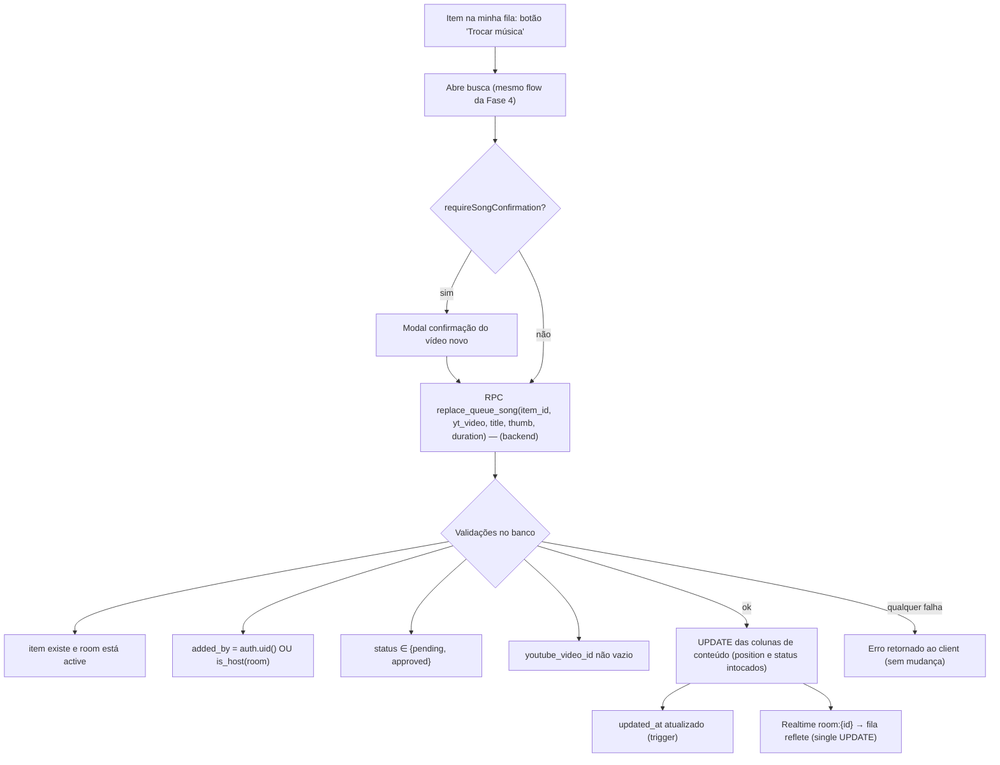

> **Reordenar (host) é operação distinta**: reescreve `position` de vários itens (pendências de Fase 5); a troca nunca muda a ordem.

**Payload da RPC (sugestão):** `p_item_id uuid`, `p_youtube_video_id text`, `p_title text`, `p_thumbnail_url text`, `p_duration_seconds integer`. Retorna o item atualizado ou levanta exceção com mensagem legível.

**RLS impactada:** hoje `queue_items` só aceita UPDATE de host (`queue_items_update_host`). A RPC `security definer` roda como superuser/definer e impõe as checagens acima explicitamente — **o client não ganha UPDATE direto** (nada de relaxar a policy).

### 5.2 Questões de fluxo — resolvidas com o PO ✅

| #   | Pergunta                                   | Resposta                                                                                       |
| --- | ------------------------------------------ | ---------------------------------------------------------------------------------------------- |
| D1  | Quem pode trocar?                          | **Autor + host** (e host também reordena a playlist).                                          |
| D2  | Modo manual: música aprovada que é trocada | **Mantém aprovada** (não volta ao fim nem à aprovação).                                        |
| D3  | Estados permitidos para trocar             | **`pending` e `approved`** (ainda não tocou). Extras: host adiciona **sem limite** de músicas. |

### 5.3 Impacto na UI (proposta, vide `fluxos-do-usuario.md`)

- Botão "Trocar" em **meus pedidos** (itens ainda não tocados).
- O mesmo componente de busca/confirmação da Fase 4 é reutilizado.
- Feedback otimista + rollback em falha; interceptar no toast de erro da RPC.
