# Fluxos do sistema

Fluxos técnicos end-to-end no estado atual do MVP (Fase 2 concluída) + propostas.

---

## 1. Autenticação e sessão

### 1.1 Login OAuth (Google/GitHub)

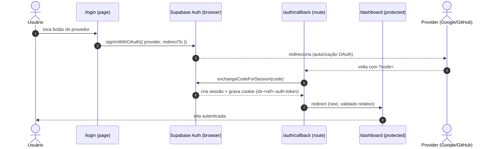

### 1.2 Login dev (e-mail/senha — somente `NODE_ENV=development`)

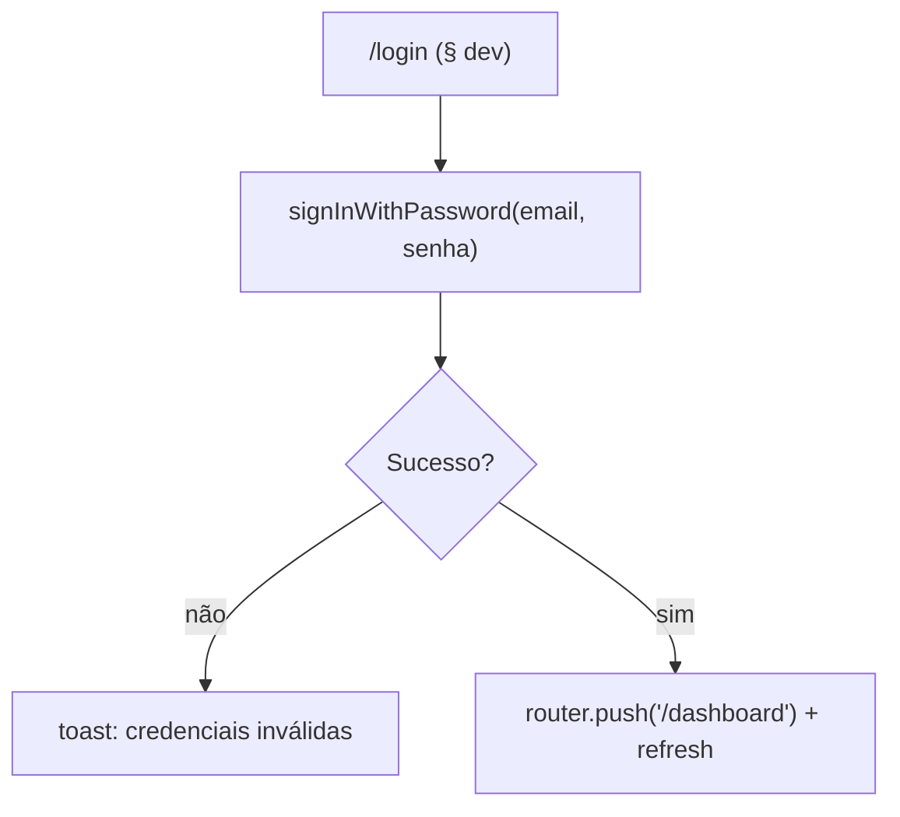

### 1.3 Manutenção de sessão (proxy)

Em Next 16 o middleware chama-se `proxy` (`src/proxy.ts`). Roda em toda request, renova o token e delega o controle de rota.

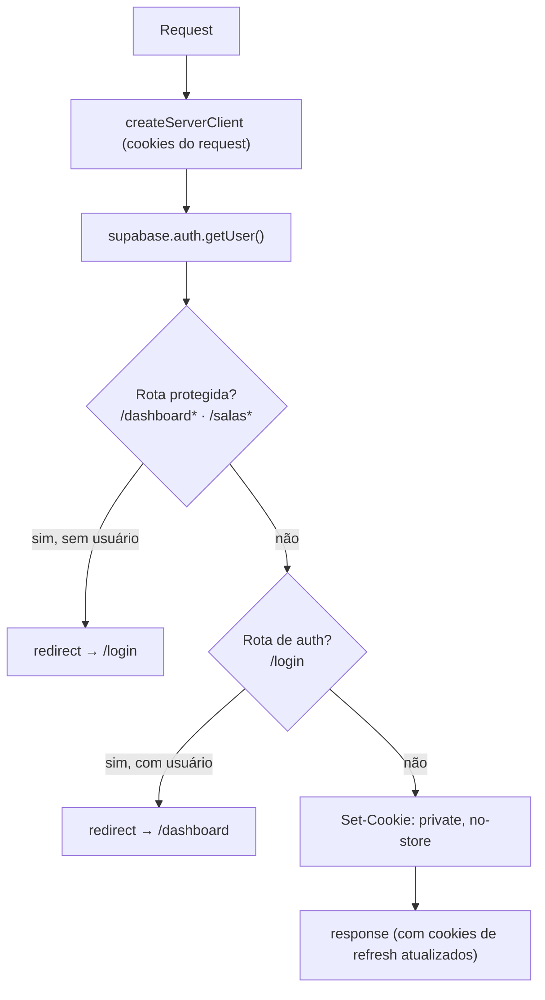

### 1.4 Logout

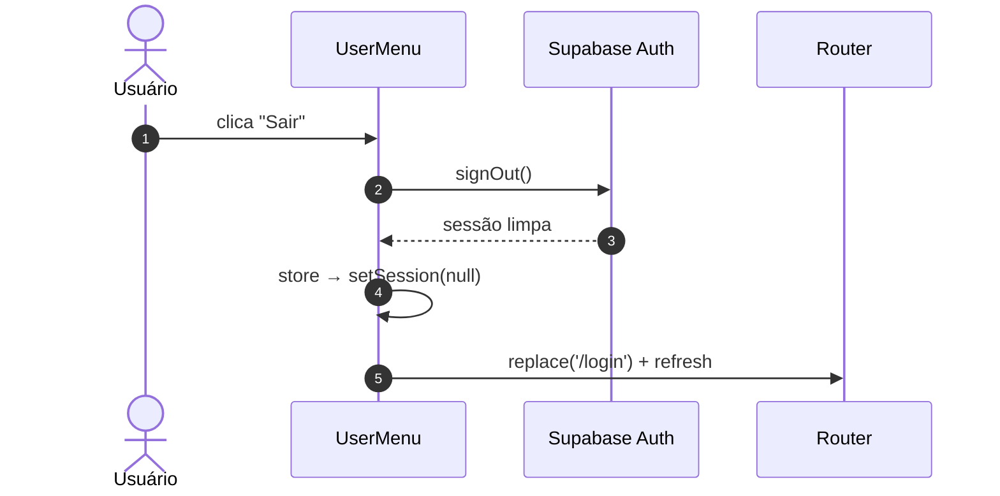

### 1.5 Sincronização da store (client)

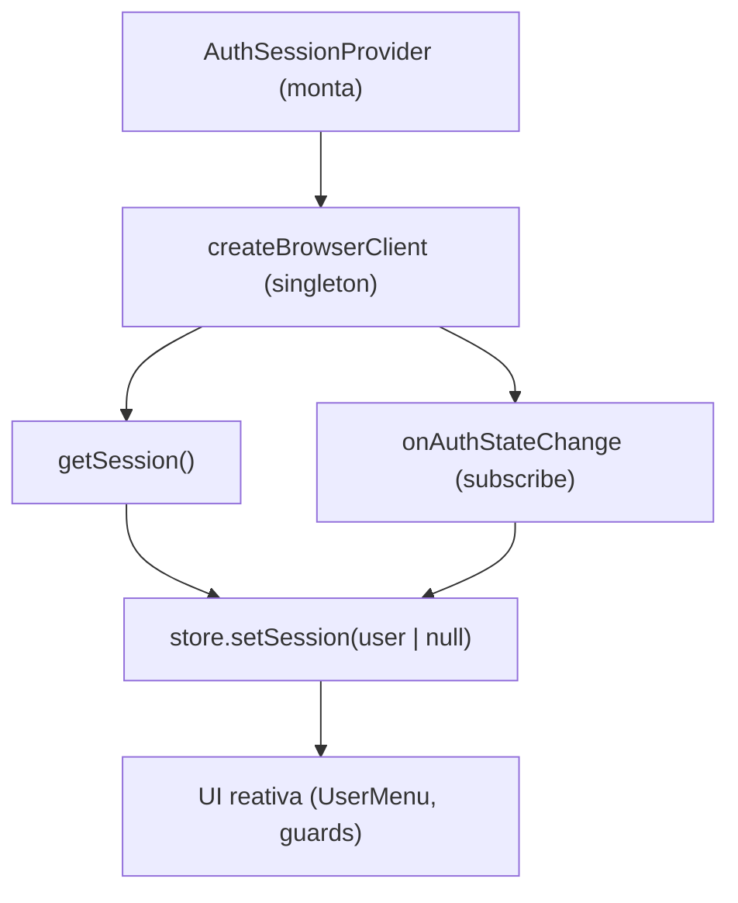

---

## 2. Ciclo de vida da sala

### 2.1 Criar sala (Fase 3 — Proposta)

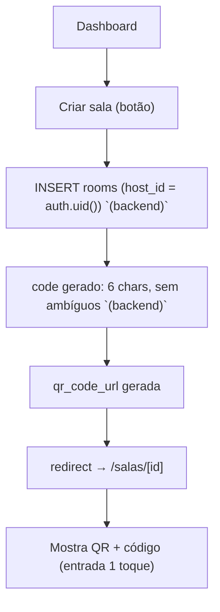

### 2.2 Entrar na sala (código/QR) — RPC `join_room`

```mermaid
flowchart TD
    A["Participante escaneia QR / digita code"] --> B["RPC join_room(code) `(backend, security definer)`"]
    B --> C{Sala ativa?}
    C -- não --> Z[erro: sala não encontrada/inativa]
    C -- sim --> D{É o host?}
    D -- sim --> Y[erro: você já é o dono]
    D -- não --> E{entry_mode = open?}
    E -- sim --> F["status = approved (entra direto) `(backend)`"]
    E -- não --> G["status = pending (aguarda host) `(backend)`"]
    F --> H["Participante vê a fila"]
    G --> I["Notifica host (Realtime room:{id})"]
    I --> J{Host aprova?}
    J -- sim --> H
    J -- não --> K[status = rejected - pode reentrar depois `(backend)`]
```

Regra de reentrada (migration `20260921000004`): `rejected` pode reentrar (RPC atualiza), mas `approved`/`pending` existentes **não** são rebaixados.

### 2.3 Fechar sala / sair (host)

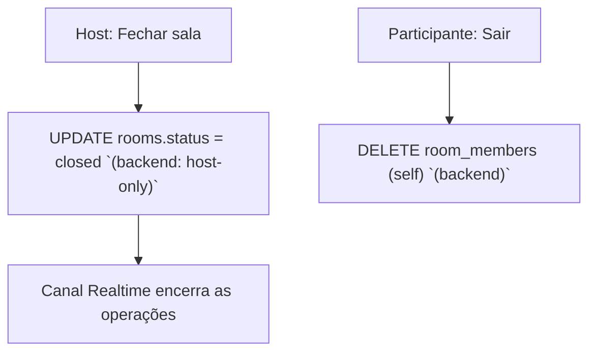

---

## 3. Fila (regras de banco)

### 3.1 Adicionar música

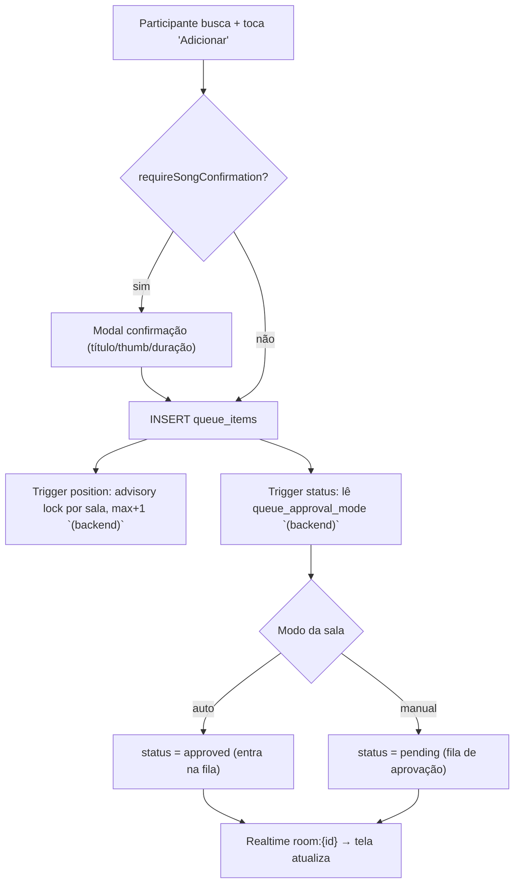

### 3.2 Aprovação (host)

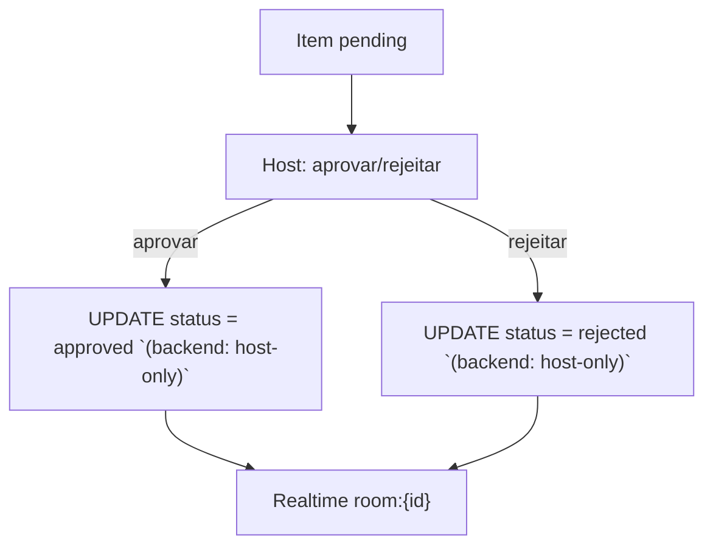

### 3.3 Reprodução e transições

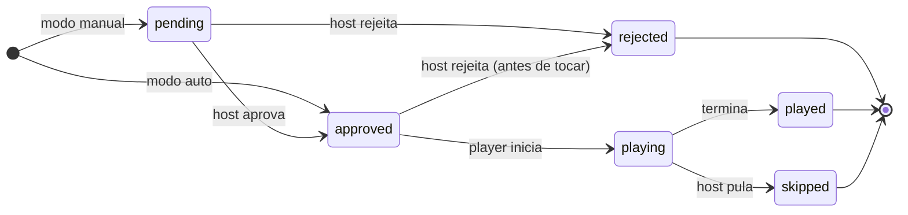

> A operação de **trocar música** (ver §5) mantém o item no mesmo estado de status em que está (com re-regra opcional conforme decisão de produto) — não cria um estado novo.

---

## 4. Player device (tela `/player/[codigoDaSala]`)

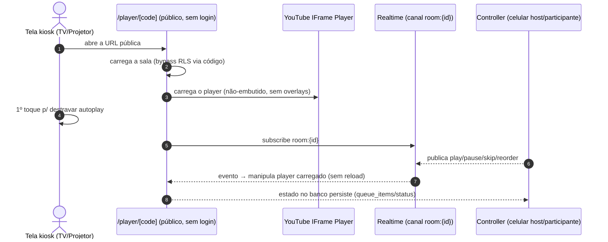

> Latência alvo < 2s entre ação no controller e reflexo na tela (Fase 6).

---

## 5. Proposta — Trocar a própria música mantendo a posição na fila

> Registrado no `TODO.md` (Fase 5). Decisões de fluxo **em aberto** (ver questões ao final).

### Contexto

Cada item da fila é uma linha de `queue_items` com `position` atribuído no banco. **Reordenar** (host, Fase 5) apenas reescreve `position`. **Trocar a música** é substituir o conteúdo de um item **sem mover a posição** — ex.: pedi "Aleatório" mas coloquei a versão errada, ou mudei de ideia antes de tocar.

### 5.1 Opções de implementação

| Opção                                                  | O que é                                                                                 | Prós                                                                                        | Contras                                                                                                | Veredito                   |
| ------------------------------------------------------ | --------------------------------------------------------------------------------------- | ------------------------------------------------------------------------------------------- | ------------------------------------------------------------------------------------------------------ | -------------------------- |
| **A — UPDATE in place via RPC `replace_queue_song`**   | Mantém a mesma linha (`id`, `position`, `status`) e só troca vídeo/título/thumb/duração | Posição garantida; atômico; Realtime é um único UPDATE; sem furo de histórico de `position` | Sobrescreve a música original (sem histórico); precisa de RPC + policy nova                            | **Recomendada para o MVP** |
| **B — DELETE + INSERT na mesma posição**               | Apaga o item e recria naquela posição (reajustando as demais)                           | "Histórico" do slot preservado (novo id)                                                    | `id` novo quebra a referência de "tocando agora" e o Realtime; 2 operações; risco de corrida           | Não recomendada            |
| **C — Normalizar `songs` e referenciar por `song_id`** | Tabela de catálogo; trocar = trocar FK                                                  | Modelo "correto" p/ futuro/catálogo                                                         | Retrabalho grande; mesma música por 2 pessoas vira 1 linha (perde "quem pediu o quê"); overkill no MVP | Roadmap                    |

**Decisão assumida: Opção A (RPC `security definer`), com regras de negócio fechadas com o PO:**

- **Quem troca (D1):** o **autor** da música, **ou o host** (host pode trocar qualquer item). O host **também pode reordenar** a playlist (movimenta `position`, funcionalidade já prevista na Fase 5 — complementar à troca, que **não** mexe em `position`).
- **Status preservado (D2):** a troca **mantém a aprovação** — no modo manual, uma música já aprovada, quando trocada, continua `approved` (troca 1:1, não volta ao fim nem à fila de aprovação).
- **Estados permitidos (D3):** `pending` e `approved` (enquanto ainda não tocou). Host **pode adicionar quantas músicas quiser, sem limite**, e a ordem da fila é sempre respeitada (o limite — se algum dia houver — nunca é imposto no insert de host).


> **Reordenar (host) é operação distinta**: reescreve `position` de vários itens (pendências de Fase 5); a troca nunca muda a ordem.

**Payload da RPC (sugestão):** `p_item_id uuid`, `p_youtube_video_id text`, `p_title text`, `p_thumbnail_url text`, `p_duration_seconds integer`. Retorna o item atualizado ou levanta exceção com mensagem legível.

**RLS impactada:** hoje `queue_items` só aceita UPDATE de host (`queue_items_update_host`). A RPC `security definer` roda como superuser/definer e impõe as checagens acima explicitamente — **o client não ganha UPDATE direto** (nada de relaxar a policy).

### 5.2 Questões de fluxo — resolvidas com o PO ✅

| #   | Pergunta                                   | Resposta                                                                                       |
| --- | ------------------------------------------ | ---------------------------------------------------------------------------------------------- |
| D1  | Quem pode trocar?                          | **Autor + host** (e host também reordena a playlist).                                          |
| D2  | Modo manual: música aprovada que é trocada | **Mantém aprovada** (não volta ao fim nem à aprovação).                                        |
| D3  | Estados permitidos para trocar             | **`pending` e `approved`** (ainda não tocou). Extras: host adiciona **sem limite** de músicas. |

### 5.3 Impacto na UI (proposta, vide `fluxos-do-usuario.md`)

- Botão "Trocar" em **meus pedidos** (itens ainda não tocados).
- O mesmo componente de busca/confirmação da Fase 4 é reutilizado.
- Feedback otimista + rollback em falha; interceptar no toast de erro da RPC.
