# Fluxos do sistema

Fluxos técnicos end-to-end no estado atual do MVP (Fases 1–3.5 **e Fase 4 — busca + fila** concluídas) + propostas.

---

## 1. Autenticação e sessão

### 1.1 Login OAuth (Google/GitHub)

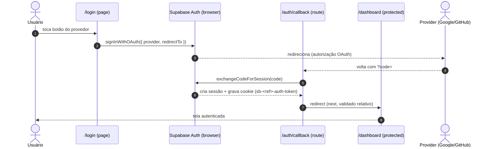
```mermaid
sequenceDiagram
    autonumber
    actor U as Usuário
    participant L as /login (page)
    participant S as Supabase Auth (browser)
    participant CB as /auth/callback (route)
    participant D as /dashboard (protected)
    actor P as Provider (Google/GitHub)

    U->>L: toca botão do provedor
    L->>S: signInWithOAuth({ provider, redirectTo })
    S-->>P: redireciona (autorização OAuth)
    P-->>CB: volta com ?code=
    CB->>S: exchangeCodeForSession(code)
    S-->>CB: cria sessão + grava cookie (sb-<ref>-auth-token)
    CB->>D: redirect (next, validado relativo)
    D-->>U: tela autenticada
```

### 1.2 Acesso anônimo (visitante sem conta)

Fase 3.5 habilita **anonymous sign-ins** (Management API `AuthConfig.external_anonymous_users_enabled` + `supabase/config.toml`), para a galera pedir música pelo QR **sem criar conta**. Anônimo **não** cria bar (RPC `create_bar` recusa `is_anonymous`); host exige login real.

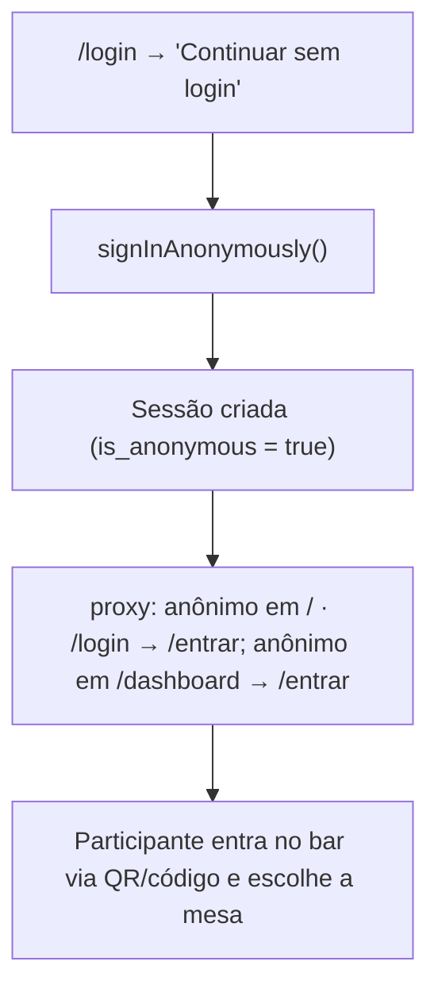
```mermaid
flowchart TD
    A["/login → 'Continuar sem login'"] --> B["signInAnonymously()"]
    B --> C["Sessão criada (is_anonymous = true)"]
    C --> D["proxy: anônimo em / · /login → /entrar; anônimo em /dashboard → /entrar"]
    D --> E["Participante entra no bar via QR/código e escolhe a mesa"]
```

### 1.3 Login dev (e-mail/senha — somente `NODE_ENV=development`)

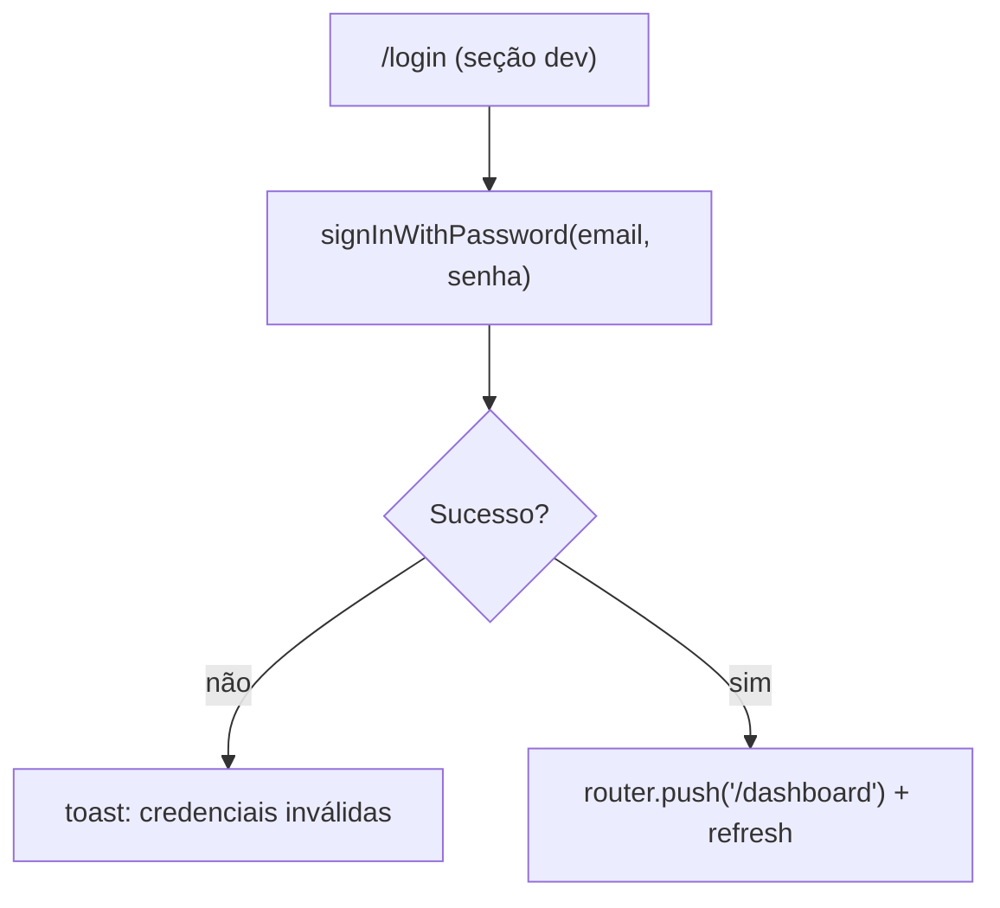
```mermaid
flowchart TD
    A["/login (seção dev)"] --> B["signInWithPassword(email, senha)"]
    B --> C{Sucesso?}
    C -->|não| E["toast: credenciais inválidas"]
    C -->|sim| F["router.push('/dashboard') + refresh"]
```

### 1.4 Manutenção de sessão (proxy)

Em Next 16 o middleware chama-se `proxy` (`src/proxy.ts`). Roda em toda request, renova o token e delega o controle de rota.

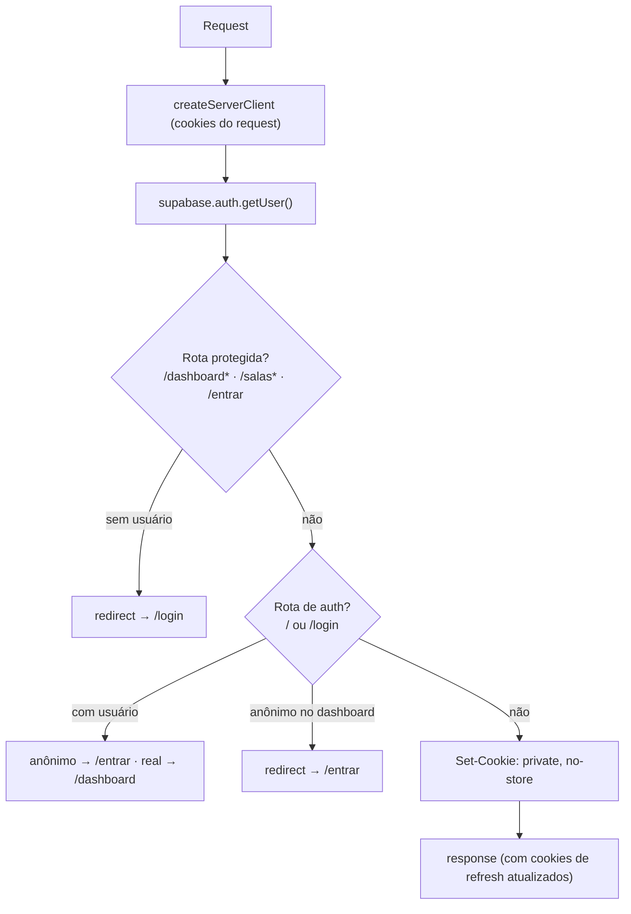
```mermaid
flowchart TD
    A["Request"] --> B["createServerClient (cookies do request)"]
    B --> C["supabase.auth.getUser()"]
    C --> D{Rota protegida?<br/>/dashboard* · /salas* · /entrar}
    D -->|sem usuário| E["redirect → /login"]
    D -->|não| F{Rota de auth?<br/>/ ou /login}
    F -->|com usuário| G["anônimo → /entrar · real → /dashboard"]
    F -->|anônimo no dashboard| G2["redirect → /entrar"]
    F -->|não| H["Set-Cookie: private, no-store"]
    H --> I["response (com cookies de refresh atualizados)"]
```

### 1.5 Logout

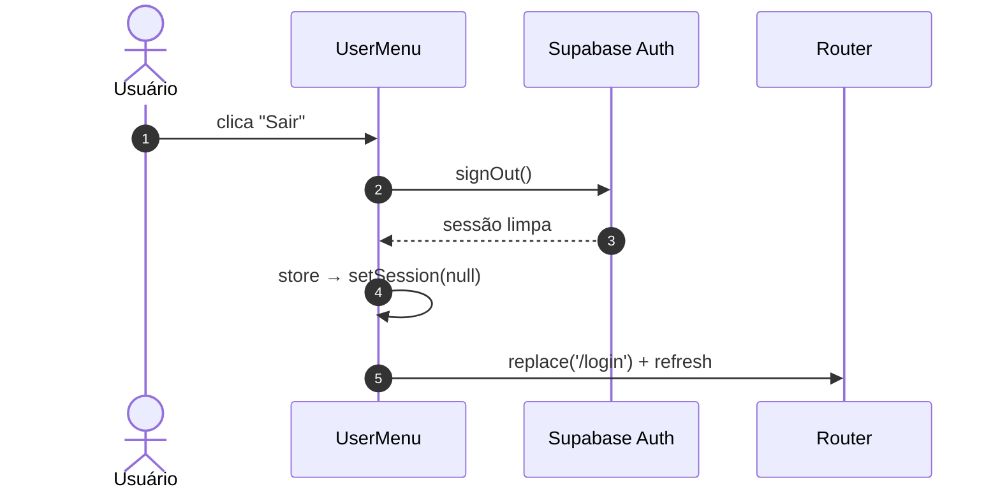
```mermaid
sequenceDiagram
    autonumber
    actor U as Usuário
    participant UM as UserMenu
    participant S as Supabase Auth
    participant R as Router

    U->>UM: clica "Sair"
    UM->>S: signOut()
    S-->>UM: sessão limpa
    UM->>UM: store → setSession(null)
    UM->>R: replace('/login') + refresh
```

### 1.5 Sincronização da store (client)

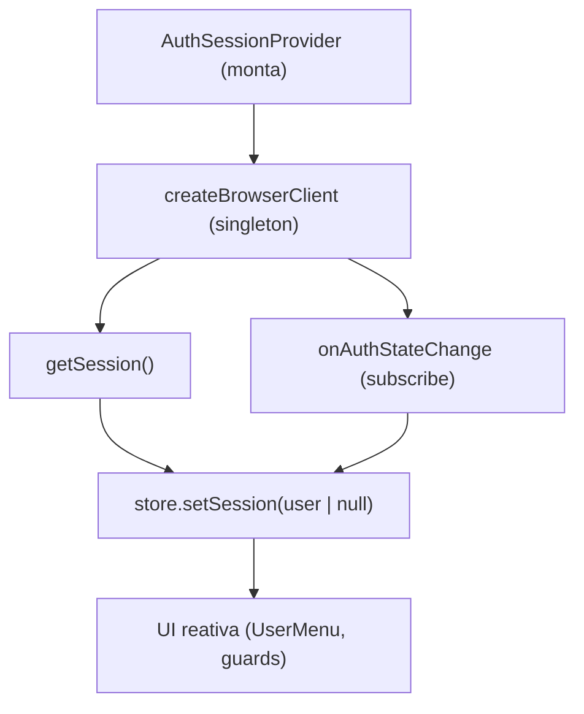
```mermaid
flowchart TD
    A["AuthSessionProvider (monta)"] --> B["createBrowserClient (singleton)"]
    B --> C["getSession()"]
    C --> D["store.setSession(user | null)"]
    B --> E["onAuthStateChange (subscribe)"]
    E --> D
    D --> F["UI reativa (UserMenu, guards)"]
```

---

## 2. Ciclo de vida do bar e do karaokê

### 2.1 Criar bar (vira perfil + mesas + karaokê único)

Fase 3.5: **1 host = 1 bar** (`bars.host_id` único), que por padrão tem **1 karaokê** (`rooms.bar_id`; multi-sala desabilitado na UI — affordance "Adicionar sala" desabilitada). O QR/código do bar já resolve direto para o karaokê único ativo.

Requisito presença (2026-09-23): o cadastro também registra a **localização física** (geocode Nominatim com fallback GPS do dispositivo) e o **raio de presença** (`raio_permitido_metros`, default 150 m) — base do gate de presença (§2.2 e §2.2.1).

**Código da sala configurável** (2026-09-24, migration `20260924000022`): `rooms.code` passa a aceitar **3–12 alfanuméricos maiúsculos** (sem acentos/espaços). No create: o host pode informar `codigo_entrada` (opcional); **default = nome do bar todo junto em maiúsculas** (`driveRoomCodeFromName`: `Karaokê do Zé` → `KARAOKEDOZE`, truncado em 12; se o resultado ficar com <3 chars → `KARAOKE` + sufixo iterativo `KARAOKE1`, `KARAOKE2`…). Helpers RPC `unique_room_code`/`default_room_code`/`room_code_available` checam colisão com `rooms.code` **e** `bars.code` (a entrada resolve o bar primeiro). O host pode trocar o código depois: `updateRoomCodeAction` (RoomSettings) valida padrão + disponibilidade, atualiza `rooms.code` (RLS host-only) e redireciona a página para o novo código.

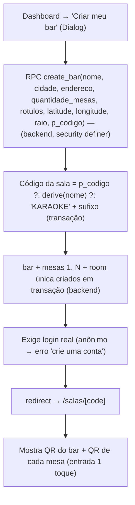
```mermaid
flowchart TD
    A["Dashboard → 'Criar meu bar' (Dialog)"] --> B["RPC create_bar(nome, cidade, endereco, quantidade_mesas, rotulos, latitude, longitude, raio, p_codigo) — (backend, security definer)"]
    B --> C["Código da sala = p_codigo ?: derive(nome) ?: 'KARAOKE' + sufixo (transação)"]
    C --> D["bar + mesas 1..N + room única criados em transação (backend)"]
    D --> E["Exige login real (anônimo → erro 'crie uma conta')"]
    E --> F["redirect → /salas/[code]"]
    F --> G["Mostra QR do bar + QR de cada mesa (entrada 1 toque)"]
```

### 2.2 Entrar no bar (código/QR) — preview unificada + RPC `join_room` com mesa

A RPC `get_room_preview` **foi substituída** pela `get_entry_preview(p_code, p_mesa)` (migration `20260923000013`): `p_code` aceita **código de bar** **ou** código de room (QR legado de sala); o karaokê é a **única sala ativa do bar**.

**Mesa escolhida dentro da sala na entrada por código** (2026-09-24): QR de bar/mesa (`?bar=…[&mesa=N]`) mantém o fluxo abaixo — mesa vai no `join_room`. Já o **código puro de sala** (`/entrar?code=KARAOKE` ou digitado) entra **direto na sala sem mesa** (`join_room(code)` com `p_mesa` nulo) e o participante é **obrigado a escolher a mesa dentro da sala** (`pick_mesa`, migration `20260924000022` — valida mesa em 1..`quantidade_mesas`, só para membro `approved` de sala `active`); enquanto `pending` vê o aviso de aguardando aprovação.

**Gate de presença física** (requisito 2026-09-23): antes de `join_room`, o servidor lê o cookie `kf-geo` (geo do participante coletada sob consentimento §2.5) e compara com as coordenadas do bar (haversine ≤ `raio_permitido_metros`). **Participante fora do raio/sem geo → bloqueado** (banner + CTA "Permitir localização"); **host isento**; sem geo o participante mantém only-view (não entra). **Exceção (2026-09-25):** quem já tem membership `pending`/`rejected` da sala vai direto para a tela de espera — o gate não esconde um pedido em andamento. O gate é independente de `entry_mode`: **entrada livre (`open`) não dispensa a presença** — o painel do host avisa isso e mostra o raio no mapa (abaixo).

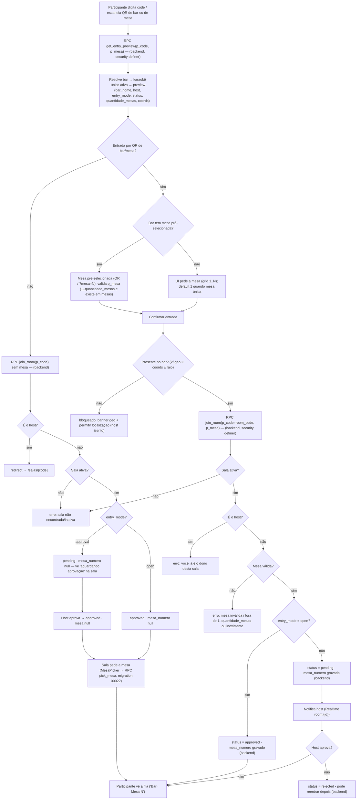
```mermaid
flowchart TD
    A["Participante digita code / escaneia QR de bar ou de mesa"] --> V["RPC get_entry_preview(p_code, p_mesa) — (backend, security definer)"]
    V --> W["Resolve bar → karaokê único ativo → preview<br/>(bar_nome, host, entry_mode, status, quantidade_mesas, coords)"]
    W --> R{"Entrada por QR de bar/mesa?"}
    R -->|não| ROOM["RPC join_room(p_code) sem mesa — (backend)"]
    ROOM --> DG0{É o host?}
    DG0 -->|sim| HOST["redirect → /salas/[code]"]
    DG0 -->|não| DG1{Sala ativa?}
    DG1 -->|não| Z["erro: sala não encontrada/inativa"]
    DG1 -->|sim| ROOM2{entry_mode?}
    ROOM2 -->|approval| PEND["pending · mesa_numero null — vê 'aguardando aprovação' na sala"]
    ROOM2 -->|open| APPR["approved · mesa_numero null"]
    APPR --> MESA_DENTRO["Sala pede a mesa (MesaPicker → RPC pick_mesa, migration 00022)"]
    PEND --> HOST2["Host aprova → approved · mesa null"]
    HOST2 --> MESA_DENTRO
    MESA_DENTRO --> H["Participante vê a fila ('Bar · Mesa N')"]
    R -->|sim| X{Bar tem mesa pré-selecionada?}
    X -->|sim| X1["Mesa pré-selecionada (QR / ?mesa=N): valida p_mesa (1..quantidade_mesas e existe em mesas)"]
    X -->|não| X2["UI pede a mesa (grid 1..N); default 1 quando mesa única"]
    X1 --> X3["Confirmar entrada"]
    X2 --> X3
    X3 --> P{"Presente no bar? (kf-geo × coords ± raio)"}
    P -->|não| P1["bloqueado: banner geo + permitir localização (host isento)"]
    P -->|sim| B["RPC join_room(p_code=room_code, p_mesa) — (backend, security definer)"]
    B --> C{Sala ativa?}
    C -->|não| Z
    C -->|sim| D{É o host?}
    D -->|sim| Y["erro: você já é o dono desta sala"]
    D -->|não| E{Mesa válida?}
    E -->|não| E1["erro: mesa inválida / fora de 1..quantidade_mesas ou inexistente"]
    E -->|sim| E2{entry_mode = open?}
    E2 -->|sim| F["status = approved · mesa_numero gravado (backend)"]
    E2 -->|não| G["status = pending · mesa_numero gravado (backend)"]
    F --> H
    G --> I["Notifica host (Realtime room:{id})"]
    I --> J{Host aprova?}
    J -->|sim| H
    J -->|não| K["status = rejected - pode reentrar depois (backend)"]
```

Regra de reentrada (migration `20260921000004`): `rejected` pode reentrar (RPC atualiza), mas `approved`/`pending` existentes **não** são rebaixados. O `mesa_numero` é atualizado no reentrar (`coalesce(excluded.mesa_numero, ...)`) ou via `pick_mesa`.

**Recuperar/cancelar o pedido (2026-09-25):** o `pending` **sobrevive à navegação** — `getEntryPreviewAction` lê a própria linha em `room_members` (RLS `room_members_select_self_or_host`) e devolve `membership`, de modo que `/entrar?code=…`, `/entrar?bar=…` e `/salas/[código]` renderizam a mesma tela de espera (`EntryApprovalWait`) sem pedir entrada de novo. `getMyEntryRequestsAction` lista os pedidos `pending` com bar/código/mesa para o dashboard e o `/entrar` sem token; como a RLS de `rooms` esconde a sala de quem não está `approved`, nome e código são resolvidos com o client de service role (**somente leitura**, nunca `youtube_api_key`). Cancelar é `cancelEntryRequestAction` (`DELETE` da própria linha com `status = 'pending'`, permitido pela RLS) — sem migration nova.

**Raio de presença no painel do host (2026-09-25, editável em 2026-09-26):** `bars.raio_permitido_metros` tem default **500 m** (migration `20260925000024`, `check` 50..1000 mantida; bars existentes migrados para 500) e é o número que o gate valida em `checkPresence`/`requirePresence` — a tela lê o mesmo campo, então mapa e gate não podem divergir. O card `PresenceGateInfo` (abaixo dos toggles, só para o host) mostra: o aviso de que o gate vale nos dois modos de entrada e de que o raio vale para **todas as salas do bar**, o mapa com o círculo do raio em metros (`PresenceRadiusMap` = Leaflet + tiles do OpenStreetMap, sem chave de API), links para Google Maps/OpenStreetMap e o campo "Raio de presença" (**input numérico + slider**, 50–1000 m de 50 em 50) com status de gravação, "Restaurar 500 m" e botão de reenvio em caso de erro. **Prévia antes de gravar:** mover o controle redesenha o círculo e reescreve o texto do aviso com o valor local; a gravação acontece no **commit** (soltar o slider, sair do campo, Enter ou debounce de 500 ms). Bar sem coordenadas: o gate cai em `geo-unavailable` e bloqueia todo participante (o host entra).

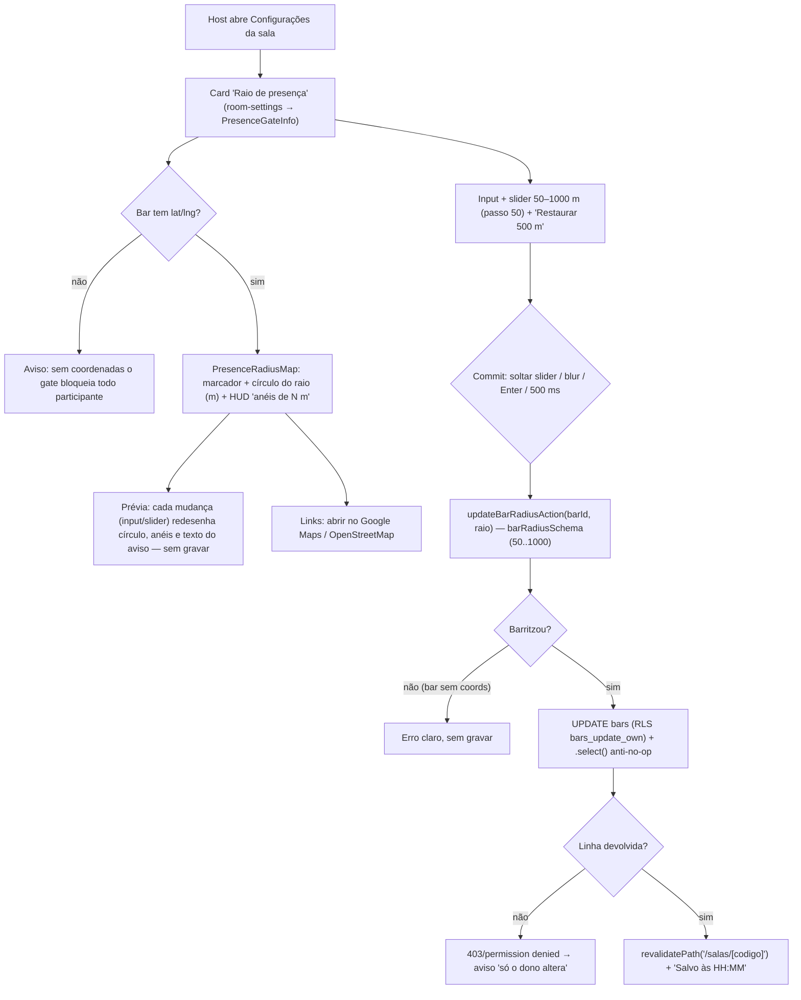
```mermaid
flowchart TD
    A["Host abre Configurações da sala"] --> B["Card 'Raio de presença' (room-settings → PresenceGateInfo)"]
    B --> C{"Bar tem lat/lng?"}
    C -->|não| C1["Aviso: sem coordenadas o gate bloqueia todo participante"]
    C -->|sim| D["PresenceRadiusMap: marcador + círculo do raio (m) + HUD 'anéis de N m'"]
    D --> D1["Prévia: cada mudança (input/slider) redesenha círculo, anéis e texto do aviso — sem gravar"]
    B --> E["Input + slider 50–1000 m (passo 50) + 'Restaurar 500 m'"]
    E --> F{"Commit: soltar slider / blur / Enter / 500 ms"}
    F --> G["updateBarRadiusAction(barId, raio) — barRadiusSchema (50..1000)"]
    G --> H{"Barritzou?"}
    H -->|"não (bar sem coords)"| H1["Erro claro, sem gravar"]
    H -->|sim| I["UPDATE bars (RLS bars_update_own) + .select() anti-no-op"]
    I --> J{"Linha devolvida?"}
    J -->|não| J1["403/permission denied → aviso 'só o dono altera'"]
    J -->|sim| K["revalidatePath('/salas/[codigo]') + 'Salvo às HH:MM'"]
    D --> L["Links: abrir no Google Maps / OpenStreetMap"]
```

**Dono do raio (2026-09-26):** a escrita é feita pelo **client do usuário** (`updateBarRadiusAction` → `supabase.from("bars").update(...)`), não por RPC — quem não é o dono é barrado pela RLS `bars_update_own`, e o `.select()` posterior transforma o "no-op" da policy em erro em vez de sucesso silencioso. O valor é do **bar**, não da sala: o raio salvo vale para as outras salas do mesmo bar sem nova ação. Constantes e validação são uma fonte só (`RAIO_*` em `src/types/bar.ts` → `barRadiusSchema` em `src/lib/bars/schema.ts`), casando com o `check` do banco; **nenhuma migration nova** foi necessária.

### 2.3 Fechar/sair/reabrir

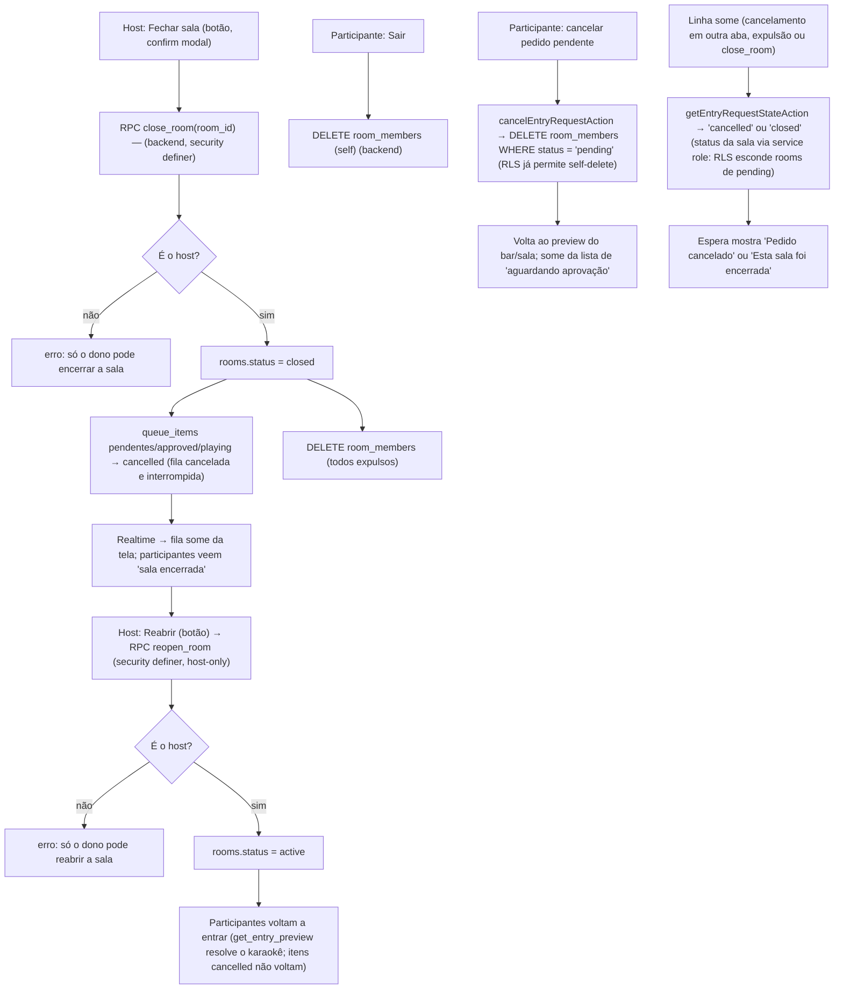
```mermaid
flowchart TD
    A["Host: Fechar sala (botão, confirm modal)"] --> B["RPC close_room(room_id) — (backend, security definer)"]
    B --> B1{É o host?}
    B1 -->|não| B2["erro: só o dono pode encerrar a sala"]
    B1 -->|sim| C["rooms.status = closed"]
    C --> D["queue_items pendentes/approved/playing → cancelled (fila cancelada e interrompida)"]
    C --> E["DELETE room_members (todos expulsos)"]
    D --> F["Realtime → fila some da tela; participantes veem 'sala encerrada'"]
    F --> R["Host: Reabrir (botão) → RPC reopen_room (security definer, host-only)"]
    R --> R1{É o host?}
    R1 -->|não| R2["erro: só o dono pode reabrir a sala"]
    R1 -->|sim| R3["rooms.status = active"]
    R3 --> R4["Participantes voltam a entrar (get_entry_preview resolve o karaokê; itens cancelled não voltam)"]
    A2["Participante: Sair"] --> G["DELETE room_members (self) (backend)"]
    A3["Participante: cancelar pedido pendente"] --> A4["cancelEntryRequestAction → DELETE room_members<br/>WHERE status = 'pending' (RLS já permite self-delete)"]
    A4 --> A5["Volta ao preview do bar/sala; some da lista de 'aguardando aprovação'"]
    A6["Linha some (cancelamento em outra aba, expulsão ou close_room)"] --> A7["getEntryRequestStateAction → 'cancelled' ou 'closed'<br/>(status da sala via service role: RLS esconde rooms de pending)"]
    A7 --> A8["Espera mostra 'Pedido cancelado' ou 'Esta sala foi encerrada'"]
```

---

## 3. Fila (regras de banco)

### 3.1 Adicionar música

**Matriz de presença física (Fase 4):** antes do `INSERT`, a server action `addSongToQueueAction` revalida **membro aprovado/pendente** e a **presença** do participante (`kf-geo` × coords do bar ± raio) — mesmos códigos da busca: `GEO_UNAVAILABLE` (bar sem coords ou geo ausente) / `OUTSIDE_BAR` (fora do raio); **host isento**.

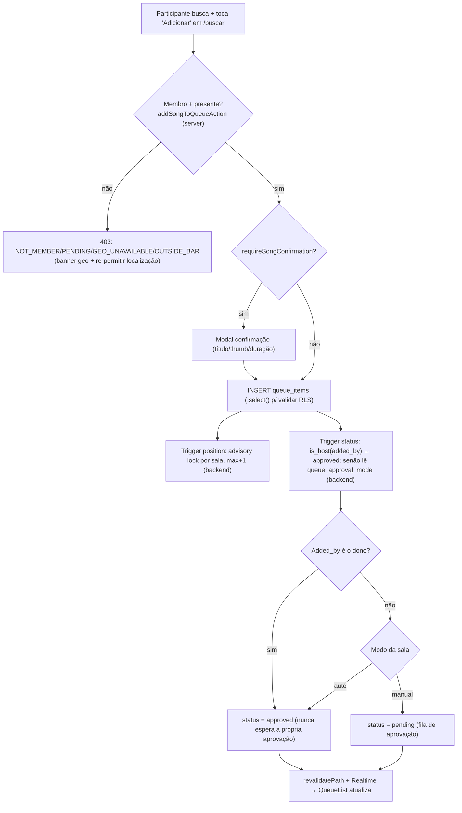
```mermaid
flowchart TD
    A["Participante busca + toca 'Adicionar' em /buscar"] --> G{"Membro + presente?<br/>addSongToQueueAction (server)"}
    G -->|não| G1["403: NOT_MEMBER/PENDING/GEO_UNAVAILABLE/OUTSIDE_BAR<br/>(banner geo + re-permitir localização)"]
    G -->|sim| B{requireSongConfirmation?}
    B -->|sim| C["Modal confirmação (título/thumb/duração)"]
    C --> D["INSERT queue_items (.select() p/ validar RLS)"]
    B -->|não| D
    D --> E["Trigger position: advisory lock por sala, max+1 (backend)"]
    D --> F["Trigger status: is_host(added_by) → approved; senão lê queue_approval_mode (backend)"]
    F --> G2{Added_by é o dono?}
    G2 -->|sim| H["status = approved (nunca espera a própria aprovação)"]
    G2 -->|não| G3{Modo da sala}
    G3 -->|auto| H
    G3 -->|manual| I["status = pending (fila de aprovação)"]
    H --> J["revalidatePath + Realtime → QueueList atualiza"]
    I --> J
```

## 3.1.1 Busca de música no YouTube (Fase 4 — implementado)

Rota `/api/youtube/search` consumida pelo `SongSearch` (rota filha `/salas/[codigo]/buscar`). Credencial é resolvida **apenas no servidor** (service role); cache `song_cache` compartilhado entre karaokês; rate limit independente da cota da Google.

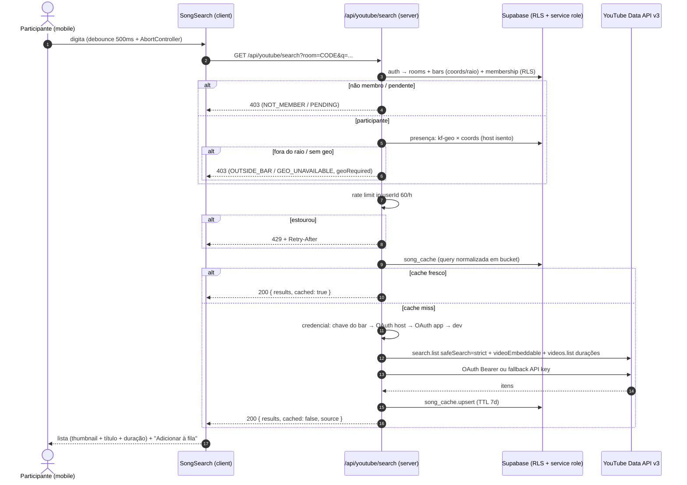
```mermaid
sequenceDiagram
    autonumber
    actor P as Participante (mobile)
    participant S as SongSearch (client)
    participant R as /api/youtube/search (server)
    participant DB as Supabase (RLS + service role)
    participant YT as YouTube Data API v3

    P->>S: digita (debounce 500ms + AbortController)
    S->>R: GET /api/youtube/search?room=CODE&q=...
    R->>DB: auth → rooms + bars (coords/raio) + membership (RLS)
    alt não membro / pendente
        R-->>S: 403 (NOT_MEMBER / PENDING)
    else participante
        R->>DB: presença: kf-geo × coords (host isento)
        alt fora do raio / sem geo
            R-->>S: 403 (OUTSIDE_BAR / GEO_UNAVAILABLE, geoRequired)
        end
    end
    R->>R: rate limit ip:userId 60/h
    alt estourou
        R-->>S: 429 + Retry-After
    end
    R->>DB: song_cache (query normalizada em bucket)
    alt cache fresco
        R-->>S: 200 { results, cached: true }
    else cache miss
        R->>R: credencial: chave do bar → OAuth host → OAuth app → dev
        R->>YT: search.list safeSearch=strict + videoEmbeddable + videos.list durações
        R->>YT: OAuth Bearer ou fallback API key
        YT-->>R: itens
        R->>DB: song_cache.upsert (TTL 7d)
        R-->>S: 200 { results, cached: false, source }
    end
    S-->>P: lista (thumbnail + título + duração) + "Adicionar à fila"
```

**OAuth por-host:** bloco "Conta do YouTube" no `RoomSettings` (mostra "conectado à conta Google + data" quando há token, com botão "Remover conexão" que **revoga na Google** e apaga a linha) → `/auth/youtube/authorize` (estado nonce em cookie httpOnly, `access_type=offline&prompt=consent`) → Google → `/auth/youtube/callback` (exchange → `youtube_oauth_tokens`, **sem policies — service role**) → redirect à sala. Fallback do app: `scripts/youtube-app-oauth.mjs` (loopback) coleta o `YOUTUBE_APP_REFRESH_TOKEN` para o `.env.local`.

### 3.2 Aprovação (host) — entregue em 2026-09-26 (Fase 5, Bloco A)

O `QueueList` ganhou um bloco **"Aguardando sua aprovação (N)"** no topo, acima da fila: o host aprova, rejeita e remove sem sair da tela, e a fila não é duplicada (as pendentes aparecem **uma vez só**, nesse bloco). Quem não é o host não vê o bloco nem os botões, mas continua vendo os pedidos pendentes na lista com o badge "aguardando aprovação". **Remover** é do mesmo Bloco A; **reordenar** é o Bloco C, entregue em 2026-09-26 (ver §3.4).

As duas server actions (`setQueueItemStatusAction`/`removeQueueItemAction`) escrevem pelo **client do usuário** — a autorização é a RLS existente (`queue_items_update_host`/`queue_items_delete_host`, host-only), sem RPC nova e sem relaxar policy. O `.select()` posterior (em `update` e em `delete`) é a prova de que a policy deixou passar: retorno vazio vira erro "Só o dono da sala pode…", não sucesso silencioso. A regra pura (`buildQueueModeration`/`buildQueueRemoval`, em `src/lib/rooms/queue.ts`) roda antes, dando a mensagem imediata e recusando `playing`/terminais — o item que está tocando só sai pela ação de pular (Fase 6/7).

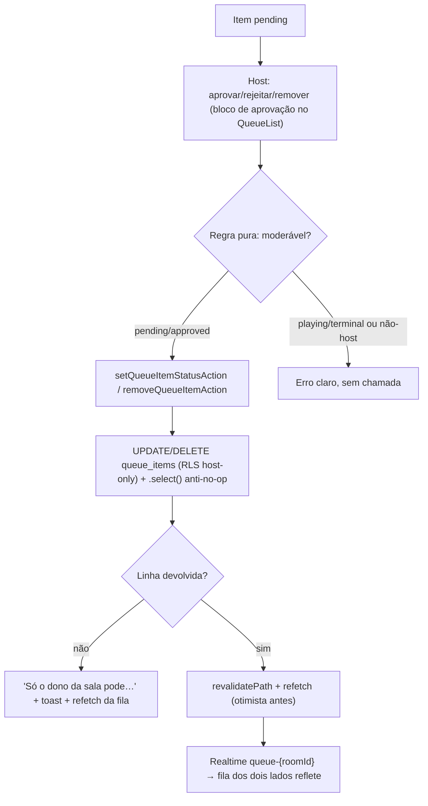
```mermaid
flowchart TD
    A["Item pending"] --> B["Host: aprovar/rejeitar/remover (bloco de aprovação no QueueList)"]
    B --> C{"Regra pura: moderável?"}
    C -->|"pending/approved"| D["setQueueItemStatusAction / removeQueueItemAction"]
    C -->|"playing/terminal ou não-host"| C1["Erro claro, sem chamada"]
    D --> E["UPDATE/DELETE queue_items (RLS host-only) + .select() anti-no-op"]
    E --> F{"Linha devolvida?"}
    F -->|não| F1["'Só o dono da sala pode…' + toast + refetch da fila"]
    F -->|sim| G["revalidatePath + refetch (otimista antes)"]
    G --> H["Realtime queue-{roomId} → fila dos dois lados reflete"]
```

### 3.4 Reordenação da fila (host) — entregue em 2026-09-26 (Fase 5, Bloco C)

O host reorder as **aprovadas** por dois caminhos, ambos gravando **uma única chamada**: as setas ⬆/⬇ (acessíveis por teclado, desabilitadas na borda) e o **drag-and-drop** com `@dnd-kit` (handle `⠿`, `PointerSensor` com `distance: 8` para não roubar o scroll do celular + `KeyboardSensor`). A lista é atualizada de forma otimista (`draftOrder`) e reconciliada com um `fetchItems()` no fim; em falha o toast explica e a ordem real do banco volta.

**Contrato da RPC `reorder_queue(p_room_id, p_item_ids)`:** o client manda a fila visível **inteira** (`playing` + `approved` + `pending`) já na ordem desejada. Isso é deliberado — `queue_items` **não tem unique em `(room_id, position)`**, então aceitar uma lista parcial criaria posições repetidas. A função valida: autenticado, `is_host`, sala `active`, sem `null`/duplicados/vazia, contagem igual à de itens visíveis e todo id pertencente à sala. Só então pega o **advisory lock com a mesma chave de `next_queue_position`** (um insert concorrente não consegue arrancar uma posição no meio do reorden) e reescreve `position = row_number()` de 1..N com um único `UPDATE ... FROM` — o realtime vê um evento só, e `pending` vai sempre para o fim porque ainda não entrou na ordem do host.

> Por que RPC e não N updates do client: cada UPDATE dispararia `touch_updated_at` → N refetches; e a policy `queue_items_update_host` é host-only **sem `WITH CHECK`**, ou seja, um update solto do client poderia até trocar o `room_id` do item. Autorizar dentro da função segue o padrão de `close_room`/`reopen_room`.

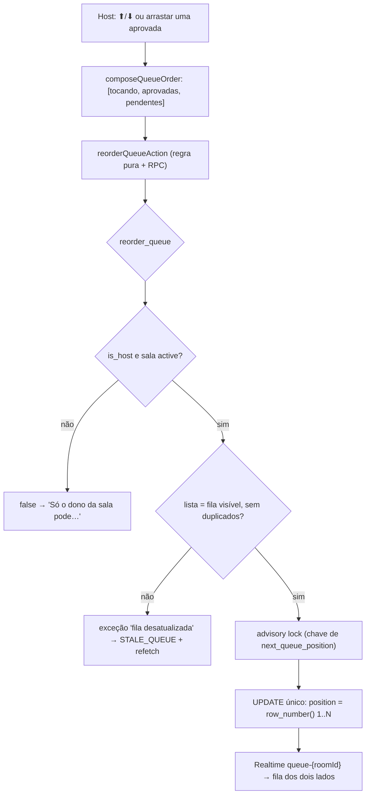
```mermaid
flowchart TD
    A["Host: ⬆/⬇ ou arrastar uma aprovada"] --> B["composeQueueOrder: [tocando, aprovadas, pendentes]"]
    B --> C["reorderQueueAction (regra pura + RPC)"]
    C --> D{"reorder_queue"}
    D --> E{"is_host e sala active?"}
    E -->|não| E1["false → 'Só o dono da sala pode…'"]
    E -->|sim| F{"lista = fila visível, sem duplicados?"}
    F -->|não| F1["exceção 'fila desatualizada' → STALE_QUEUE + refetch"]
    F -->|sim| G["advisory lock (chave de next_queue_position)"]
    G --> H["UPDATE único: position = row_number() 1..N"]
    H --> I["Realtime queue-{roomId} → fila dos dois lados"]
```

### 3.3 Reprodução e transições

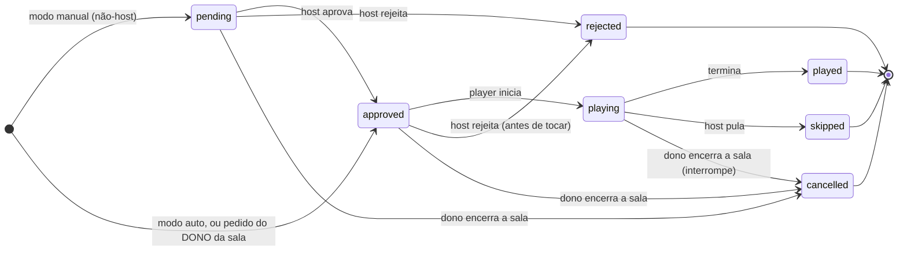
```mermaid
stateDiagram-v2
    direction LR
    [*] --> pending: modo manual (não-host)
    [*] --> approved: modo auto, ou pedido do DONO da sala
    pending --> approved: host aprova
    pending --> rejected: host rejeita
    approved --> playing: player inicia
    approved --> rejected: host rejeita (antes de tocar)
    playing --> played: termina
    playing --> skipped: host pula
    pending --> cancelled: dono encerra a sala
    approved --> cancelled: dono encerra a sala
    playing --> cancelled: dono encerra a sala (interrompe)
    rejected --> [*]
    played --> [*]
    skipped --> [*]
    cancelled --> [*]
```

> A operação de **trocar música** (ver §5) mantém o item no mesmo estado de status em que está (com re-regra opcional conforme decisão de produto) — não cria um estado novo.

---

## 4. Player device (tela `/player/[codigoDaSala]`)

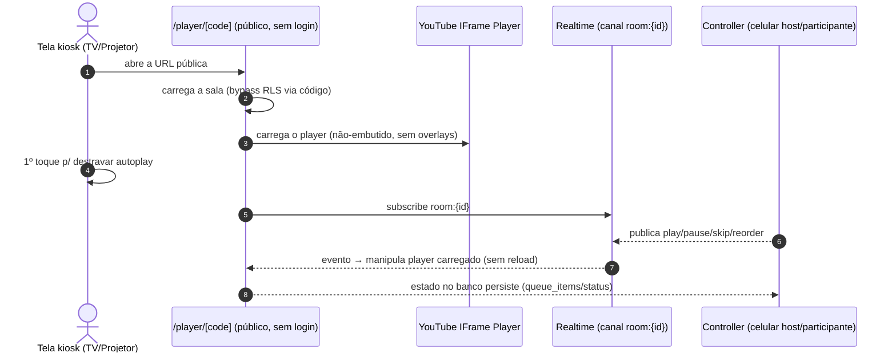
```mermaid
sequenceDiagram
    autonumber
    actor T as Tela kiosk (TV/Projetor)
    participant P as /player/[code] (público, sem login)
    participant YT as YouTube IFrame Player
    participant RT as Realtime (canal room:{id})
    participant C as Controller (celular host/participante)

    T->>P: abre a URL pública
    P->>P: carrega a sala (bypass RLS via código)
    P->>YT: carrega o player (não-embutido, sem overlays)
    T->>T: 1º toque p/ destravar autoplay
    P->>RT: subscribe room:{id}
    C-->>RT: publica play/pause/skip/reorder
    RT-->>P: evento → manipula player carregado (sem reload)
    P-->>C: estado no banco persiste (queue_items/status)
```

> Latência alvo < 2s entre ação no controller e reflexo na tela (Fase 6).

---

## 5. Trocar a música da fila mantendo a posição — entregue em 2026-09-26 (Fase 5, Bloco D)

> As opções abaixo são o histórico da decisão; a implementação é a **Opção A**, com as regras D1–D3 já fechadas com o PO (§5.2).

### Contexto

Cada item da fila é uma linha de `queue_items` com `position` atribuído no banco. **Reordenar** (host, Fase 5) apenas reescreve `position`. **Trocar a música** é substituir o conteúdo de um item **sem mover a posição** — ex.: pedi "Aleatório" mas coloquei a versão errada, ou mudei de ideia antes de tocar.

### 5.1 Opções de implementação (histórico)

| Opção                                                  | O que é                                                                                 | Prós                                                                                        | Contras                                                                                                | Veredito                   |
| ------------------------------------------------------ | --------------------------------------------------------------------------------------- | ------------------------------------------------------------------------------------------- | ------------------------------------------------------------------------------------------------------ | -------------------------- |
| **A — UPDATE in place via RPC `replace_queue_song`**   | Mantém a mesma linha (`id`, `position`, `status`) e só troca vídeo/título/thumb/duração | Posição garantida; atômico; Realtime é um único UPDATE; sem furo de histórico de `position` | Sobrescreve a música original (sem histórico); precisa de RPC + policy nova                            | **Recomendada para o MVP** |
| **B — DELETE + INSERT na mesma posição**               | Apaga o item e recria naquela posição (reajustando as demais)                           | "Histórico" do slot preservado (novo id)                                                    | `id` novo quebra a referência de "tocando agora" e o Realtime; 2 operações; risco de corrida           | Não recomendada            |
| **C — Normalizar `songs` e referenciar por `song_id`** | Tabela de catálogo; trocar = trocar FK                                                  | Modelo "correto" p/ futuro/catálogo                                                         | Retrabalho grande; mesma música por 2 pessoas vira 1 linha (perde "quem pediu o quê"); overkill no MVP | Roadmap                    |

**Decisão assumida: Opção A (RPC `security definer`), com regras de negócio fechadas com o PO:**

- **Quem troca (D1):** o **autor** da música, **ou o host** (host pode trocar qualquer item). O host **também pode reordenar** a playlist (movimenta `position`, funcionalidade já prevista na Fase 5 — complementar à troca, que **não** mexe em `position`).
- **Status preservado (D2):** a troca **mantém a aprovação** — no modo manual, uma música já aprovada, quando trocada, continua `approved` (troca 1:1, não volta ao fim nem à fila de aprovação).
- **Estados permitidos (D3):** `pending` e `approved` (enquanto ainda não tocou). Host **pode adicionar quantas músicas quiser, sem limite**, e a ordem da fila é sempre respeitada (o limite — se algum dia houver — nunca é imposto no insert de host).

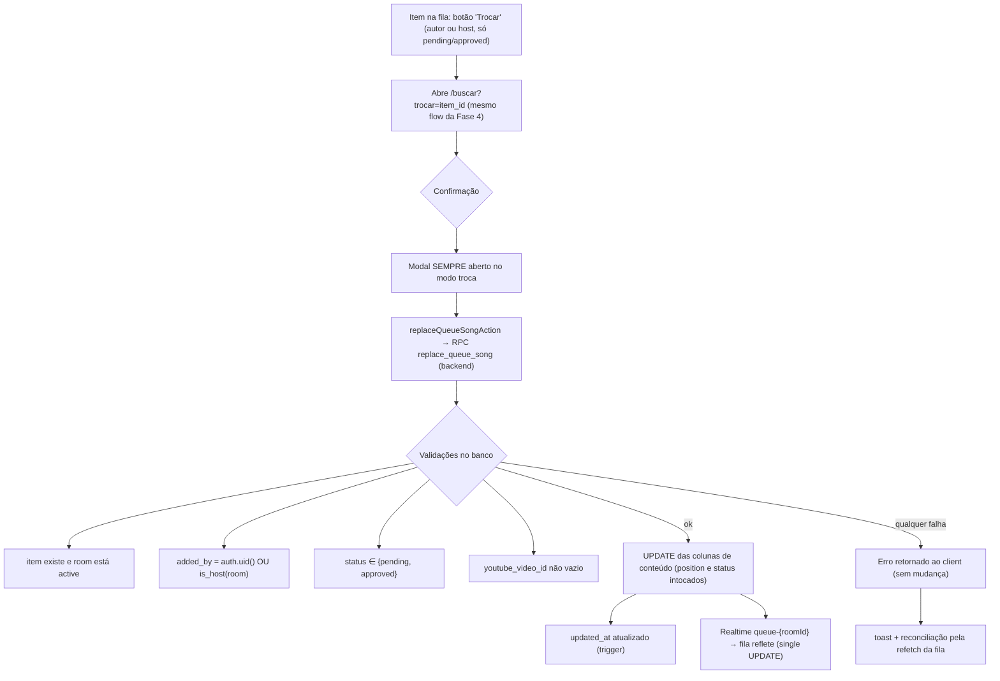
```mermaid
flowchart TD
    A["Item na fila: botão 'Trocar' (autor ou host, só pending/approved)"] --> B["Abre /buscar?trocar=item_id (mesmo flow da Fase 4)"]
    B --> C{"Confirmação"}
    C --> D["Modal SEMPRE aberto no modo troca"]
    D --> E["replaceQueueSongAction → RPC replace_queue_song (backend)"]
    E --> F{Validações no banco}
    F --> F1["item existe e room está active"]
    F --> F2["added_by = auth.uid() OU is_host(room)"]
    F --> F3["status ∈ {pending, approved}"]
    F --> F4["youtube_video_id não vazio"]
    F -->|ok| G["UPDATE das colunas de conteúdo (position e status intocados)"]
    G --> H["updated_at atualizado (trigger)"]
    G --> I["Realtime queue-{roomId} → fila reflete (single UPDATE)"]
    F -->|qualquer falha| K["Erro retornado ao client (sem mudança)"]
    K --> L["toast + reconciliação pela refetch da fila"]
```

> **Reordenar (host) é operação distinta**: reescreve `position` de vários itens (pendências de Fase 5); a troca nunca muda a ordem.

> **Formas de reordenar (entregue no Bloco C):** mover ⬆/⬇ por item **e** drag-and-drop (ambos); `position` reescrito de forma atômica na RPC `reorder_queue`, com advisory lock na chave de `next_queue_position` — a concorrência com insert é tratada no banco, não no client (§3.4).

**Payload da RPC (entregue):** `p_item_id uuid`, `p_youtube_video_id text`, `p_title text`, `p_thumbnail_url text`, `p_duration_seconds integer`. Retorna `true` em sucesso, `false` quando o item não existe ou o usuário não é autor/host, e **levanta exceção com mensagem legível** para o resto (não autenticado, sala encerrada, música já saiu da fila, vídeo/título/duração inválidos). A action `replaceQueueSongAction` traduz `fila`/mensagens do banco para texto de toast e revalida a sala e a página de busca.

**Onde a regra mora:** o contrato D1–D3 é validado **no banco** (fonte da verdade) e **repetido na regra pura** `buildQueueSongReplacement` (`src/lib/rooms/queue.ts`) para dar erro imediato sem round-trip. A page `/buscar` também valida o item no servidor: quem não puder trocar cai no fluxo normal de "pedir música", em vez de numa tela morta.

**RLS impactada:** hoje `queue_items` só aceita UPDATE de host (`queue_items_update_host`). A RPC `security definer` roda como superuser/definer e impõe as checagens acima explicitamente — **o client não ganha UPDATE direto** (nada de relaxar a policy).

### 5.2 Questões de fluxo — resolvidas com o PO ✅

| #   | Pergunta                                   | Resposta                                                                                       |
| --- | ------------------------------------------ | ---------------------------------------------------------------------------------------------- |
| D1  | Quem pode trocar?                          | **Autor + host** (e host também reordena a playlist).                                          |
| D2  | Modo manual: música aprovada que é trocada | **Mantém aprovada** (não volta ao fim nem à aprovação).                                        |
| D3  | Estados permitidos para trocar             | **`pending` e `approved`** (ainda não tocou). Extras: host adiciona **sem limite** de músicas. |

### 5.3 Impacto na UI (entregue, vide `fluxos-do-usuario.md`)

- Botão "Trocar" (ícone ↻) nos itens **pendentes e aprovados** que o usuário pediu — e em qualquer item quando ele é o host (D1).
- O mesmo `SongSearch` + `SongConfirmDialog` da Fase 4 é reutilizado em `/salas/[codigo]/buscar?trocar=<itemId>`; no modo troca o botão do resultado vira ↻ e a **confirmação é sempre exigida**, mesmo com `rooms.require_song_confirmation` desligado (a ação sobrescreve o pedido de outra pessoa).
- O diálogo no modo troca promete o que a RPC faz: "a posição na fila e a aprovação são mantidas" (D2).
- Sem update otimista aqui (o conteúdo muda, não a ordem): toast de sucesso com o título novo e a refetch reconcilia pelo realtime.
