# Fluxos do sistema

Fluxos técnicos end-to-end no estado atual do MVP (Fases 1–3.5 **e Fase 4 — busca + fila** concluídas) + propostas.

---

## 1. Autenticação e sessão

### 1.1 Login OAuth (Google/GitHub)

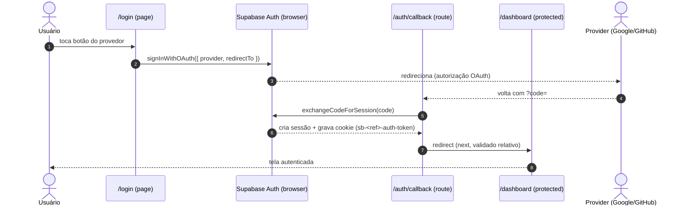
```mermaid
sequenceDiagram
    autonumber
    actor U as Usuário
    participant L as /login (page)
    participant S as Supabase Auth (browser)
    participant CB as /auth/callback (route)
    participant D as /dashboard (protected)
    actor P as Provider (Google/GitHub)

    U->>L: toca botão do provedor
    L->>S: signInWithOAuth({ provider, redirectTo })
    S-->>P: redireciona (autorização OAuth)
    P-->>CB: volta com ?code=
    CB->>S: exchangeCodeForSession(code)
    S-->>CB: cria sessão + grava cookie (sb-<ref>-auth-token)
    CB->>D: redirect (next, validado relativo)
    D-->>U: tela autenticada
```

### 1.2 Acesso anônimo (visitante sem conta)

Fase 3.5 habilita **anonymous sign-ins** (Management API `AuthConfig.external_anonymous_users_enabled` + `supabase/config.toml`), para a galera pedir música pelo QR **sem criar conta**. Anônimo **não** cria bar (RPC `create_bar` recusa `is_anonymous`); host exige login real.

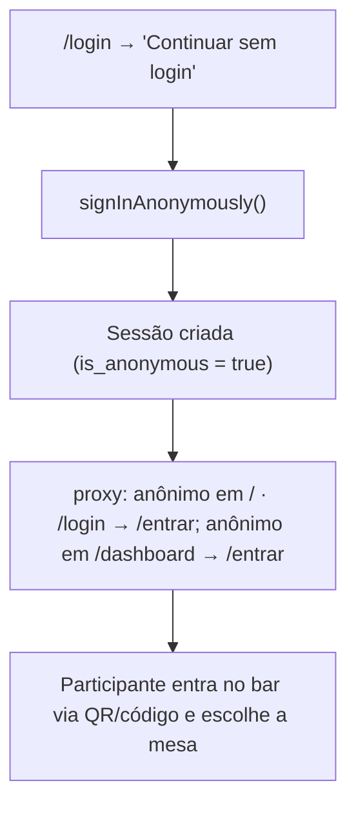
```mermaid
flowchart TD
    A["/login → 'Continuar sem login'"] --> B["signInAnonymously()"]
    B --> C["Sessão criada (is_anonymous = true)"]
    C --> D["proxy: anônimo em / · /login → /entrar; anônimo em /dashboard → /entrar"]
    D --> E["Participante entra no bar via QR/código e escolhe a mesa"]
```

### 1.3 Login dev (e-mail/senha — somente `NODE_ENV=development`)

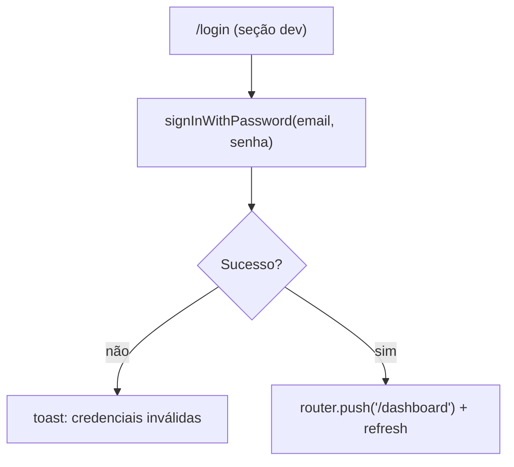
```mermaid
flowchart TD
    A["/login (seção dev)"] --> B["signInWithPassword(email, senha)"]
    B --> C{Sucesso?}
    C -->|não| E["toast: credenciais inválidas"]
    C -->|sim| F["router.push('/dashboard') + refresh"]
```

### 1.4 Manutenção de sessão (proxy)

Em Next 16 o middleware chama-se `proxy` (`src/proxy.ts`). Roda em toda request, renova o token e delega o controle de rota.

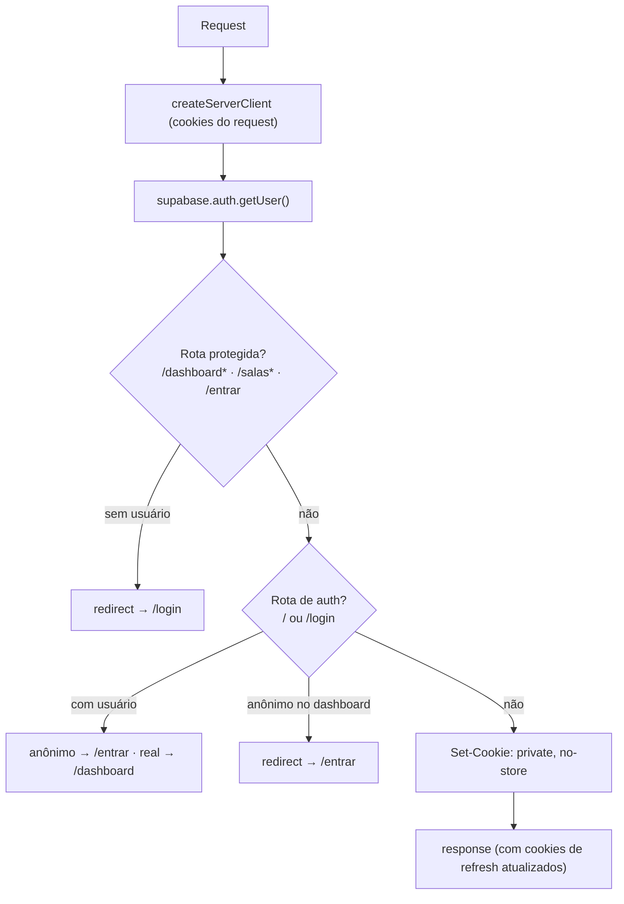
```mermaid
flowchart TD
    A["Request"] --> B["createServerClient (cookies do request)"]
    B --> C["supabase.auth.getUser()"]
    C --> D{Rota protegida?<br/>/dashboard* · /salas* · /entrar}
    D -->|sem usuário| E["redirect → /login"]
    D -->|não| F{Rota de auth?<br/>/ ou /login}
    F -->|com usuário| G["anônimo → /entrar · real → /dashboard"]
    F -->|anônimo no dashboard| G2["redirect → /entrar"]
    F -->|não| H["Set-Cookie: private, no-store"]
    H --> I["response (com cookies de refresh atualizados)"]
```

### 1.5 Logout

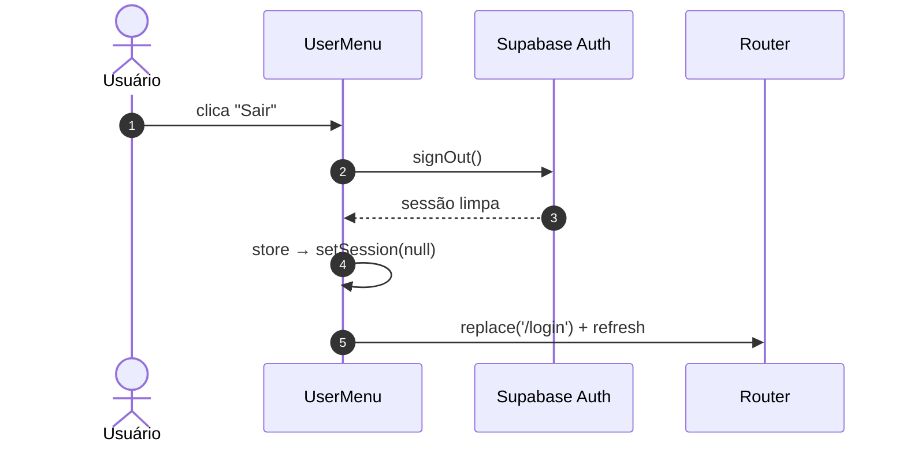
```mermaid
sequenceDiagram
    autonumber
    actor U as Usuário
    participant UM as UserMenu
    participant S as Supabase Auth
    participant R as Router

    U->>UM: clica "Sair"
    UM->>S: signOut()
    S-->>UM: sessão limpa
    UM->>UM: store → setSession(null)
    UM->>R: replace('/login') + refresh
```

### 1.5 Sincronização da store (client)

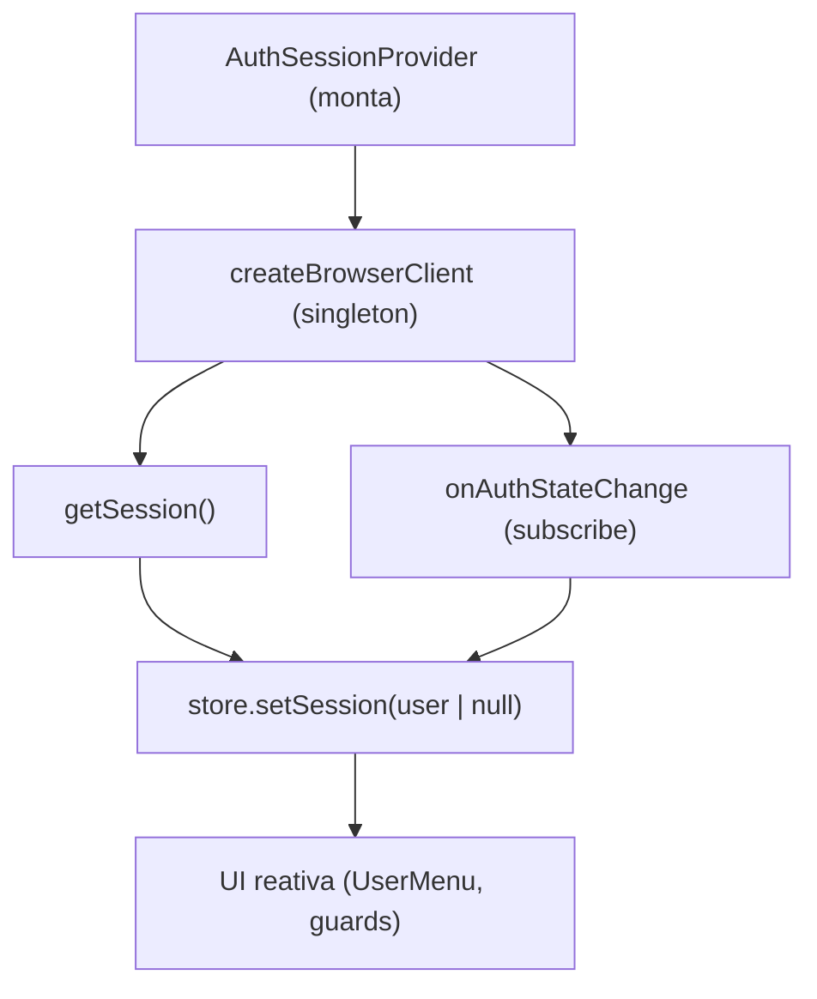
```mermaid
flowchart TD
    A["AuthSessionProvider (monta)"] --> B["createBrowserClient (singleton)"]
    B --> C["getSession()"]
    C --> D["store.setSession(user | null)"]
    B --> E["onAuthStateChange (subscribe)"]
    E --> D
    D --> F["UI reativa (UserMenu, guards)"]
```

---

## 2. Ciclo de vida do bar e do karaokê

### 2.1 Criar bar (vira perfil + mesas + karaokê único)

Fase 3.5: **1 host = 1 bar** (`bars.host_id` único), que por padrão tem **1 karaokê** (`rooms.bar_id`; multi-sala desabilitado na UI — affordance "Adicionar sala" desabilitada). O QR/código do bar já resolve direto para o karaokê único ativo.

Requisito presença (2026-09-23): o cadastro também registra a **localização física** (geocode Nominatim com fallback GPS do dispositivo) e o **raio de presença** (`raio_permitido_metros`, default 150 m) — base do gate de presença (§2.2 e §2.2.1).

**Código da sala configurável** (2026-09-24, migration `20260924000022`): `rooms.code` passa a aceitar **3–12 alfanuméricos maiúsculos** (sem acentos/espaços). No create: o host pode informar `codigo_entrada` (opcional); **default = nome do bar todo junto em maiúsculas** (`driveRoomCodeFromName`: `Karaokê do Zé` → `KARAOKEDOZE`, truncado em 12; se o resultado ficar com <3 chars → `KARAOKE` + sufixo iterativo `KARAOKE1`, `KARAOKE2`…). Helpers RPC `unique_room_code`/`default_room_code`/`room_code_available` checam colisão com `rooms.code` **e** `bars.code` (a entrada resolve o bar primeiro). O host pode trocar o código depois: `updateRoomCodeAction` (RoomSettings) valida padrão + disponibilidade, atualiza `rooms.code` (RLS host-only) e redireciona a página para o novo código.

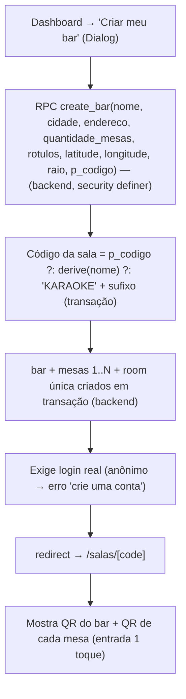
```mermaid
flowchart TD
    A["Dashboard → 'Criar meu bar' (Dialog)"] --> B["RPC create_bar(nome, cidade, endereco, quantidade_mesas, rotulos, latitude, longitude, raio, p_codigo) — (backend, security definer)"]
    B --> C["Código da sala = p_codigo ?: derive(nome) ?: 'KARAOKE' + sufixo (transação)"]
    C --> D["bar + mesas 1..N + room única criados em transação (backend)"]
    D --> E["Exige login real (anônimo → erro 'crie uma conta')"]
    E --> F["redirect → /salas/[code]"]
    F --> G["Mostra QR do bar + QR de cada mesa (entrada 1 toque)"]
```

### 2.2 Entrar no bar (código/QR) — preview unificada + RPC `join_room` com mesa

A RPC `get_room_preview` **foi substituída** pela `get_entry_preview(p_code, p_mesa)` (migration `20260923000013`): `p_code` aceita **código de bar** **ou** código de room (QR legado de sala); o karaokê é a **única sala ativa do bar**.

**Mesa escolhida dentro da sala na entrada por código** (2026-09-24): QR de bar/mesa (`?bar=…[&mesa=N]`) mantém o fluxo abaixo — mesa vai no `join_room`. Já o **código puro de sala** (`/entrar?code=KARAOKE` ou digitado) entra **direto na sala sem mesa** (`join_room(code)` com `p_mesa` nulo) e o participante é **obrigado a escolher a mesa dentro da sala** (`pick_mesa`, migration `20260924000022` — valida mesa em 1..`quantidade_mesas`, só para membro `approved` de sala `active`); enquanto `pending` vê o aviso de aguardando aprovação.

**Exceção — bar de uma mesa só não pergunta** (Fase 16, `20261008000001`, 2026-10-08): se `quantidade_mesas = 1`, o próprio `join_room` devolve `mesa_numero = 1` para quem mandou `p_mesa` nulo, e o `needsMesa` de `/salas/<código>` só exige escolha quando há **2 ou mais** mesas — quem entra cai direto na tela de pedir música. **Espectador (`fora_do_raio`) é excluído da regra**: continua `mesa_numero null`, porque quem está de fora não senta (sentá-lo mentiria para o card de ocupação).

**Gate de presença física** (requisito 2026-09-23, revisto em 2026-10-02): antes de `join_room`, o servidor lê o cookie `kf-geo` (geo do participante coletada sob consentimento §2.5) e compara com as coordenadas do bar (haversine ≤ `raio_permitido_metros`). A decisão tem **três desfechos** (`src/lib/bars/geo.ts`), porque "onde a pessoa está" responde a duas perguntas diferentes — **entrar** e **participar**:

| Desfecho | Quando | Entrada | Pedir música |
|---|---|---|---|
| `ok` | dentro do raio · **host sempre isento** | entra, com mesa | permite |
| `geo-unavailable` | sem consentimento/coords do usuário, ou bar sem coords/raio | **bloqueia** (banner + CTA "Permitir localização") | bloqueia |
| `outside` | tem coordenadas e está genuinamente longe | **entra sem mesa**, só assistindo (`join_room` com `p_mesa = null`; a grade de mesas some, o CTA vira "Entrar só assistindo" e o destino é a **sala**, com o player só pelo botão "Ver o player") | **bloqueia** (`addSongToQueueAction` + `buildQueueSongItem`, §3.1.1) |

Até 2026-10-02 os dois desfechos negativos bloqueavam a entrada, e quem caía no `outside` ficava numa tela **sem caminho possível**: sem mesa para escolher e sem como pedir música. O corte de pedir música é **independente** do gate de entrada — mudou de camada em 2026-10-03, quando saiu do `buildQueueSongItem` para também ser recusado pela `addSongToQueueAction` (`OUTSIDE_BAR`, pelo `fora_do_raio` gravado no join). **Exceção (2026-09-25):** quem já tem membership `pending`/`rejected` da sala vai direto para a tela de espera — o gate não esconde um pedido em andamento. O gate é independente de `entry_mode`: **entrada livre (`open`) não dispensa a presença** — o painel do host avisa isso e mostra o raio no mapa (abaixo).

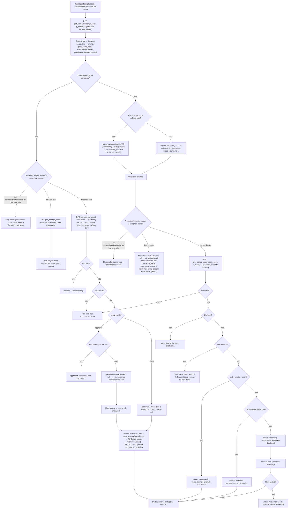
```mermaid
flowchart TD
    A["Participante digita code / escaneia QR de bar ou de mesa"] --> V["RPC get_entry_preview(p_code, p_mesa) — (backend, security definer)"]
    V --> W["Resolve bar → karaokê único ativo → preview<br/>(bar_nome, host, entry_mode, status, quantidade_mesas, coords)"]
    W --> R{"Entrada por QR de bar/mesa?"}
    R -->|não| PC{"Presença: kf-geo × coords ± raio (host isento)"}
    PC -->|sem consentimento/coords, ou bar sem raio| PC1["bloqueado: geoRequired → a entrada oferece 'Permitir localização'"]
    PC -->|fora do raio| ROOMOUT["RPC join_room(p_code) sem mesa · entrada como espectador"]
    PC -->|dentro do raio| ROOM["RPC join_room(p_code) sem mesa — (backend)<br/>bar de 1 mesa devolve mesa_numero = 1 (Fase 16)"]
    ROOMOUT --> OUTV["vê o player · sem MesaPicker e sem pedir música"]
    ROOM --> DG0{É o host?}
    DG0 -->|sim| HOST["redirect → /salas/[code]"]
    DG0 -->|não| DG1{Sala ativa?}
    DG1 -->|não| Z["erro: sala não encontrada/inativa"]
    DG1 -->|sim| ROOM2{entry_mode?}
    ROOM2 -->|approval| PRE{Pré-aprovação de 24h?}
    ROOM2 -->|open| APPR["approved · mesa 1 se o bar for de 1 mesa, senão null"]
    PRE -->|sim| APPR2["approved · reconecta sem novo pedido"]
    PRE -->|não| PEND["pending · mesa_numero null — vê 'aguardando aprovação' na sala"]
    APPR --> MESA_DENTRO["Bar de 2+ mesas: a sala pede a mesa (MesaPicker → RPC pick_mesa, migration 00022)<br/>Bar de 1 mesa: já está sentado, sem escolha"]
    PEND --> HOST2["Host aprova → approved · mesa null"]
    HOST2 --> MESA_DENTRO
    MESA_DENTRO --> H["Participante vê a fila ('Bar · Mesa N')"]
    R -->|sim| X{Bar tem mesa pré-selecionada?}
    X -->|sim| X1["Mesa pré-selecionada (QR / ?mesa=N): valida p_mesa (1..quantidade_mesas e existe em mesas)"]
    X -->|não| X2["UI pede a mesa (grid 1..N) — bar de 1 mesa pula a grade e senta na 1"]
    X1 --> X3["Confirmar entrada"]
    X2 --> X3
    X3 --> P{"Presença: kf-geo × coords ± raio (host isento)"}
    P -->|sem consentimento/coords, ou bar sem raio| P1["bloqueado: banner geo + permitir localização"]
    P -->|fora do raio| POUT["entra sem mesa (p_mesa null) — só assiste; pedir música barrado por OUTSIDE_BAR; pick_mesa recusa e claim_next_song só com token da TV (00041)"]
    P -->|dentro do raio| B["RPC join_room(p_code=room_code, p_mesa) — (backend, security definer)"]
    B --> C{Sala ativa?}
    C -->|não| Z
    C -->|sim| D{É o host?}
    D -->|sim| Y["erro: você já é o dono desta sala"]
    D -->|não| E{Mesa válida?}
    E -->|não| E1["erro: mesa inválida / fora de 1..quantidade_mesas ou inexistente"]
    E -->|sim| E2{entry_mode = open?}
    E2 -->|sim| F["status = approved · mesa_numero gravado (backend)"]
    E2 -->|não| PRE2{Pré-aprovação de 24h?}
    PRE2 -->|sim| F2["status = approved · reconecta sem novo pedido"]
    PRE2 -->|não| G["status = pending · mesa_numero gravado (backend)"]
    F --> H
    F2 --> H
    G --> I["Notifica host (Realtime room:{id})"]
    I --> J{Host aprova?}
    J -->|sim| H
    J -->|não| K["status = rejected - pode reentrar depois (backend)"]
```

Regra de reentrada (migration `20260921000004`, **revisada na Fase 8a** — `20260927000030`): `rejected` pode reentrar (a RPC atualiza); `approved`/`pending` existentes **não são rebaixados**; o `mesa_numero` é atualizado no reentrar (`coalesce(excluded.mesa_numero, ...)`) ou via `pick_mesa`.

O que mudou na Fase 8a é **para quem** vale o `approved` guardado: antes ele valia para sempre (era o `on conflict` que preservava qualquer status antigo), agora vale **24h** e só para usuário **autenticado**. A janela nasce em `room_members.approved_at` (trigger, escrita só na transição para `approved` — reaprovar não renova) e a regra mora em uma função só, `member_entry_state`, que o `join_room` consome e o app lê (preview, tela de espera, página da sala):

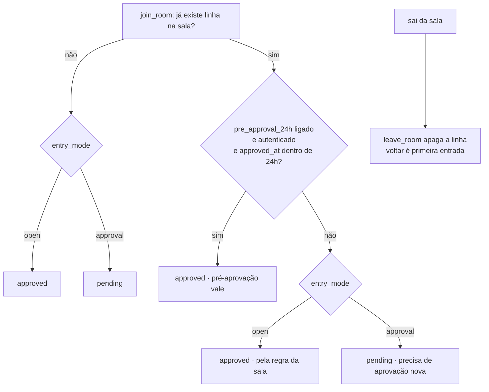
```mermaid
flowchart TD
    A["join_room: já existe linha na sala?"] -->|não| B{"entry_mode"}
    B -->|open| B1[approved]
    B -->|approval| B2[pending]
    A -->|sim| C{"pre_approval_24h ligado<br/>e autenticado<br/>e approved_at dentro de 24h?"}
    C -->|sim| D[approved · pré-aprovação vale]
    C -->|não| E{"entry_mode"}
    E -->|open| E1[approved · pela regra da sala]
    E -->|approval| E2[pending · precisa de aprovação nova]
    F["sai da sala"] --> G["leave_room apaga a linha<br/>voltar é primeira entrada"]
```

| Situação | `pre_approval_24h` ON (padrão) | `pre_approval_24h` OFF |
|---|---|---|
| Autenticado aprovado há < 24h, reconecta | **aprovado** (pré-aprovação) | regra da sala (com entrada livre OFF, **pendente**) |
| Autenticado aprovado há > 24h, reconecta | regra da sala (pendente) | regra da sala (pendente) |
| Anônimo (sem conta), qualquer idade | **nunca** pré-aprovado | nunca pré-aprovado |
| Saiu da sala e voltou | **pendente** (a linha foi apagada) | pendente |

> **Na UI o toggle é sempre ligado e travado** (`RoomSettings` → "Aprovação vale por 24h", com cadeado e o aviso de que sair da sala volta a exigir aprovação): decisão de produto de 2026-09-27, registrada no `CHANGELOG` e no `TODO.md`. O banco e a action aceitam os dois valores — desligado existe para teste e para dado legado, e é por update direto que os smokes rodaram a matriz.

**Recuperar/cancelar o pedido (2026-09-25; leitura pelo status efetivo desde 2026-09-27):** o `pending` **sobrevive à navegação** — `getEntryPreviewAction` pergunta o status **efetivo** a `member_entry_state` (RLS `room_members_select_self_or_host` por baixo) e devolve `membership`, de modo que `/entrar?code=…`, `/entrar?bar=…` e `/salas/[código]` renderizam a mesma tela de espera (`EntryApprovalWait`) sem pedir entrada de novo. `getMyEntryRequestsAction` lista os pedidos `pending` com bar/código/mesa para o dashboard e o `/entrar` sem token; como a RLS de `rooms` esconde a sala de quem não está `approved`, nome e código são resolvidos com o client de service role (**somente leitura**, nunca `youtube_api_key`). Cancelar é `cancelEntryRequestAction` (`DELETE` da própria linha com `status = 'pending'`, permitido pela RLS) — sem migration nova.

**Raio de presença no painel do host (2026-09-25, editável em 2026-09-26):** `bars.raio_permitido_metros` tem default **500 m** (migration `20260925000024`, `check` 50..1000 mantida; bars existentes migrados para 500) e é o número que o gate valida em `checkPresence`/`requirePresence` — a tela lê o mesmo campo, então mapa e gate não podem divergir. O card `PresenceGateInfo` (abaixo dos toggles, só para o host) mostra: o aviso de que o gate vale nos dois modos de entrada e de que o raio vale para **todas as salas do bar**, o mapa com o círculo do raio em metros (`PresenceRadiusMap` = Leaflet + tiles do OpenStreetMap, sem chave de API), links para Google Maps/OpenStreetMap e o campo "Raio de presença" (**input numérico + slider**, 50–1000 m de 50 em 50) com status de gravação, "Restaurar 500 m" e botão de reenvio em caso de erro. **Prévia antes de gravar:** mover o controle redesenha o círculo e reescreve o texto do aviso com o valor local; a gravação acontece no **commit** (soltar o slider, sair do campo, Enter ou debounce de 500 ms). Bar sem coordenadas: o gate cai em `geo-unavailable` e bloqueia todo participante (o host entra).

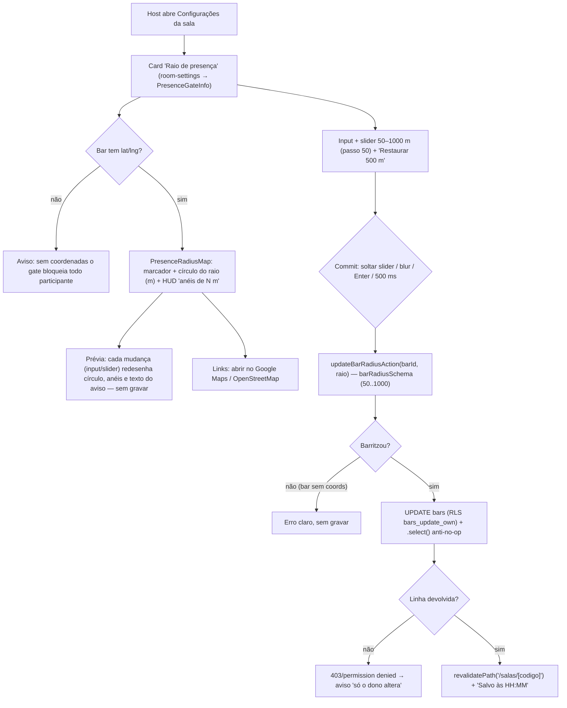
```mermaid
flowchart TD
    A["Host abre Configurações da sala"] --> B["Card 'Raio de presença' (room-settings → PresenceGateInfo)"]
    B --> C{"Bar tem lat/lng?"}
    C -->|não| C1["Aviso: sem coordenadas o gate bloqueia todo participante"]
    C -->|sim| D["PresenceRadiusMap: marcador + círculo do raio (m) + HUD 'anéis de N m'"]
    D --> D1["Prévia: cada mudança (input/slider) redesenha círculo, anéis e texto do aviso — sem gravar"]
    B --> E["Input + slider 50–1000 m (passo 50) + 'Restaurar 500 m'"]
    E --> F{"Commit: soltar slider / blur / Enter / 500 ms"}
    F --> G["updateBarRadiusAction(barId, raio) — barRadiusSchema (50..1000)"]
    G --> H{"Barritzou?"}
    H -->|"não (bar sem coords)"| H1["Erro claro, sem gravar"]
    H -->|sim| I["UPDATE bars (RLS bars_update_own) + .select() anti-no-op"]
    I --> J{"Linha devolvida?"}
    J -->|não| J1["403/permission denied → aviso 'só o dono altera'"]
    J -->|sim| K["revalidatePath('/salas/[codigo]') + 'Salvo às HH:MM'"]
    D --> L["Links: abrir no Google Maps / OpenStreetMap"]
```

**Dono do raio (2026-09-26):** a escrita é feita pelo **client do usuário** (`updateBarRadiusAction` → `supabase.from("bars").update(...)`), não por RPC — quem não é o dono é barrado pela RLS `bars_update_own`, e o `.select()` posterior transforma o "no-op" da policy em erro em vez de sucesso silencioso. O valor é do **bar**, não da sala: o raio salvo vale para as outras salas do mesmo bar sem nova ação. Constantes e validação são uma fonte só (`RAIO_*` em `src/types/bar.ts` → `barRadiusSchema` em `src/lib/bars/schema.ts`), casando com o `check` do banco; **nenhuma migration nova** foi necessária.

### 2.3 Fechar/sair/reabrir

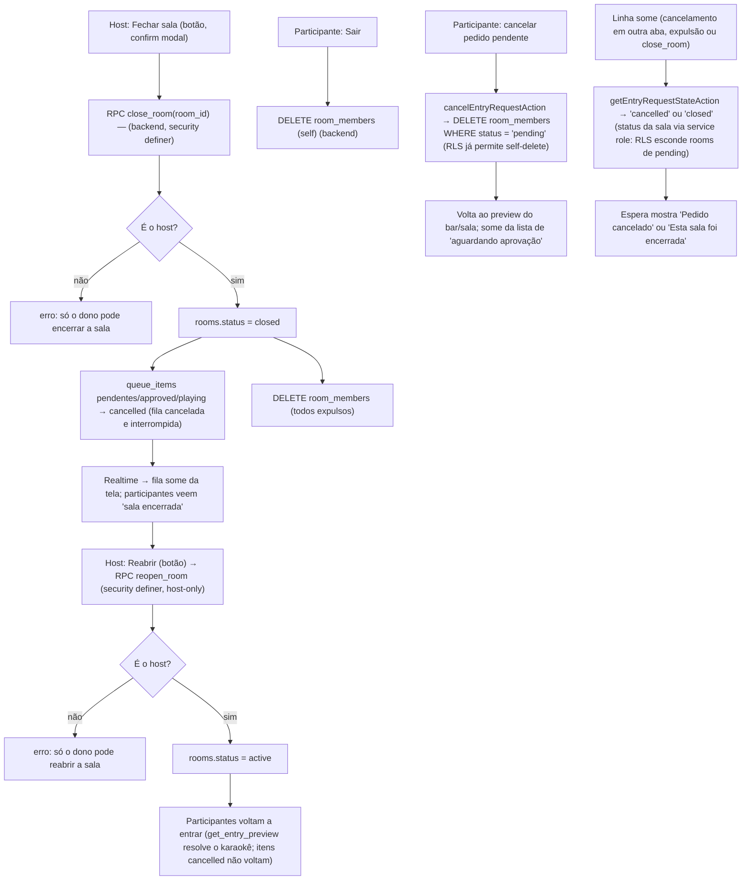
```mermaid
flowchart TD
    A["Host: Fechar sala (botão, confirm modal)"] --> B["RPC close_room(room_id) — (backend, security definer)"]
    B --> B1{É o host?}
    B1 -->|não| B2["erro: só o dono pode encerrar a sala"]
    B1 -->|sim| C["rooms.status = closed"]
    C --> D["queue_items pendentes/approved/playing → cancelled (fila cancelada e interrompida)"]
    C --> E["DELETE room_members (todos expulsos)"]
    D --> F["Realtime → fila some da tela; participantes veem 'sala encerrada'"]
    F --> R["Host: Reabrir (botão) → RPC reopen_room (security definer, host-only)"]
    R --> R1{É o host?}
    R1 -->|não| R2["erro: só o dono pode reabrir a sala"]
    R1 -->|sim| R3["rooms.status = active"]
    R3 --> R4["Participantes voltam a entrar (get_entry_preview resolve o karaokê; itens cancelled não voltam)"]
    A2["Participante: Sair"] --> G["DELETE room_members (self) (backend)"]
    A3["Participante: cancelar pedido pendente"] --> A4["cancelEntryRequestAction → DELETE room_members<br/>WHERE status = 'pending' (RLS já permite self-delete)"]
    A4 --> A5["Volta ao preview do bar/sala; some da lista de 'aguardando aprovação'"]
    A6["Linha some (cancelamento em outra aba, expulsão ou close_room)"] --> A7["getEntryRequestStateAction → 'cancelled' ou 'closed'<br/>(status da sala via service role: RLS esconde rooms de pending)"]
    A7 --> A8["Espera mostra 'Pedido cancelado' ou 'Esta sala foi encerrada'"]
```

---

## 3. Fila (regras de banco)

### 3.1 Adicionar música

**Matriz de presença física (Fase 4):** antes do `INSERT`, a server action `addSongToQueueAction` revalida **membro aprovado/pendente** e a **presença** do participante (`kf-geo` × coords do bar ± raio) — mesmos códigos da busca: `GEO_UNAVAILABLE` (bar sem coords ou geo ausente) / `OUTSIDE_BAR` (fora do raio); **host isento**. **Desde 03/10 (`20261003000041`)** o status vem de `member_entry_state` (o efetivo, com a pré-aprovação de 24h) em vez de `select status` em `room_members`, e um membro com `fora_do_raio` gravado no join é recusado com `OUTSIDE_BAR` **antes** do INSERT.

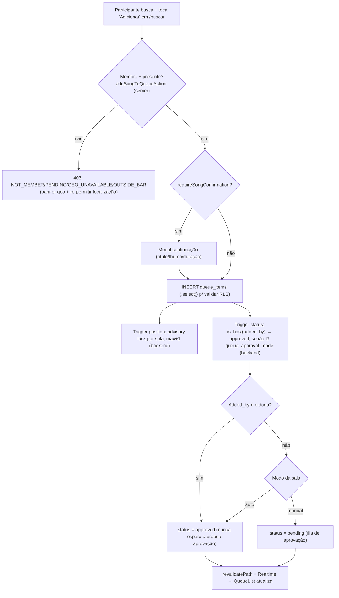
```mermaid
flowchart TD
    A["Participante busca + toca 'Adicionar' em /buscar"] --> G{"Membro + presente?<br/>addSongToQueueAction (server)"}
    G -->|não| G1["403: NOT_MEMBER/PENDING/GEO_UNAVAILABLE/OUTSIDE_BAR<br/>(banner geo + re-permitir localização)"]
    G -->|sim| B{requireSongConfirmation?}
    B -->|sim| C["Modal confirmação (título/thumb/duração)"]
    C --> D["INSERT queue_items (.select() p/ validar RLS)"]
    B -->|não| D
    D --> E["Trigger position: advisory lock por sala, max+1 (backend)"]
    D --> F["Trigger status: is_host(added_by) → approved; senão lê queue_approval_mode (backend)"]
    F --> G2{Added_by é o dono?}
    G2 -->|sim| H["status = approved (nunca espera a própria aprovação)"]
    G2 -->|não| G3{Modo da sala}
    G3 -->|auto| H
    G3 -->|manual| I["status = pending (fila de aprovação)"]
    H --> J["revalidatePath + Realtime → QueueList atualiza"]
    I --> J
```

### 3.1.2 Uma música ativa por participante — migration `20261004000042` (2026-10-04)

**Regra:** um participante tem no máximo **uma** música **ativa** por sala. Ativa
não é um estado novo — é exatamente o que a fila mostra
(`QUEUE_VISIBLE_STATUSES`): `pending` + `approved` + `playing`. `played`,
`rejected`, `skipped` e `cancelled` são terminais e não ocupam vaga. Pedir outra
**substitui** a ativa anterior; **pedir com uma tocando é recusado**.

**Por que no banco.** O pedido é um `INSERT` direto em `queue_items` com a sessão
de quem pede, governado só pela policy `queue_items_insert_member_or_host`. Uma
regra no botão seria furada por qualquer chamada autenticada. A trigger
`queue_items_one_active_per_participant` (`before insert`, em `queue_items`) é a
autoridade:

1. `auth.uid()` nulo → sai fora (seed / Management API / migration).
2. `is_host(new.room_id, auth.uid())` → sai fora: o host é isento **na sala dele**
   (`is_host` responde por sala, então dono de uma e participante de outra
   recebe a regra como participante).
3. Existe uma `playing` do próprio participante → `raise exception … errcode =
   'KF001'`. **Não** substitui: cortar o áudio da TV para a música que todo mundo
   está ouvindo é pior do que recusar o pedido.
4. `delete` das ativas `pending`/`approved` do próprio participante.
5. Recontagem: sobrou ativa? → `KF001` também. Sem `security definer`, o
   `delete` passa pela policy `queue_items_delete_own` (`20260927000031`), que já
   autoriza o autor sobre o próprio item nesses dois status — RLS real em vez de
   privilégio novo. Se a RLS barrar, a trigger falha em vez de deixar duas ativas.

**Espelho no app (não é a fonte da verdade):** a regra pura é **uma só** —
`ownActiveSongView` (`src/lib/rooms/queue.ts`), que devolve a **mensagem** e o
estado que a busca mostra. Ela é lida por `readOwnActiveSong` no servidor e por
`useOwnActiveSong` no cliente (2026-10-07, Fase 8g): o hook escuta
`postgres_changes` em `queue_items` (a virada `playing → played`, que acontece
dentro da `claim_next_song` da TV), o broadcast da fila e um poll de 10 s, com
relê no foco/visibilidade/online — as mesmas três camadas da `queue-list`.
Enquanto a faixa toca, o botão da busca fica travado com o aviso; quando ela
termina, a página destrava **sem F5**. Antes havia duas fontes de verdade (uma
prop de Server Component lida por render) e a virada de status não revalidava
`/buscar`, então o destravar dependia de alguém navegar. As actions
`claimNextSongAction`/`setPlaybackAction` revalidam `/salas/<código>` **e**
`/salas/<código>/buscar`, e a action `addSongToQueueAction` lê antes de inserir
e mapeia `KF001` para a mesma frase, o que cobre a corrida entre a leitura e o
INSERT. O **host** é isento por derivação da própria regra (ele não tem limite),
não por efeito — foi um teste dessa leitura que pegou o antigo leitor mostrando
o aviso "sua música vai sair" para o host.

**Limite declarado:** o visitante sem login autenticado é usuário Supabase
anônimo de verdade (`signInAnonymously`), com `auth.uid()` estável **por
navegador** — limpar os dados do site cria uma identidade nova. Fechar isso é
prova de identidade, não uma trigger.

## 3.1.1 Busca de música no YouTube (Fase 4 — implementado; credencial e erros revisados na Fase 8f — 2026-10-05/06)

Rota `/api/youtube/search` consumida pelo `SongSearch` (rota filha `/salas/[codigo]/buscar`). Credencial é resolvida **apenas no servidor** (service role) numa cadeia com dono em cada degrau — **chave do bar → OAuth do host**, e os dois últimos degraus (OAuth do app, `YOUTUBE_API_KEY`) **só para conta `dev`** (`is_dev`, papel vivo no banco e não numa env, falha fechada); cache `song_cache` compartilhado entre karaokês; rate limit independente da cota da Google. **Quem paga a cota de cada bar é decisão explícita** (`bars.youtube_credential_policy`, migration `20261005000043`): `own_only` (default — o bar banca a própria credencial) ou `platform_pool` (chave de conta de empresa com teto diário por bar). Ver o bloco "Política de credencial por bar" abaixo do diagrama.

```mermaid
sequenceDiagram
    autonumber
    actor P as Participante (mobile)
    participant S as SongSearch (client)
    participant R as /api/youtube/search (server)
    participant DB as Supabase (RLS + service role)
    participant YT as YouTube Data API v3

    P->>S: digita (debounce 500ms + AbortController)
    S->>R: GET /api/youtube/search?room=CODE&q=...
    R->>DB: auth → rooms + bars (coords/raio) + membership (RLS)
    alt não membro / pendente
        R-->>S: 403 (NOT_MEMBER / PENDING)
    else participante
        R->>DB: presença: kf-geo × coords (host isento)
        alt fora do raio / sem geo
            R-->>S: 403 (OUTSIDE_BAR / GEO_UNAVAILABLE, geoRequired)
        end
    end
    R->>R: rate limit ip:userId 60/h
    alt estourou
        R-->>S: 429 + Retry-After
    end
    R->>DB: song_cache (query normalizada em bucket)
    alt cache fresco
        R-->>S: 200 { results, cached: true }
    else cache miss
        R->>R: credencial: chave do bar → OAuth host → (só conta dev) OAuth app → chave dev
        R->>YT: search.list safeSearch=strict + videoEmbeddable + videos.list durações
        R->>YT: OAuth Bearer ou fallback API key
        YT-->>R: itens
        R->>DB: song_cache.upsert (TTL 7d)
        R-->>S: 200 { results, cached: false, source }
    end
    S-->>P: lista (thumbnail + título + duração) + "Adicionar à fila"
```

**OAuth por-host:** bloco "Conta do YouTube" no `RoomSettings` (mostra "conectado à conta Google + data" quando há token, com botão "Remover conexão" que **revoga na Google** e apaga a linha) → `/auth/youtube/authorize` (estado nonce em cookie httpOnly, `access_type=offline&prompt=consent`) → Google → `/auth/youtube/callback` (exchange → `youtube_oauth_tokens`, **sem policies — service role**) → redirect à sala. Fallback do app: `scripts/youtube-app-oauth.mjs` (loopback) coleta o `YOUTUBE_APP_REFRESH_TOKEN` para o `.env.local`.

**A cadeia de credencial ganhou dono em cada degrau (Fase 8f — 2026-10-05, `20261005000043`):**

- **`is_dev` no portão dos últimos degraus.** Antes, a única condição de "OAuth do app" e "`YOUTUBE_API_KEY`" era "a env existe" — na prática **qualquer bar sem nada nos três primeiros degraus gastava a cota pessoal do dono**, sem ele saber e sem poder recusar. Agora os dois últimos só são alcançados por conta `dev` (`dev_accounts` no banco, `isDevAccount` falha fechada), o que mantém a conta do dev funcionando em local e remoto.
- **`bars.youtube_credential_policy`** (`own_only` | `platform_pool`, default `own_only`) e **`bars.youtube_pool_id`**: a chave é coluna da **sala** (o dono cola por sala), mas a política é decisão do **dono do bar** e vale para todas as salas dele — a coerência entre as duas mora em **trigger**, não em `if` de TypeScript (`own_only` com pool apontado e `platform_pool` sem pool ativo são recusados na escrita; mesmo padrão da `20260930000036`).
- **`youtube_credential_pools`** (chave da conta de empresa + `daily_search_budget` + `active`) com **RLS ligado e nenhuma policy** — só service role, como `song_cache` e `youtube_oauth_tokens`; uma RPC "só para membros" não resolveria (o argumento da auditoria F1, `20260930000038`). O FK do pool é `ON DELETE RESTRICT`, porque `SET NULL` anularia a invariante que o trigger sustenta.
- **`admin_youtube_credential_health(bar_id)`** (dev-only): política, rótulo/estado do pool, quantas salas têm chave própria, se o host tem OAuth conectado e se herda o orçamento — **nunca** chave, token ou id de projeto. O `daily_search_budget` é teto **de configuração**, não contador: nada impede um bar de estourá-lo, ele apenas não é contabilizado por request; e o pool não tem rotação automática de chave.
- **Erros com causa e ação.** `classifyYouTubeError` (`src/lib/youtube/errors.ts`) classifica pelo `reason` do Google (campo estável) antes da mensagem: cota, chave inválida, chave com **restrição de origem** (o caso que só aparece no deploy — a busca é server-side, não manda `Referer`, e o IP de saída não é o da máquina do dono) e API não habilitada viram textos diferentes, com `Retry-After` propagado no 429. O **`/api/youtube/diagnostics`** (só dev) mostra o estado do ambiente **sem gastar cota**; `?probe=1` faz a chamada real (100 unidades), `?room=CODIGO` mostra a credencial que aquela sala resolveria — e a chave/tokens **nunca** saem (`safeDiagnosticDetail` é fronteira com `SECRET_PATTERNS`, não rótulo). Verificado no deploy de 06/10: a causa do 502 relatado era uma chave `YOUTUBE_API_KEY` de Production com **198 dias**, não restrição de origem — foi o `?probe=1` que provou.
- **Smoke:** `scripts/smoke-youtube-credential.sql` (precisa de Postgres: o Vitest não alcança o trigger) — default `own_only`, as quatro recusas de coerência, FK `RESTRICT` e recusa de apagar pool em uso, pools invisíveis ao cliente autenticado, RPC de saúde recusada para não-dev e sem chave no corpo.

> **Falha de busca nunca é "falha de rede" (Fase 8f):** a rota responde **sempre JSON** (configuração ruim vira `SERVER_MISCONFIGURED`/503, não HTML 500), e no cliente só `fetch` recusado diz "falha de rede" — um 500 com HTML não vira mais rede na tela do participante.

### 3.2 Aprovação (host) — entregue em 2026-09-26 (Fase 5, Bloco A)

O `QueueList` ganhou um bloco **"Aguardando sua aprovação (N)"** no topo, acima da fila: o host aprova, rejeita e remove sem sair da tela, e a fila não é duplicada (as pendentes aparecem **uma vez só**, nesse bloco). Quem não é o host não vê o bloco nem os botões, mas continua vendo os pedidos pendentes na lista com o badge "aguardando aprovação". **Remover** é do mesmo Bloco A; **reordenar** é o Bloco C, entregue em 2026-09-26 (ver §3.4).

As duas server actions (`setQueueItemStatusAction`/`removeQueueItemAction`) escrevem pelo **client do usuário** — a autorização é a RLS existente (`queue_items_update_host`/`queue_items_delete_host`, host-only), sem RPC nova e sem relaxar policy. O `.select()` posterior (em `update` e em `delete`) é a prova de que a policy deixou passar: retorno vazio vira erro "Só o dono da sala pode…", não sucesso silencioso. A regra pura (`buildQueueModeration`/`buildQueueRemoval`, em `src/lib/rooms/queue.ts`) roda antes, dando a mensagem imediata e recusando `playing`/terminais — o item que está tocando só sai pela ação de pular (Fase 6/7).

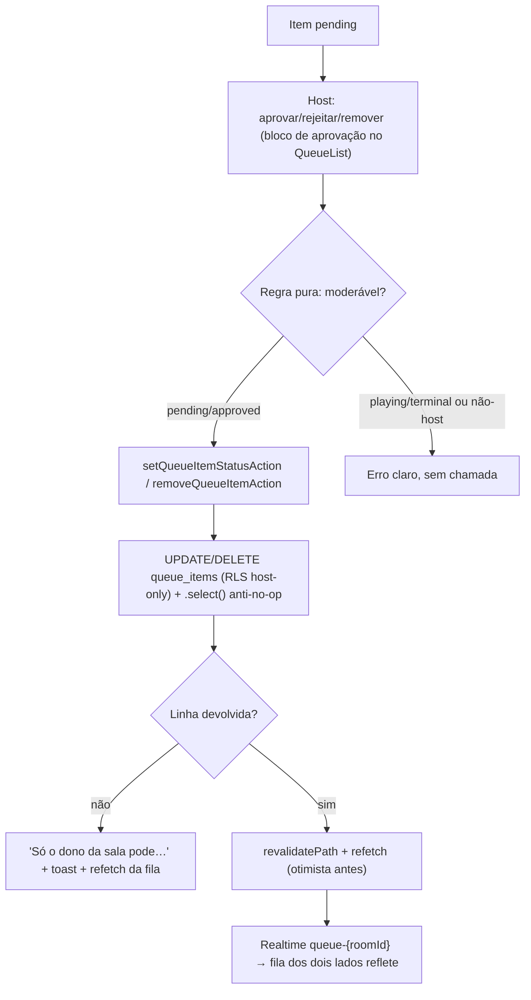
```mermaid
flowchart TD
    A["Item pending"] --> B["Host: aprovar/rejeitar/remover (bloco de aprovação no QueueList)"]
    B --> C{"Regra pura: moderável?"}
    C -->|"pending/approved"| D["setQueueItemStatusAction / removeQueueItemAction"]
    C -->|"playing/terminal ou não-host"| C1["Erro claro, sem chamada"]
    D --> E["UPDATE/DELETE queue_items (RLS host-only) + .select() anti-no-op"]
    E --> F{"Linha devolvida?"}
    F -->|não| F1["'Só o dono da sala pode…' + toast + refetch da fila"]
    F -->|sim| G["revalidatePath + refetch (otimista antes)"]
    G --> H["Realtime queue-{roomId} → fila dos dois lados reflete"]
```

### 3.4 Reordenação da fila (host) — entregue em 2026-09-26 (Fase 5, Bloco C)

O host reorder as **aprovadas** por dois caminhos, ambos gravando **uma única chamada**: as setas ⬆/⬇ (acessíveis por teclado, desabilitadas na borda) e o **drag-and-drop** com `@dnd-kit` (handle `⠿`, `PointerSensor` com `distance: 8` para não roubar o scroll do celular + `KeyboardSensor`). A lista é atualizada de forma otimista (`draftOrder`) e reconciliada com um `fetchItems()` no fim; em falha o toast explica e a ordem real do banco volta.

**Contrato da RPC `reorder_queue(p_room_id, p_item_ids)`:** o client manda a fila visível **inteira** (`playing` + `approved` + `pending`) já na ordem desejada. Isso é deliberado — `queue_items` **não tem unique em `(room_id, position)`**, então aceitar uma lista parcial criaria posições repetidas. A função valida: autenticado, `is_host`, sala `active`, sem `null`/duplicados/vazia, contagem igual à de itens visíveis e todo id pertencente à sala. Só então pega o **advisory lock com a mesma chave de `next_queue_position`** (um insert concorrente não consegue arrancar uma posição no meio do reorden) e reescreve `position = row_number()` de 1..N com um único `UPDATE ... FROM` — o realtime vê um evento só, e `pending` vai sempre para o fim porque ainda não entrou na ordem do host.

> Por que RPC e não N updates do client: cada UPDATE dispararia `touch_updated_at` → N refetches; e a policy `queue_items_update_host` é host-only **sem `WITH CHECK`**, ou seja, um update solto do client poderia até trocar o `room_id` do item. Autorizar dentro da função segue o padrão de `close_room`/`reopen_room`.

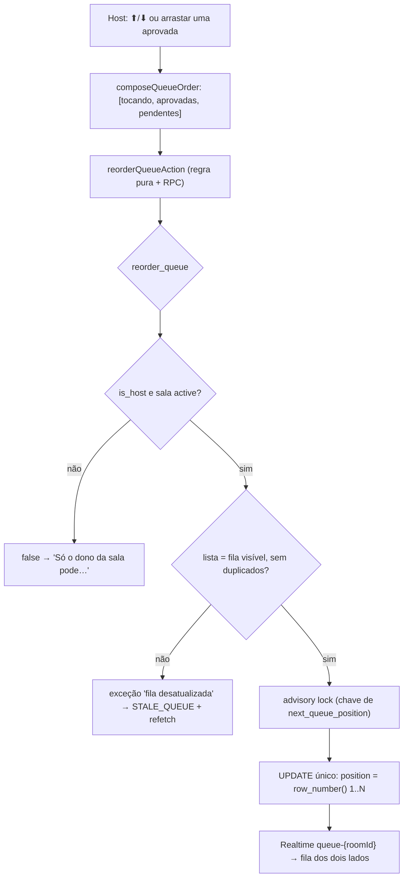
```mermaid
flowchart TD
    A["Host: ⬆/⬇ ou arrastar uma aprovada"] --> B["composeQueueOrder: [tocando, aprovadas, pendentes]"]
    B --> C["reorderQueueAction (regra pura + RPC)"]
    C --> D{"reorder_queue"}
    D --> E{"is_host e sala active?"}
    E -->|não| E1["false → 'Só o dono da sala pode…'"]
    E -->|sim| F{"lista = fila visível, sem duplicados?"}
    F -->|não| F1["exceção 'fila desatualizada' → STALE_QUEUE + refetch"]
    F -->|sim| G["advisory lock (chave de next_queue_position)"]
    G --> H["UPDATE único: position = row_number() 1..N"]
    H --> I["Realtime queue-{roomId} → fila dos dois lados"]
```

### 3.3 Reprodução e transições

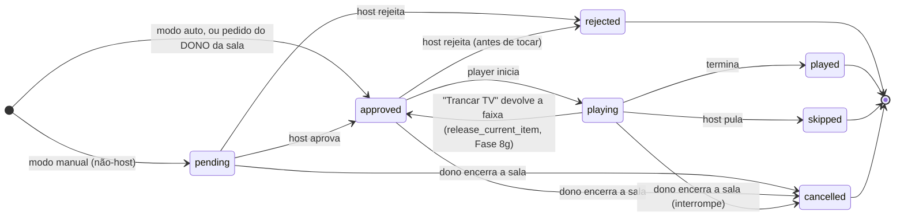
```mermaid
stateDiagram-v2
    direction LR
    [*] --> pending: modo manual (não-host)
    [*] --> approved: modo auto, ou pedido do DONO da sala
    pending --> approved: host aprova
    pending --> rejected: host rejeita
    approved --> playing: player inicia
    approved --> rejected: host rejeita (antes de tocar)
    playing --> played: termina
    playing --> skipped: host pula
    playing --> approved: "Trancar TV" devolve a faixa (release_current_item, Fase 8g)
    pending --> cancelled: dono encerra a sala
    approved --> cancelled: dono encerra a sala
    playing --> cancelled: dono encerra a sala (interrompe)
    rejected --> [*]
    played --> [*]
    skipped --> [*]
    cancelled --> [*]
```

> A operação de **trocar música** (ver §5) mantém o item no mesmo estado de status em que está (com re-regra opcional conforme decisão de produto) — não cria um estado novo.

> **Quem promove `approved → playing` agora (entregue em 27/09):** a RPC `claim_next_song`, chamada pelo **player**, e não pelo painel. Ela é a única porta de entrada em `playing` (o painel do host não tem "tocar"), garante a **mesma chave de advisory lock** da fila e marca o item anterior como `played` **só se o player mandar o id dele** (ver §4.1).
>
> **E a única volta de `playing` para `approved` (entregue em 07/10, Fase 8g):** `release_current_item`, chamada pelo quiosque no "Trancar TV" (ver §4.4). Não é um quinto status nem uma exceção à regra `KF001` — é a devolução da vez que não terminou: a música não tocou até o fim, então `played` seria mentira e `skipped` roubaria a vez de quem estava cantando.

---

## 4. Player device (tela `/player/[codigoDaSala]`) — entregue em 2026-09-27 (Fases 6 e 7)

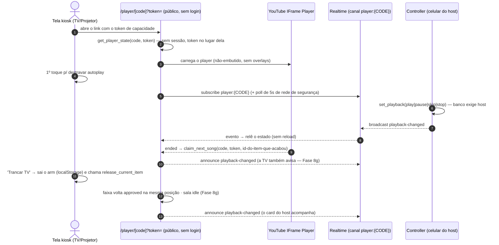
```mermaid
sequenceDiagram
    autonumber
    actor T as Tela kiosk (TV/Projetor)
    participant P as /player/[code]?token= (público, sem login)
    participant YT as YouTube IFrame Player
    participant RT as Realtime (canal player:{CODE})
    participant C as Controller (celular do host)

    T->>P: abre o link com o token de capacidade
    P->>P: get_player_state(code, token) — sem sessão, token no lugar dela
    P->>YT: carrega o player (não-embutido, sem overlays)
    T->>T: 1º toque p/ destravar autoplay
    P->>RT: subscribe player:{CODE} (+ poll de 5s de rede de segurança)
    C->>C: set_playback(play|pause|skip|stop) — banco exige host
    C-->>RT: broadcast playback-changed
    RT-->>P: evento → relê o estado (sem reload)
    YT-->>P: ended → claim_next_song(code, token, id-do-item-que-acabou)
    P-->>RT: announce playback-changed (a TV também avisa — Fase 8g)
    T->>T: 'Trancar TV' → sai o arm (localStorage) e chama release_current_item
    P->>P: faixa volta approved na mesma posição · sala idle (Fase 8g)
    P-->>RT: announce playback-changed (o card do host acompanha)
```

> Latência alvo < 2s entre ação no controller e reflexo na tela: o caminho rápido é o broadcast; o poll de 5s existe para canal caído (TV ligada o dia todo).

### 4.1 A corrida do avanço automático (e a migration que a fechou)

O player descobre que a música acabou de duas formas ao mesmo tempo: o `onStateChange(ENDED)` do YouTube e o poll de 5s que acabou de passar. Se as duas chamassem `claim_next_song` com a sala "ociosa", a segunda chamada veria a sala ocupada e simplesmente devolveria o estado novo — mas como o player **avançava** ao ser chamado, uma delas pulava a música que estava tocando.

A correção é o item **que terminou** viajar no pedido: `claim_next_song(p_room_code, p_token, p_finished_item_id)`. O banco só terminaliza (`playing → played`) se esse id ainda for o `rooms.current_item_id`; se for outro, a chamada é **no-op** e devolve `already_advanced: true` com o estado atual. O `onEnded` do client é o único que manda o id, então o poll (que manda `null`) nunca atrapalha.

### 4.2 O que é estado do playback e onde mora

| Dado | Onde | Por quê |
|---|---|---|
| Tocando agora / pausado / parado | `rooms.playback_status` | O painel do host e a TV leem o mesmo dado; a UI não adivinha pelo `queue_items` |
| Item atual | `rooms.current_item_id` (FK `on delete set null`) | Referência única para "tocando agora"; remover o item da fila esvazia a sala sozinha |
| Âncora de tempo | `rooms.current_item_started_at` | Base da Fase 13 (tempo de música, alarme, minutagem) |
| Link da TV | `rooms.player_token` | Token de capacidade: sem ele a rota pública não abre nada, e "gerar novo link" invalida a TV velha |
| Invariante | trigger `rooms_sync_playback` | `current_item_id` só aponta para item `playing`; sem item, sala `idle` e âncora nula |

> Fora do escopo entregue: pré-carregar o próximo vídeo e os eventos `queueUpdated`/`reorder` no canal do player (a TV relê por poll). Ver `TODO.md`.

### 4.3 A segunda porta do player e a pré-aprovação de 24h (Fase 8a — 2026-09-27)

O player nasceu como tela **da TV**: a única autorização era o token de capacidade, que só existe na página do host. No uso real apareceu o furo correspondente: quem pede uma música precisa ver a watch party **da sala dele**, e não tinha porta nenhuma — o caminho terminava em "pedi a música, recebi um toast e fiquei na tela de busca".

A autorização ficou com **duas portas**, decididas dentro de `player_room_id` (nunca no client):

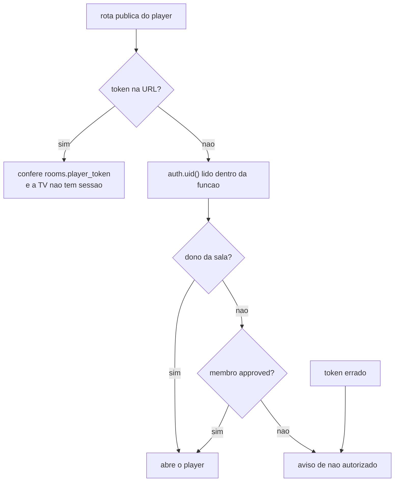
```mermaid
flowchart TD
    A["rota publica do player"] --> B{token na URL?}
    B -->|sim| C["confere rooms.player_token<br/>e a TV nao tem sessao"]
    B -->|nao| D["auth.uid() lido dentro da funcao"]
    D --> E{dono da sala?}
    E -->|sim| F[abre o player]
    E -->|nao| G{membro approved?}
    G -->|sim| F
    G -->|nao| H[aviso de nao autorizado]
    I["token errado"] --> H
```

| Porta | Quem é | O que o banco exige |
|---|---|---|
| `p_token` preenchido | a TV (anônima, sem membership) | `rooms.player_token` da sala |
| `p_token` nulo | participante logado ou host | `auth.uid() = rooms.host_id` **ou** `room_members.status = 'approved'` |

Três regras que vieram junto, para não abrir brecha:

- **Token errado não cai para a sessão.** Se caísse, um link velho da TV deixaria de avisar que morreu — e o quiosque abriria o player de outra sala para quem estivesse logado no mesmo navegador.
- **`auth.uid()` é lido dentro da função.** Um `p_user` vindo do client seria forjável; o argumento opcional existe para o service role dos smokes e para o próprio usuário.
- **Membro `pending` não entra.** Pré-aprovação de 24h vale para a entrada e para o player: só entra quem está `approved` de verdade.

No app, `getPlayerStateAction` e o quiosque aceitam token **ausente** (`null` = sessão) e **adicionar música redireciona** para o player da sala; a troca de música continua voltando para a busca. O token da TV nunca é enviado ao navegador do participante.

Dois consertos de comportamento que o mesmo levantamento trouxe (os detalhes estão no `CHANGELOG` e no `TODO.md` da Fase 8a):

- **A TV acorda tocando.** O quiosque só pedia a próxima faixa no `onStateChange(ENDED)`; quem acordasse, recarregasse ou perdesse o broadcast com a sala ociosa ficava parado no QR para sempre. Agora qualquer leitura de estado que encontra **sala ociosa com fila aprovada** pede música (`shouldClaimFromIdle`), e aprovar/rejeitar/remover/reordenar emite broadcast — o poll de 5s virou só a rede de segurança.
- **O painel do host aprovava nada.** O embed `rooms(...)` das actions de fila virou ambíguo quando `rooms.current_item_id` passou a apontar para `queue_items` (PGRST201), e o erro era reportado como "música não encontrada". Corrigido com o hint explícito da FK, com o erro real chegando ao `toast`, e com `npm run diagnose:queue` no repositório para o próximo bug de RPC/PostgREST.

### 4.4 A faixa presa em `playing` e a RPC `release_current_item` (Fase 8g — 2026-10-07, migration `20261005000044`)

**O sintoma:** com o quiosque **trancado** ("Trancar TV") e uma faixa no ar, o cantor daquela música ficava **bloqueado para sempre** — todo pedido novo dele era recusado com `KF001` ("você já tem uma música tocando") e nada mais tirava o item de `playing`: `onEnded` não dispara com o stage desmontado, e `shouldAutoAdvance`/`shouldClaimFromIdle` respondem `false` porque o quiosque está desarmado. A única saída era o host lembrar de apertar Pular/Parar.

**Por que o banco não sabia que a TV trancou.** O estado "armada/desarmada" vive só no `localStorage` da TV (`player-arm.ts`, por origem) — é um gate de autoplay, não um estado de sala. Conferido em 2026-10-07: a migration `20260927000032_playback_held` **nunca existiu** (o diretório salta de `00031` para `00033`), então não há coluna nenhuma que registre "sala segurada". Quem sabe que trancou é, portanto, **o próprio quiosque** — e é ele quem precisa dar o passo de saída.

**A RPC (`security definer`, mesma porta de `claim_next_song`):** `release_current_item(p_room_code, p_token)` resolve a sala por `player_room_id` — **token da TV ou sessão** (host da sala ou membro `approved`; forasteiro não libera, token errado não cai para a sessão), sob o **mesmo advisory lock** das demais operações de playback. Com uma faixa em `playing`, devolve o item para **`approved` na mesma posição** (a música não terminou, então `played` seria mentira, e `skipped` roubaria a vez de quem estava cantando) e põe a sala em `idle`; sem música no ar, responde `released: false` e nada muda. A sala encerrada recusa.

**A ordem no `Trancar TV` importa:** o arm sai **primeiro** (`setPlayerArmed(false)`), para que nenhum `claim` dispare entre o clique e a liberação; o RPC sai em seguida, sem esperar a UI. **Falha do RPC não impede o travamento** (a TV fecha mesmo assim), e depois disso o `refresh` roda de qualquer jeito para a tela não mentir. Quando o release efetivamente devolve uma faixa, o quiosque **anuncia** no canal `player:{CODE}` — senão o card do host (§6 de `fluxos-do-usuario.md`) ficaria dizendo "tocando" para uma sala que acabou de ficar ociosa.

**Verificação (2026-10-07):** migration aplicada no projeto Cloud `kskoipyzqcacccepcqpc` e **`scripts/smoke-release-current-item.sql` rodou 11/11** (sala `SMOKE8G`, autossuficiente): `KF001` recusa com a faixa no ar · release devolve `approved` na mesma posição com sala `idle` · sem faixa no ar `released: false` · token errado não cai para sessão · host libera pela sessão · forasteiro não libera · sala encerrada recusa · **depois do release o cantor pede de novo**. Roteiro manual em [`TESTING.md`](../../TESTING.md) §3.16.

**Limite declarado:** fechar o navegador da TV **no meio da faixa** não dispara nada (não há servidor para avisar) — o destravamento aí continua sendo Pular/Parar do host, que já existia. O `claim_next_song` **não foi tocado**: ele só é chamado por uma TV armada, então não havia momento em que ele pudesse enxergar o travamento.

---

## 5. Trocar a música da fila mantendo a posição — entregue em 2026-09-26 (Fase 5, Bloco D)

> As opções abaixo são o histórico da decisão; a implementação é a **Opção A**, com as regras D1–D3 já fechadas com o PO (§5.2).

### Contexto

Cada item da fila é uma linha de `queue_items` com `position` atribuído no banco. **Reordenar** (host, Fase 5) apenas reescreve `position`. **Trocar a música** é substituir o conteúdo de um item **sem mover a posição** — ex.: pedi "Aleatório" mas coloquei a versão errada, ou mudei de ideia antes de tocar.

### 5.1 Opções de implementação (histórico)

| Opção                                                  | O que é                                                                                 | Prós                                                                                        | Contras                                                                                                | Veredito                   |
| ------------------------------------------------------ | --------------------------------------------------------------------------------------- | ------------------------------------------------------------------------------------------- | ------------------------------------------------------------------------------------------------------ | -------------------------- |
| **A — UPDATE in place via RPC `replace_queue_song`**   | Mantém a mesma linha (`id`, `position`, `status`) e só troca vídeo/título/thumb/duração | Posição garantida; atômico; Realtime é um único UPDATE; sem furo de histórico de `position` | Sobrescreve a música original (sem histórico); precisa de RPC + policy nova                            | **Recomendada para o MVP** |
| **B — DELETE + INSERT na mesma posição**               | Apaga o item e recria naquela posição (reajustando as demais)                           | "Histórico" do slot preservado (novo id)                                                    | `id` novo quebra a referência de "tocando agora" e o Realtime; 2 operações; risco de corrida           | Não recomendada            |
| **C — Normalizar `songs` e referenciar por `song_id`** | Tabela de catálogo; trocar = trocar FK                                                  | Modelo "correto" p/ futuro/catálogo                                                         | Retrabalho grande; mesma música por 2 pessoas vira 1 linha (perde "quem pediu o quê"); overkill no MVP | Roadmap                    |

**Decisão assumida: Opção A (RPC `security definer`), com regras de negócio fechadas com o PO:**

- **Quem troca (D1):** o **autor** da música, **ou o host** (host pode trocar qualquer item). O host **também pode reordenar** a playlist (movimenta `position`, funcionalidade já prevista na Fase 5 — complementar à troca, que **não** mexe em `position`).
- **Status preservado (D2):** a troca **mantém a aprovação** — no modo manual, uma música já aprovada, quando trocada, continua `approved` (troca 1:1, não volta ao fim nem à fila de aprovação).
- **Estados permitidos (D3):** `pending` e `approved` (enquanto ainda não tocou). Host **pode adicionar quantas músicas quiser, sem limite**, e a ordem da fila é sempre respeitada (o limite — se algum dia houver — nunca é imposto no insert de host).

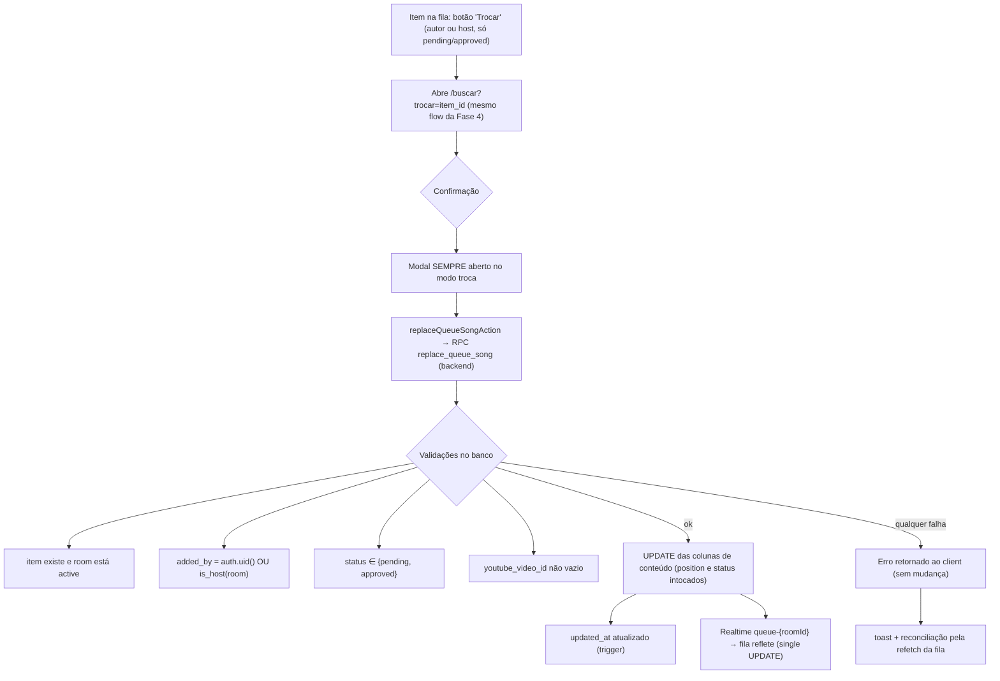
```mermaid
flowchart TD
    A["Item na fila: botão 'Trocar' (autor ou host, só pending/approved)"] --> B["Abre /buscar?trocar=item_id (mesmo flow da Fase 4)"]
    B --> C{"Confirmação"}
    C --> D["Modal SEMPRE aberto no modo troca"]
    D --> E["replaceQueueSongAction → RPC replace_queue_song (backend)"]
    E --> F{Validações no banco}
    F --> F1["item existe e room está active"]
    F --> F2["added_by = auth.uid() OU is_host(room)"]
    F --> F3["status ∈ {pending, approved}"]
    F --> F4["youtube_video_id não vazio"]
    F -->|ok| G["UPDATE das colunas de conteúdo (position e status intocados)"]
    G --> H["updated_at atualizado (trigger)"]
    G --> I["Realtime queue-{roomId} → fila reflete (single UPDATE)"]
    F -->|qualquer falha| K["Erro retornado ao client (sem mudança)"]
    K --> L["toast + reconciliação pela refetch da fila"]
```

> **Reordenar (host) é operação distinta**: reescreve `position` de vários itens (pendências de Fase 5); a troca nunca muda a ordem.

> **Formas de reordenar (entregue no Bloco C):** mover ⬆/⬇ por item **e** drag-and-drop (ambos); `position` reescrito de forma atômica na RPC `reorder_queue`, com advisory lock na chave de `next_queue_position` — a concorrência com insert é tratada no banco, não no client (§3.4).

**Payload da RPC (entregue):** `p_item_id uuid`, `p_youtube_video_id text`, `p_title text`, `p_thumbnail_url text`, `p_duration_seconds integer`. Retorna `true` em sucesso, `false` quando o item não existe ou o usuário não é autor/host, e **levanta exceção com mensagem legível** para o resto (não autenticado, sala encerrada, música já saiu da fila, vídeo/título/duração inválidos). A action `replaceQueueSongAction` traduz `fila`/mensagens do banco para texto de toast e revalida a sala e a página de busca.

**Onde a regra mora:** o contrato D1–D3 é validado **no banco** (fonte da verdade) e **repetido na regra pura** `buildQueueSongReplacement` (`src/lib/rooms/queue.ts`) para dar erro imediato sem round-trip. A page `/buscar` também valida o item no servidor: quem não puder trocar cai no fluxo normal de "pedir música", em vez de numa tela morta.

**RLS impactada:** hoje `queue_items` só aceita UPDATE de host (`queue_items_update_host`). A RPC `security definer` roda como superuser/definer e impõe as checagens acima explicitamente — **o client não ganha UPDATE direto** (nada de relaxar a policy).

### 5.2 Questões de fluxo — resolvidas com o PO ✅

| #   | Pergunta                                   | Resposta                                                                                       |
| --- | ------------------------------------------ | ---------------------------------------------------------------------------------------------- |
| D1  | Quem pode trocar?                          | **Autor + host** (e host também reordena a playlist).                                          |
| D2  | Modo manual: música aprovada que é trocada | **Mantém aprovada** (não volta ao fim nem à aprovação).                                        |
| D3  | Estados permitidos para trocar             | **`pending` e `approved`** (ainda não tocou). Extras: host adiciona **sem limite** de músicas. |

### 5.3 Impacto na UI (entregue, vide `fluxos-do-usuario.md`)

- Botão "Trocar" (ícone ↻) nos itens **pendentes e aprovados** que o usuário pediu — e em qualquer item quando ele é o host (D1).
- O mesmo `SongSearch` + `SongConfirmDialog` da Fase 4 é reutilizado em `/salas/[codigo]/buscar?trocar=<itemId>`; no modo troca o botão do resultado vira ↻ e a **confirmação é sempre exigida**, mesmo com `rooms.require_song_confirmation` desligado (a ação sobrescreve o pedido de outra pessoa).
- O diálogo no modo troca promete o que a RPC faz: "a posição na fila e a aprovação são mantidas" (D2).
- Sem update otimista aqui (o conteúdo muda, não a ordem): toast de sucesso com o título novo e a refetch reconcilia pelo realtime.
