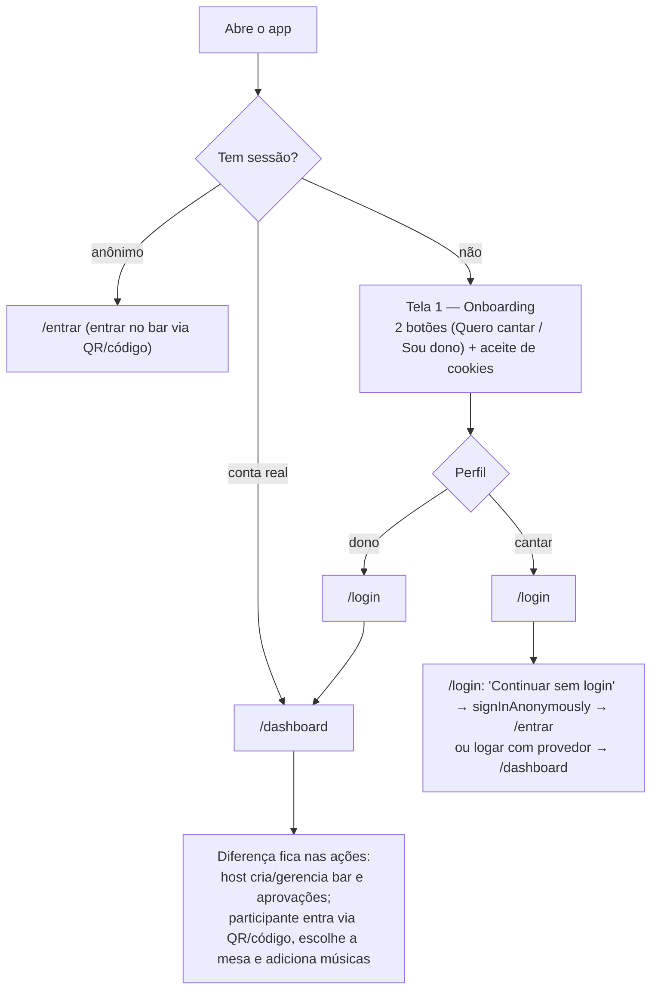
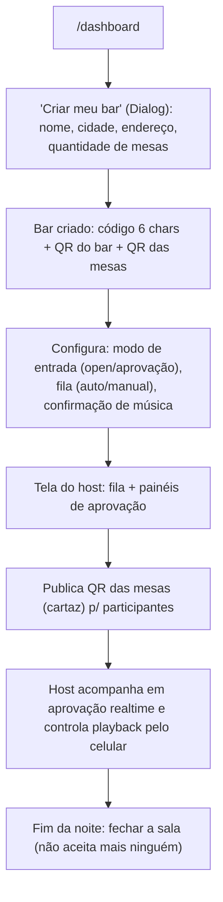
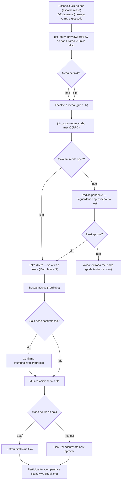
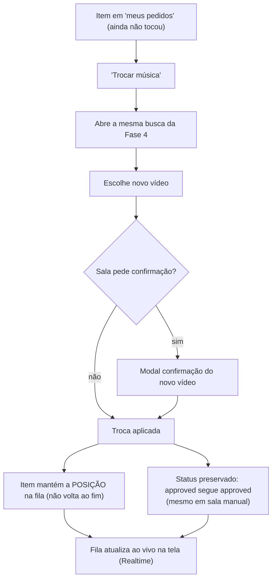
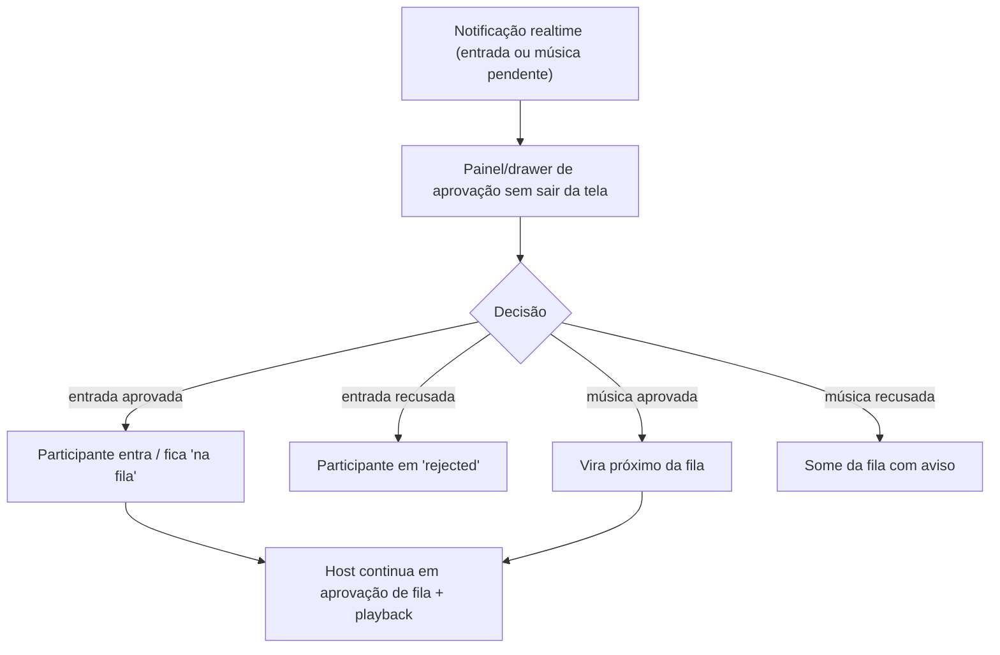
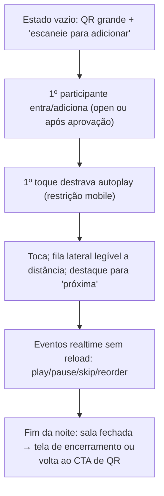
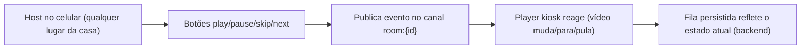

# Fluxos do usuário

Jornadas por persona no MVP. Foco em telas, toques e decisões — o "quê" e o "porquê"; o "como" técnico está em [`fluxos-do-sistema.md`](./fluxos-do-sistema.md).

Personas:

- **Host** — dono do bar/restaurante que controla a sala.
- **Participante** — cliente que escaneia o QR e adiciona músicas.
- **Tela kiosk** — TV/projetor em modo quiosque (rota pública `/player/[codigoDaSala]`).

---

## 1. Primeiro acesso (todos)

Tela de bifurcação (MVP — spec §2.5): antes de qualquer login, o usuário escolhe o perfil ("Quero cantar" / "Sou dono"). O texto dos botões segue o idioma do navegador; a coleta de idioma/geolocalização e o cookie de preferências (idioma + último perfil) só ocorrem após o **aceite de cookies** (LGPD/GDPR), independentemente do botão escolhido. Se já há sessão, o proxy pula para o dashboard (real) ou `/entrar` (anônimo).

Após o login, o fluxo de sessão/dashboard é comum aos dois perfis (ver [`fluxos-do-sistema.md`](./fluxos-do-sistema.md) §1).

---

## 2. Host — criar bar e começar a noite

---

## 3. Participante — entrar e adicionar música

### 3.3 Participante — trocar a própria música mantendo a posição (Proposta, Fase 5)

---

## 4. Host — aprovar entradas e músicas

---

## 5. Tela kiosk — do vazio ao show

---

## 6. Controle de playback (host, pelo celular)

---

## Anexo — decisões que afetam os fluxos acima (fechadas com o PO)

| #   | Decisão                            | Impacto                                                                                       |
| --- | ---------------------------------- | --------------------------------------------------------------------------------------------- |
| D1  | Quem pode trocar a música          | §3.3: **autor ou host** (host também **reordena** a playlist)                                 |
| D2  | Status ao trocar em sala manual    | §3.3: **mantém aprovada** — não volta ao fim nem re-aprovação                                 |
| D3  | Estados em que a troca é permitida | §3.3: `pending`+`approved`; host adiciona músicas **sem limite**, respeitando a ordem da fila |

As opções detalhadas estão na **seção 5 de [`fluxos-do-sistema.md`](./fluxos-do-sistema.md)**.
