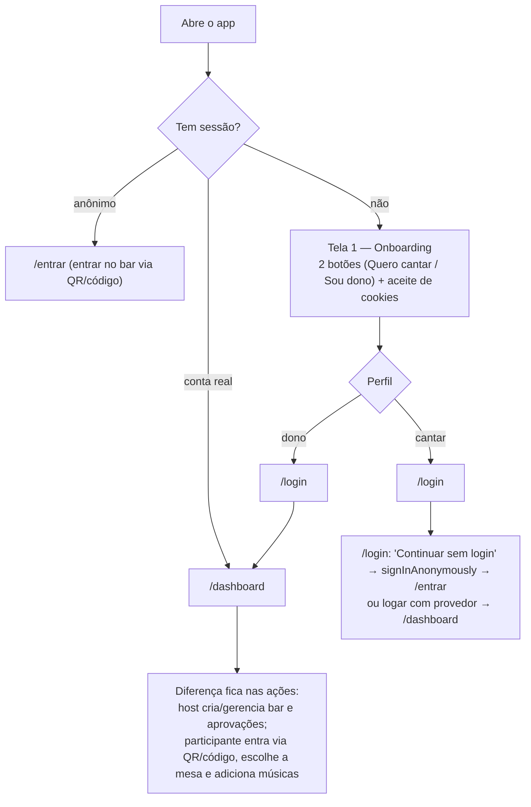
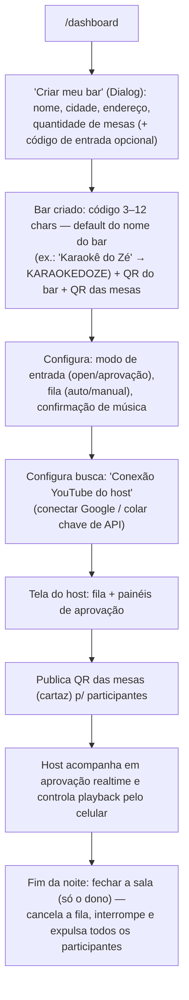
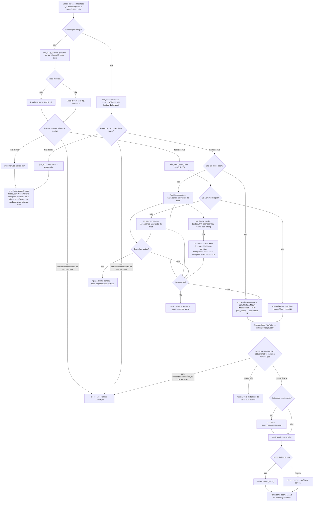
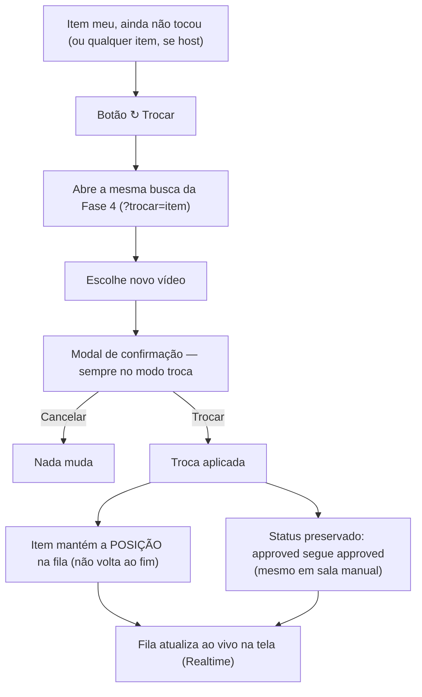
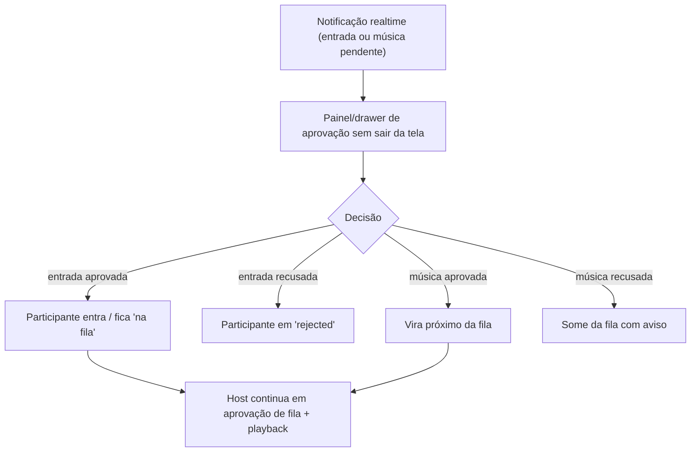
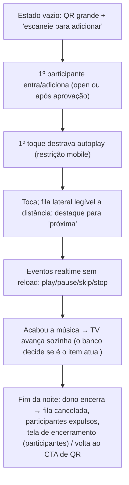
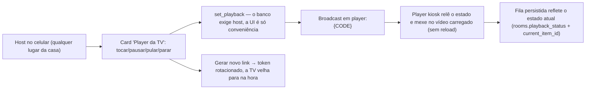

# Fluxos do usuário

Jornadas por persona no MVP. Foco em telas, toques e decisões — o "quê" e o "porquê"; o "como" técnico está em [`fluxos-do-sistema.md`](./fluxos-do-sistema.md).

Personas:

- **Host** — dono do bar/restaurante que controla a sala.
- **Participante** — cliente que escaneia o QR e adiciona músicas.
- **Tela kiosk** — TV/projetor em modo quiosque (rota pública `/player/[codigoDaSala]`).

---

## 1. Primeiro acesso (todos)

Tela de bifurcação (MVP — spec §2.5): antes de qualquer login, o usuário escolhe o perfil ("Quero cantar" / "Sou dono"). O texto dos botões segue o idioma do navegador; a coleta de idioma/geolocalização e o cookie de preferências (idioma + último perfil) só ocorrem após o **aceite de cookies** (LGPD/GDPR), independentemente do botão escolhido. Se já há sessão, o proxy pula para o dashboard (real) ou `/entrar` (anônimo).

```mermaid
flowchart TD
    A["Abre o app"] --> B{Tem sessão?}
    B -->|anônimo| B1["/entrar (entrar no bar via QR/código)"]
    B -->|conta real| G["/dashboard"]
    B -->|não| C["Tela 1 — Onboarding<br/>2 botões (Quero cantar / Sou dono) + aceite de cookies"]
    C --> D{"Perfil"}
    D -->|cantar| E["/login"]
    D -->|dono| F["/login"]
    E --> E1["/login: 'Continuar sem login' → signInAnonymously → /entrar<br/>ou logar com provedor → /dashboard"]
    F --> G
    G --> H["Diferença fica nas ações:<br/>host cria/gerencia bar e aprovações;<br/>participante entra via QR/código, escolhe a mesa e adiciona músicas"]
```

Após o login, o fluxo de sessão/dashboard é comum aos dois perfis (ver [`fluxos-do-sistema.md`](./fluxos-do-sistema.md) §1).

---

## 2. Host — criar bar e começar a noite

```mermaid
flowchart TD
    A["/dashboard"] --> B["'Criar meu bar' (Dialog): nome, cidade, endereço,<br/>quantidade de mesas (+ código de entrada opcional)"]
    B --> C["Bar criado: código 3–12 chars — default do nome do bar<br/>(ex.: 'Karaokê do Zé' → KARAOKEDOZE) + QR do bar + QR das mesas"]
    C --> D["Configura: modo de entrada (open/aprovação),<br/>fila (auto/manual), confirmação de música"]
    D --> D1["Configura busca: 'Conexão YouTube do host'<br/>(conectar Google / colar chave de API)"]
    D1 --> E["Tela do host: fila + painéis de aprovação"]
    E --> F["Publica QR das mesas (cartaz) p/ participantes"]
    F --> G["Host acompanha em aprovação realtime e controla playback pelo celular"]
    G --> H["Fim da noite: fechar a sala (só o dono) —<br/>cancela a fila, interrompe e expulsa todos os participantes"]
```

---

## 3. Participante — entrar e adicionar música

```mermaid
flowchart TD
    A["QR do bar (escolhe mesa)<br/>QR da mesa (mesa já vem) / digita code"] --> R{"Entrada por código?"}
    R -->|sim| R1["join_room sem mesa - entra DIRETO na sala (código do karaokê)"]
    R -->|não| P["get_entry_preview: preview do bar + karaokê único ativo"]
    P --> M{"Mesa definida?"}
    M -->|não| M1["Escolhe a mesa (grid 1..N)"]
    M -->|sim| MM["Mesa já vem no QR (?mesa=N)"]
    M1 --> GB{"Presença: geo × raio (host isento)"}
    MM --> GB
    GB -->|sem consentimento/coords, ou bar sem raio| G1["bloqueado: 'Permitir localização'"]
    GB -->|fora do raio| GB1["aviso 'fora do raio do bar'"]
    GB -->|dentro do raio| B["join_room(room_code, mesa) (RPC)"]
    GB1 --> GBV
    R1 --> G0{"Presença: geo × raio (host isento)"}
    G0 -->|sem consentimento/coords, ou bar sem raio| G1
    G0 -->|fora do raio| G01["join_room sem mesa · espectador"]
    G0 -->|dentro do raio| C{Sala em modo open?}
    G01 --> GBV
    GBV["vê a fila em /salas/<código> · sem busca, sem MesaPicker e sem pedir música · 'Ver o player' abre /player/<código> em modo somente leitura e mudo"]
    C -->|sim| D0["approved · sem mesa → sala PEDE A MESA<br/>(MesaPicker → RPC pick_mesa) → 'Bar · Mesa N'"]
    C -->|não| E["Pedido pendente — 'aguardando aprovação do host'"]
    B --> C2{Sala em modo open?}
    C2 -->|sim| D["Entra direto — vê a fila e busca ('Bar · Mesa N')"]
    C2 -->|não| E2["Pedido pendente — 'aguardando aprovação do host'"]
    E --> F{Host aprova?}
    F -->|sim| D0
    F -->|não| G["Aviso: entrada recusada (pode tentar de novo)"]
    E2 --> F
    E --> E3{"Cancela o pedido?"}
    E3 -->|sim| E4["Apaga a linha pending → volta ao preview do bar/sala"]
    E3 -->|não| F
    E2 --> E3
    E --> E5["Sai da tela e volta?<br/>(código, QR, dashboard ou /entrar sem token)"]
    E5 -->|volta| E6["Tela de espera de novo (membership lida no servidor,<br/>sem gate de presença e sem pedir entrada de novo)"]
    E6 --> F
    D0 --> H["Busca música (YouTube — /salas/[codigo]/buscar)"]
    D --> H
    H --> H0{"Ainda presente no bar?<br/>addSongToQueueAction revalida geo"}
    H0 -->|sem consentimento/coords, ou bar sem raio| G1
    H0 -->|fora do raio| G2["recusa: 'fora do bar não dá para pedir música'"]
    H0 -->|dentro do raio| I{Sala pede confirmação?}
    I -->|sim| J["Confirma thumbnail/título/duração"]
    J --> K["Música adicionada à fila"]
    I -->|não| K
    K --> L{Modo de fila da sala}
    L -->|auto| M2["Entrou direto (na fila)"]
    L -->|manual| N["Ficou 'pendente' até host aprovar"]
    M2 --> O["Participante acompanha a fila ao vivo (Realtime)"]
    N --> O
```

> **Pré-aprovação de 24h (2026-09-27, Fase 8a):** quem o host aprovou e **tem conta** volta aprovado por **24h** ao reconectar na sala, sem o host tocar em nada. Passou disso (ou com o toggle desligado no banco) a entrada volta a ser pedida normalmente, e **sair da sala** sempre exige aprovação nova — a linha do participante é apagada, então voltar é uma entrada do zero. **Visitante sem conta nunca é pré-aprovado**, mesmo que o host tenha aprovado antes. No painel do dono, o item "**Aprovação vale por 24h**" aparece **ligado e travado**, com o aviso de que sair da sala passa a exigir aprovação de novo (decisão de produto: o host não desliga isso). Detalhe da regra em [`banco-de-dados.md`](./banco-de-dados.md) §4.2 e [`fluxos-do-sistema.md`](./fluxos-do-sistema.md) §2.2.
>
> **Depois de pedir música, o celular vai para o player (Fase 8a):** `/salas/<código>/buscar` redireciona para `/player/<código>` ao adicionar — o participante vê a watch party da **sua** sala (o que está tocando e a fila) sem precisar do link da TV, que ele nunca recebe. Quem abre essa URL sem token entra pela **sessão**: host ou membro aprovado. Membro com pedido pendente, visitante sem aprovação e quem não é da sala recebem um aviso, não o player. A **troca** de música continua voltando para a busca, porque o ponto ali é escolher o vídeo novo.
>
> **Entrada por código puro (2026-09-24):** digitar o código do karaokê (ex.: `KARAOKE`, 3–12 caracteres, código do bar → vira o código de entrada) entra **direto na sala sem mesa** — a mesa é escolhida **dentro da sala** (`MesaPicker` → RPC `pick_mesa`) assim que o participante está `approved`. O QR de bar/mesa continua pré-selecionando a mesa no `join_room`. O host pode trocar o código da sala pelo RoomSettings (`updateRoomCodeAction`).

> **Requisito presença física (2026-09-23, revisto em 2026-10-02):** o gate de geo (`kf-geo` × coordenadas do bar ± raio, validado no servidor) é obrigatório para **adicionar música** (`addSongToQueueAction` revalida) — impede participação remota. Para **entrar** ele foi revisto em 2026-10-02 e agora tem três desfechos (`src/lib/bars/geo.ts`): **dentro do raio** entra normalmente; **sem consentimento/coords, ou bar sem raio** segue **bloqueado** (banner "Permitir localização"), porque sem o cookie não dá nem para saber onde a pessoa está; **fora do raio** **entra sem mesa, como espectador** — fica na tela da sala, vê a fila, **sem busca**, **sem `MesaPicker`** e **sem conseguir pedir música**; o botão "Ver o player" abre `/player/<código>` em modo somente leitura (mudo, sem gate, sem "Trancar TV"). **Revisto em 2026-10-03:** a regra virou de UI para banco (`20261003000041`) — `addSongToQueueAction` recusa com `OUTSIDE_BAR`, `pick_mesa` recusa, e `claim_next_song` só aceita o token da TV. Antes os dois casos negativos bloqueavam a entrada e quem caía no "fora do raio" ficava numa tela sem caminho possível. Ver `fluxos-do-sistema.md` §2.2 e §3.1. **Exceção (2026-09-25):** quem já tem pedido `pending` volta direto para a tela de espera — o gate não esconde um pedido em andamento.
>
> **Pedido de entrada pendente (2026-09-25; status efetivo desde 2026-09-27):** `EntryApprovalWait` (tela de espera) é compartilhada por `/entrar` (QR de bar/mesa e código) e `/salas/[código]`; acompanha `room_members` via Realtime + poll de 8 s e, na aprovação, entra sozinho na sala. O pedido **sobrevive à navegação**: `getEntryPreviewAction` devolve a membership do participante, `getMyEntryRequestsAction` lista os pedidos `pending` no `/entrar` sem token e no dashboard (com "Acompanhar aprovação" → `/entrar?code=…` e "Cancelar"), e a lista resolve nome/código do bar via client de service role porque a RLS de `rooms` esconde a sala de quem não está `approved`. `cancelEntryRequestAction` apaga a linha só quando `status = 'pending'`; quando a linha some, `getEntryRequestStateAction` diz se foi cancelamento ou `close_room`, para não mostrar "sala encerrada" a quem cancelou. **A partir da Fase 8a** a tela de espera, o preview e a página da sala leem o status **efetivo** (`member_entry_state`), e não a linha crua — é o que faz a pré-aprovação de 24h valer na tela, sem a UI saber a regra.
>
> **Raio de presença no painel do host (2026-09-25, editável em 2026-09-26):** o card "Raio de presença" (abaixo dos toggles de "Como a sala funciona") explica que o gate de localização vale **mesmo com entrada livre ligada** e que o raio vale para **todas as salas do bar**, desenha o raio (padrão **500 m**) sobre o endereço do bar num mapa Leaflet/OpenStreetMap — com a metragem no HUD, os anéis internos rotulados ("anéis de 100 m") e links para abrir no Google Maps/OpenStreetMap. O host ajusta o valor no **input numérico ou no slider** (**50 a 1000 m**, de 50 em 50) e **vê o círculo e o aviso mudarem na hora, antes de gravar**; ao soltar o slider, sair do campo, apertar Enter ou parar por meio segundo, o valor é gravado e aparece "Salvo às HH:MM". Valor inválido (abaixo de 50 ou acima de 1000) é recusado no campo, erro do servidor devolve o valor anterior com aviso, e há "Restaurar 500 m" para voltar ao padrão. Bar sem endereço geolocalizado: aviso de que todo participante é bloqueado (o host entra). Quem não é dono do bar vê o mesmo mapa em modo somente leitura.

> **Busca (Fase 4):** debounce ~500 ms + cache compartilhado (`song_cache`) entre karaokês; credencial resolvida só no servidor (chave do bar → OAuth do host → OAuth do app → dev); cota esgotada vira mensagem amigável; 429 por excesso de buscas.

### 3.3 Participante — trocar a música da fila mantendo a posição — entregue em 2026-09-26 (Fase 5, Bloco D)

O botão **↻ Trocar** aparece nos itens **pendentes e aprovados que você pediu** (o host vê em qualquer item, D1). Ele abre a **mesma tela de busca** em `/salas/[código]/buscar?trocar=<item>` — com um aviso "**Evidências** · a posição e a aprovação são mantidas" e um link para voltar à fila. Ao escolher o vídeo novo, a **confirmação aparece sempre** (mesmo com "Pedir confirmação do vídeo" desligado, porque aqui a ação troca o pedido de outra pessoa) e o botão diz **Trocar**: "a posição na fila e a aprovação são mantidas — a troca não volta para a fila de aprovação". Cancelar não grava nada. Se a música já saiu da fila enquanto o participante buscava, um aviso explica e nada muda.

```mermaid
flowchart TD
    A["Item meu, ainda não tocou (ou qualquer item, se host)"] --> B["Botão ↻ Trocar"]
    B --> C["Abre a mesma busca da Fase 4 (?trocar=item)"]
    C --> D["Escolhe novo vídeo"]
    D --> F["Modal de confirmação — sempre no modo troca"]
    F -->|Cancelar| F1["Nada muda"]
    F -->|Trocar| G["Troca aplicada"]
    G --> H["Item mantém a POSIÇÃO na fila (não volta ao fim)"]
    G --> I["Status preservado: approved segue approved<br/>(mesmo em sala manual)"]
    H --> J["Fila atualiza ao vivo na tela (Realtime)"]
    I --> J
```

---

## 4. Host — aprovar entradas e músicas

```mermaid
flowchart TD
    A["Notificação realtime (entrada ou música pendente)"] --> B["Painel/drawer de aprovação sem sair da tela"]
    B --> C{Decisão}
    C -->|entrada aprovada| D["Participante entra / fica 'na fila'"]
    C -->|entrada recusada| E["Participante em 'rejected'"]

    C -->|música aprovada| F["Vira próximo da fila"]
    C -->|música recusada| G["Some da fila com aviso"]
    D --> H["Host continua em aprovação de fila + playback"]
    F --> H
```

**Aprovação de músicas entregue em 2026-09-26 (Fase 5, Blocos A/B/E):** o bloco **"Aguardando sua aprovação (N)"** fica no topo do card da fila, dentro da própria sala — os pedidos chegam por realtime e o host **Aprova**, **Rejeita** ou **Remove** ali mesmo. Cada linha mostra `4:05 · pedido por Ana` (o próprio pedido diz "pedido por **você**") e um badge de estado: _aguardando aprovação_, _na fila_ ou _tocando agora_ — este último com destaque. As ações são otimistas (a lista muda na hora) e, se o banco recusar, um aviso explica e a lista volta ao estado real.

**Reordenar entregue em 2026-09-26 (Fase 5, Bloco C):** o item **tocando agora** fica fixo no topo, em destaque, e as **aprovadas** são reordenáveis de duas formas — as setas **⬆/⬇** (que desabilitam na borda da lista) ou **arrastando pelo punho ⠿**. O participante não vê nenhum desses controles. A fila muda na hora e, se alguém pedir/aprovar algo no meio do arrasto, o banco detecta a fila desatualizada e a lista volta à ordem real com um aviso — sem estado quebrado.

**Confirmação antes de adicionar:** com **"Pedir confirmação do vídeo"** ligado nas configurações, o participante vê um modal com **thumbnail, título e duração** ao tocar em "Adicionar à fila" — "Cancelar" não adiciona nada, "Confirmar" é o único caminho que envia. Com o toggle desligado, a música vai direto.

---

## 5. Tela kiosk — do vazio ao show — entregue em 2026-09-27 (Fase 6)

```mermaid
flowchart TD
    A["Estado vazio: QR grande + 'escaneie para adicionar'"] --> B["1º participante entra/adiciona (open ou após aprovação)"]
    B --> C["1º toque destrava autoplay (restrição mobile)"]
    C --> D["Toca; fila lateral legível a distância; destaque para 'próxima'"]
    D --> E["Eventos realtime sem reload: play/pause/skip/stop"]
    E --> E2["Acabou a música → TV avança sozinha (o banco decide se é o item atual)"]
    E2 --> F["Fim da noite: dono encerra → fila cancelada, participantes expulsos,<br/>tela de encerramento (participantes) / volta ao CTA de QR"]
```

> **Quem está cantando, na TV:** a faixa fixa mostra posição, título e quem pediu, com "tocando agora" em destaque e a próxima destacada logo abaixo. Nenhum overlay sobre o vídeo (restrição de TOS do YouTube).
>
> **A TV é anonima**: ela abre um link com um **token** (`/player/KARAOKE?token=…`). Sem token — ou com um link já rotacionado — a tela explica que o link não serve mais, em vez de mostrar fila errada. O link fica no card "Player da TV" do painel, com **copiar** e **gerar novo link**.
>
> **A mesma tela no celular do participante (Fase 8a):** `/player/KARAOKE` **sem token** abre para quem está logado e é **host ou membro aprovado** — a autorização é a sessão, lida no banco, e o token da TV **nunca** é entregue a quem não é host. Token errado não "volta" para a sessão: a tela mostra o aviso de link inválido. A TV acordando com a sala parada e música aprovada **toca sozinha** (não precisa de ninguém tocando nela), e aprovar/rejeitar/remover/reordenar chega nela na hora, sem esperar o poll.

---

## 6. Controle de playback (host, pelo celular) — entregue em 2026-09-27 (Fase 7)

```mermaid
flowchart LR
    A["Host no celular (qualquer lugar da casa)"] --> B["Card 'Player da TV': tocar/pausar/pular/parar"]
    B --> C["set_playback — o banco exige host, a UI é só conveniência"]
    C --> D["Broadcast em player:{CODE}"]
    D --> E["Player kiosk relê o estado e mexe no vídeo carregado (sem reload)"]
    E --> F["Fila persistida reflete o estado atual (rooms.playback_status + current_item_id)"]
    B --> G["Gerar novo link → token rotacionado, a TV velha para na hora"]
```

> **Quem não é host não vê o card** — e, se chamar a API direto, recebe `false`: a autorização é `auth.uid() = rooms.host_id` no banco.
>
> **Sem música aprovada, os botões de tocar/pausar somem** e o painel diz "Nenhuma música aprovada na fila" — melhor que um botão morto.

---

## Anexo — decisões que afetam os fluxos acima (fechadas com o PO)

| #   | Decisão                            | Impacto                                                                                       |
| --- | ---------------------------------- | --------------------------------------------------------------------------------------------- |
| D1  | Quem pode trocar a música          | §3.3: **autor ou host** (host também **reordena** a playlist)                                 |
| D2  | Status ao trocar em sala manual    | §3.3: **mantém aprovada** — não volta ao fim nem re-aprovação                                 |
| D3  | Estados em que a troca é permitida | §3.3: `pending`+`approved`; host adiciona músicas **sem limite**, respeitando a ordem da fila |
| D4  | Duração da pré-aprovação           | §3: **24h** desde a aprovação do host, **só para usuário com conta**; anônimo nunca           |
| D5  | Quem pode desligar a pré-aprovação | §3: **ninguém pela interface** — toggle ligado e travado; o banco aceita ON/OFF (teste/legado) |
| D6  | Efeito de sair da sala             | §3: **apaga a linha** → voltar é entrada nova e precisa de aprovação (com entrada livre OFF) |
| D7  | Autorização do player              | §5: **duas portas** — token (TV, sem sessão) ou sessão (host/membro aprovado); token errado não cai para a sessão |
| D8  | Para onde vai o celular depois de pedir música | §3: para o **player da própria sala** (`/player/<código>`); a troca de música volta para a busca |

As opções detalhadas estão na **seção 5 de [`fluxos-do-sistema.md`](./fluxos-do-sistema.md)**.
