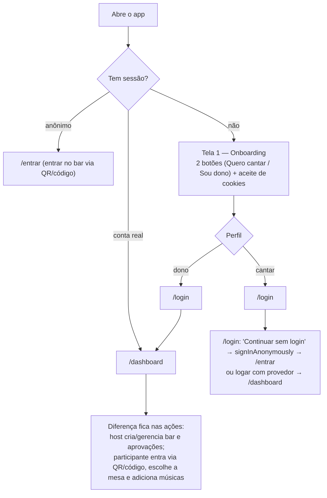
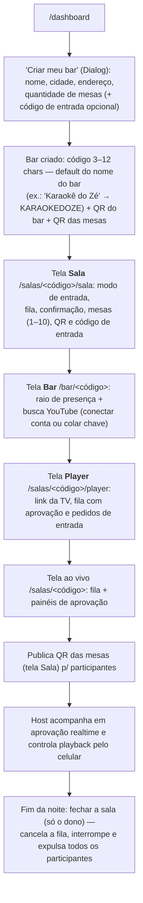
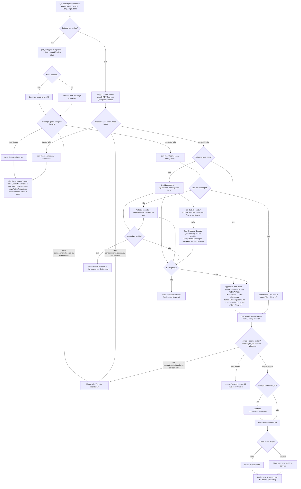
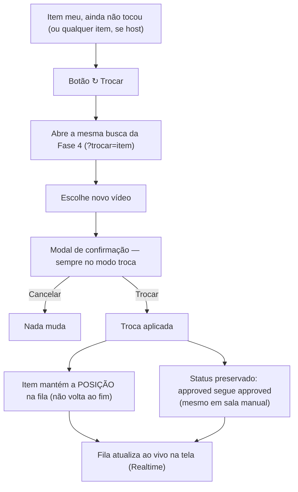
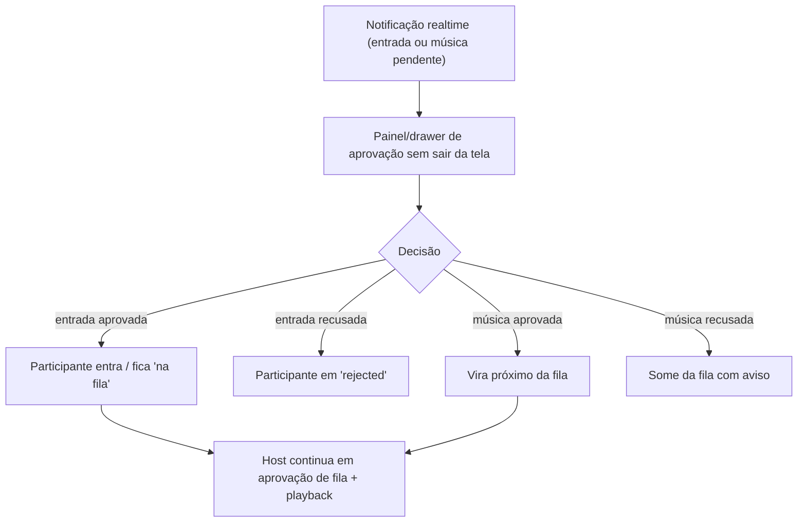
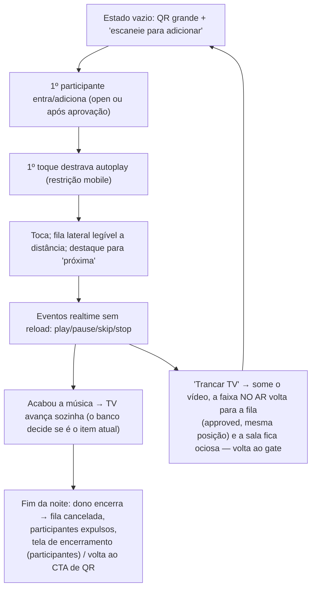
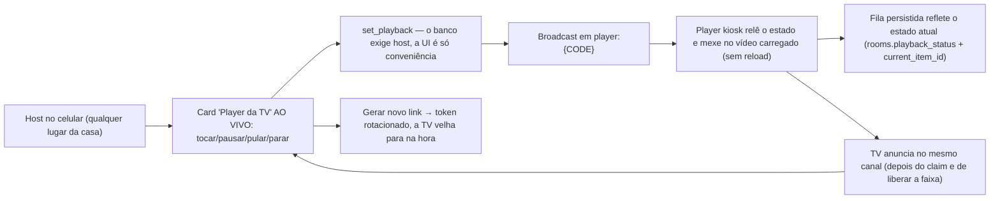
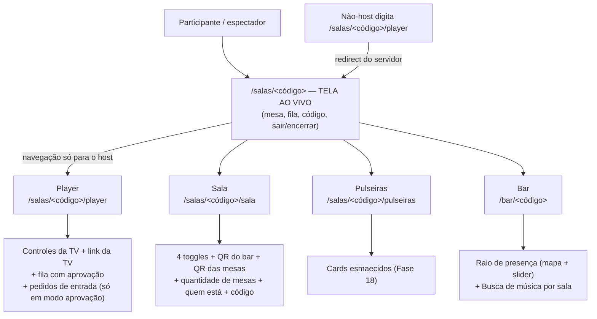
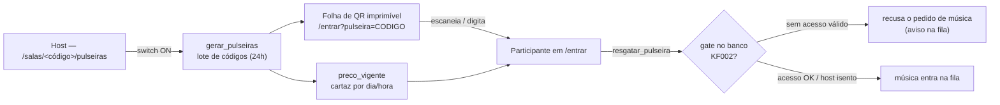

# Fluxos do usuário

Jornadas por persona no MVP. Foco em telas, toques e decisões — o "quê" e o "porquê"; o "como" técnico está em [`fluxos-do-sistema.md`](./fluxos-do-sistema.md).

Personas:

- **Host** — dono do bar/restaurante que controla a sala.
- **Participante** — cliente que escaneia o QR e adiciona músicas.
- **Tela kiosk** — TV/projetor em modo quiosque (rota pública `/player/[codigoDaSala]`).

---

## 1. Primeiro acesso (todos)

Tela de bifurcação (MVP — spec §2.5): antes de qualquer login, o usuário escolhe o perfil ("Quero cantar" / "Sou dono"). O texto dos botões segue o idioma do navegador; a coleta de idioma/geolocalização e o cookie de preferências (idioma + último perfil) só ocorrem após o **aceite de cookies** (LGPD/GDPR), independentemente do botão escolhido. Se já há sessão, o proxy pula para o dashboard (real) ou `/entrar` (anônimo).

```mermaid
flowchart TD
    A["Abre o app"] --> B{Tem sessão?}
    B -->|anônimo| B1["/entrar (entrar no bar via QR/código)"]
    B -->|conta real| G["/dashboard"]
    B -->|não| C["Tela 1 — Onboarding<br/>2 botões (Quero cantar / Sou dono) + aceite de cookies"]
    C --> D{"Perfil"}
    D -->|cantar| E["/login"]
    D -->|dono| F["/login"]
    E --> E1["/login: 'Continuar sem login' → signInAnonymously → /entrar<br/>ou logar com provedor → /dashboard"]
    F --> G
    G --> H["Diferença fica nas ações:<br/>host cria/gerencia bar e aprovações;<br/>participante entra via QR/código, escolhe a mesa e adiciona músicas"]
```

Após o login, o fluxo de sessão/dashboard é comum aos dois perfis (ver [`fluxos-do-sistema.md`](./fluxos-do-sistema.md) §1).

---

## 2. Host — criar bar e começar a noite

```mermaid
flowchart TD
    A["/dashboard"] --> B["'Criar meu bar' (Dialog): nome, cidade, endereço,<br/>quantidade de mesas (+ código de entrada opcional)"]
    B --> C["Bar criado: código 3–12 chars — default do nome do bar<br/>(ex.: 'Karaokê do Zé' → KARAOKEDOZE) + QR do bar + QR das mesas"]
    C --> D["Tela <b>Sala</b> /salas/&lt;código&gt;/sala: modo de entrada,<br/>fila, confirmação, mesas (1–10), QR e código de entrada"]
    D --> D1["Tela <b>Bar</b> /bar/&lt;código&gt;: raio de presença +<br/>busca YouTube (conectar conta ou colar chave)"]
    D1 --> D2["Tela <b>Player</b> /salas/&lt;código&gt;/player:<br/>link da TV, fila com aprovação e pedidos de entrada"]
    D2 --> E["Tela ao vivo /salas/&lt;código&gt;: fila + painéis de aprovação"]
    E --> F["Publica QR das mesas (tela Sala) p/ participantes"]
    F --> G["Host acompanha em aprovação realtime e controla playback pelo celular"]
    G --> H["Fim da noite: fechar a sala (só o dono) —<br/>cancela a fila, interrompe e expulsa todos os participantes"]
```

---

## 3. Participante — entrar e adicionar música

```mermaid
flowchart TD
    A["QR do bar (escolhe mesa)<br/>QR da mesa (mesa já vem) / digita code"] --> R{"Entrada por código?"}
    R -->|sim| R1["join_room sem mesa - entra DIRETO na sala (código do karaokê)"]
    R -->|não| P["get_entry_preview: preview do bar + karaokê único ativo"]
    P --> M{"Mesa definida?"}
    M -->|não| M1["Escolhe a mesa (grid 1..N)"]
    M -->|sim| MM["Mesa já vem no QR (?mesa=N)"]
    M1 --> GB{"Presença: geo × raio (host isento)"}
    MM --> GB
    GB -->|sem consentimento/coords, ou bar sem raio| G1["bloqueado: 'Permitir localização'"]
    GB -->|fora do raio| GB1["aviso 'fora do raio do bar'"]
    GB -->|dentro do raio| B["join_room(room_code, mesa) (RPC)"]
    GB1 --> GBV
    R1 --> G0{"Presença: geo × raio (host isento)"}
    G0 -->|sem consentimento/coords, ou bar sem raio| G1
    G0 -->|fora do raio| G01["join_room sem mesa · espectador"]
    G0 -->|dentro do raio| C{Sala em modo open?}
    G01 --> GBV
    GBV["vê a fila em /salas/<código> · sem busca, sem MesaPicker e sem pedir música · 'Ver o player' abre /player/<código> em modo somente leitura e mudo"]
    C -->|sim| D0["approved · sem mesa →<br/>bar de 2+ mesas: a sala PEDE A MESA (MesaPicker → RPC pick_mesa)<br/>bar de 1 mesa: já senta na 1, sem escolha (Fase 16) → 'Bar · Mesa N'"]
    C -->|não| E["Pedido pendente — 'aguardando aprovação do host'"]
    B --> C2{Sala em modo open?}
    C2 -->|sim| D["Entra direto — vê a fila e busca ('Bar · Mesa N')"]
    C2 -->|não| E2["Pedido pendente — 'aguardando aprovação do host'"]
    E --> F{Host aprova?}
    F -->|sim| D0
    F -->|não| G["Aviso: entrada recusada (pode tentar de novo)"]
    E2 --> F
    E --> E3{"Cancela o pedido?"}
    E3 -->|sim| E4["Apaga a linha pending → volta ao preview do bar/sala"]
    E3 -->|não| F
    E2 --> E3
    E --> E5["Sai da tela e volta?<br/>(código, QR, dashboard ou /entrar sem token)"]
    E5 -->|volta| E6["Tela de espera de novo (membership lida no servidor,<br/>sem gate de presença e sem pedir entrada de novo)"]
    E6 --> F
    D0 --> H["Busca música (YouTube — /salas/[codigo]/buscar)"]
    D --> H
    H --> H0{"Ainda presente no bar?<br/>addSongToQueueAction revalida geo"}
    H0 -->|sem consentimento/coords, ou bar sem raio| G1
    H0 -->|fora do raio| G2["recusa: 'fora do bar não dá para pedir música'"]
    H0 -->|dentro do raio| I{Sala pede confirmação?}
    I -->|sim| J["Confirma thumbnail/título/duração"]
    J --> K["Música adicionada à fila"]
    I -->|não| K
    K --> L{Modo de fila da sala}
    L -->|auto| M2["Entrou direto (na fila)"]
    L -->|manual| N["Ficou 'pendente' até host aprovar"]
    M2 --> O["Participante acompanha a fila ao vivo (Realtime)"]
    N --> O
```

> **Uma música ativa por participante (2026-10-04, migration `20261004000042`):** quem não é o **host da própria sala** tem no máximo **uma** música ativa — ativa é o que a fila mostra: `pending` + `approved` + `playing`. Pedir outra **substitui** a anterior (a mais antiga sai da fila), e **pedir com uma música tocando é recusado** — trocar a que está tocando cortaria o áudio da TV. Quando ela vira `played`, a vaga abre e o próximo pedido entra. Vale para o **visitante sem login autenticado** (que é usuário Supabase anônimo, com id estável por navegador) e para qualquer outro participante. O **host** pode manter quantas quiser, só na sala dele. A tela **avisa nos dois sentidos**: antes do clique, qual música vai sair; depois, um toast nomeando a que foi substituída. A decisão é do **banco** (trigger `before insert`), não do botão — ver `fluxos-do-sistema.md` §2.2 e o roteiro em [`../../TESTING.md`](../../TESTING.md) §3.14.
>
> **A busca destrava em tempo real, sem F5 (2026-10-07, Fase 8g):** enquanto a sua música toca, o botão "Adicionar" fica travado com o texto explicando que dá para pedir de novo quando ela terminar; quando a TV dá o `claim` e a faixa vira `played`, **a tela de busca reabre sozinha na hora** — era precisar navegar ou recarregar, porque a página lia a música ativa uma vez por render e a virada de status acontece dentro da TV, sem avisar a busca. Agora há **uma regra só** (`ownActiveSongView`), lida ao vivo por `useOwnActiveSong` (postgres_changes + broadcast + poll de 10 s + relê no foco) e pelas actions de playback, que revalidam `/salas/<código>` **e** `/salas/<código>/buscar`. O **host** não vê nenhum aviso nem trava (ele não tem limite) — a leitura que mostrava o aviso "sua música vai sair" para o host era um defeito, corrigido na mesma rodada. Roteiro em [`../../TESTING.md`](../../TESTING.md) §3.16.

> **Pré-aprovação de 24h (2026-09-27, Fase 8a):** quem o host aprovou e **tem conta** volta aprovado por **24h** ao reconectar na sala, sem o host tocar em nada. Passou disso (ou com o toggle desligado no banco) a entrada volta a ser pedida normalmente, e **sair da sala** sempre exige aprovação nova — a linha do participante é apagada, então voltar é uma entrada do zero. **Visitante sem conta nunca é pré-aprovado**, mesmo que o host tenha aprovado antes. Na tela do dono, na tela **Sala**, o item "**Aprovação vale por 24h**" aparece **ligado e travado**, com o aviso de que sair da sala passa a exigir aprovação de novo (decisão de produto: o host não desliga isso). Detalhe da regra em [`banco-de-dados.md`](./banco-de-dados.md) §4.2 e [`fluxos-do-sistema.md`](./fluxos-do-sistema.md) §2.2.
>
> **Depois de pedir música, o celular vai para o player (Fase 8a):** `/salas/<código>/buscar` redireciona para `/player/<código>` ao adicionar — o participante vê a watch party da **sua** sala (o que está tocando e a fila) sem precisar do link da TV, que ele nunca recebe. Quem abre essa URL sem token entra pela **sessão**: host ou membro aprovado. Membro com pedido pendente, visitante sem aprovação e quem não é da sala recebem um aviso, não o player. A **troca** de música continua voltando para a busca, porque o ponto ali é escolher o vídeo novo.
>
> **Entrada por código puro (2026-09-24):** digitar o código do karaokê (ex.: `KARAOKE`, 3–12 caracteres, código do bar → vira o código de entrada) entra **direto na sala sem mesa** — a mesa é escolhida **dentro da sala** (`MesaPicker` → RPC `pick_mesa`) assim que o participante está `approved`. O QR de bar/mesa continua pré-selecionando a mesa no `join_room`. O host pode trocar o código da sala pela tela **Sala** (card "Código de entrada", `updateRoomCodeAction`, que em seguida leva para a rota nova). **Fase 16 (2026-10-08): bar de mesa única não pergunta** — com `quantidade_mesas = 1`, o próprio `join_room` devolve `mesa_numero = 1` e o `MesaPicker` some do caminho (quem entra cai direto na tela de pedir música). Espectador (`fora_do_raio`) continua sem mesa, mesmo em bar de 1 mesa. O host mexe na quantidade pelo card **"Mesas do bar"** na tela Sala (RPC `update_bar_mesas`, 1–10).

> **Requisito presença física (2026-09-23, revisto em 2026-10-02):** o gate de geo (`kf-geo` × coordenadas do bar ± raio, validado no servidor) é obrigatório para **adicionar música** (`addSongToQueueAction` revalida) — impede participação remota. Para **entrar** ele foi revisto em 2026-10-02 e agora tem três desfechos (`src/lib/bars/geo.ts`): **dentro do raio** entra normalmente; **sem consentimento/coords, ou bar sem raio** segue **bloqueado** (banner "Permitir localização"), porque sem o cookie não dá nem para saber onde a pessoa está; **fora do raio** **entra sem mesa, como espectador** — fica na tela da sala, vê a fila, **sem busca**, **sem `MesaPicker`** e **sem conseguir pedir música**; o botão "Ver o player" abre `/player/<código>` em modo somente leitura (mudo, sem gate, sem "Trancar TV"). **Revisto em 2026-10-03:** a regra virou de UI para banco (`20261003000041`) — `addSongToQueueAction` recusa com `OUTSIDE_BAR`, `pick_mesa` recusa, e `claim_next_song` só aceita o token da TV. Antes os dois casos negativos bloqueavam a entrada e quem caía no "fora do raio" ficava numa tela sem caminho possível. Ver `fluxos-do-sistema.md` §2.2 e §3.1. **Exceção (2026-09-25):** quem já tem pedido `pending` volta direto para a tela de espera — o gate não esconde um pedido em andamento.
>
> **Pedido de entrada pendente (2026-09-25; status efetivo desde 2026-09-27):** `EntryApprovalWait` (tela de espera) é compartilhada por `/entrar` (QR de bar/mesa e código) e `/salas/[código]`; acompanha `room_members` via Realtime + poll de 8 s e, na aprovação, entra sozinho na sala. O pedido **sobrevive à navegação**: `getEntryPreviewAction` devolve a membership do participante, `getMyEntryRequestsAction` lista os pedidos `pending` no `/entrar` sem token e no dashboard (com "Acompanhar aprovação" → `/entrar?code=…` e "Cancelar"), e a lista resolve nome/código do bar via client de service role porque a RLS de `rooms` esconde a sala de quem não está `approved`. `cancelEntryRequestAction` apaga a linha só quando `status = 'pending'`; quando a linha some, `getEntryRequestStateAction` diz se foi cancelamento ou `close_room`, para não mostrar "sala encerrada" a quem cancelou. **A partir da Fase 8a** a tela de espera, o preview e a página da sala leem o status **efetivo** (`member_entry_state`), e não a linha crua — é o que faz a pré-aprovação de 24h valer na tela, sem a UI saber a regra.
>
> **Raio de presença (2026-09-25, editável em 2026-09-26; na tela do bar desde a Fase 17):** o card "Raio de presença" vive em **`/bar/<código>`** (junto da busca do YouTube, porque os dois valem para todas as salas do bar) e explica que o gate de localização vale **mesmo com entrada livre ligada** e que o raio vale para **todas as salas do bar**, desenha o raio (padrão **500 m**) sobre o endereço do bar num mapa Leaflet/OpenStreetMap — com a metragem no HUD, os anéis internos rotulados ("anéis de 100 m") e links para abrir no Google Maps/OpenStreetMap. O host ajusta o valor no **input numérico ou no slider** (**50 a 1000 m**, de 50 em 50) e **vê o círculo e o aviso mudarem na hora, antes de gravar**; ao soltar o slider, sair do campo, apertar Enter ou parar por meio segundo, o valor é gravado e aparece "Salvo às HH:MM". Valor inválido (abaixo de 50 ou acima de 1000) é recusado no campo, erro do servidor devolve o valor anterior com aviso, e há "Restaurar 500 m" para voltar ao padrão. Bar sem endereço geolocalizado: aviso de que todo participante é bloqueado (o host entra). Quem não é dono do bar nem chega nesta tela (guard na página).

> **Busca (Fase 4; erros e credencial revisados na Fase 8f, 2026-10-05/06):** debounce ~500 ms + cache compartilhado (`song_cache`) entre karaokês; credencial resolvida **só no servidor** na ordem **chave do bar → OAuth do host**, e os degraus seguintes (OAuth do app e chave dev) **só para conta `dev`** — antes, qualquer bar sem nada gastava a cota do dono sem ele saber. **Política de credencial por bar** (`own_only` ou `platform_pool`, migration `20261005000043`) define quem paga a cota. A resposta do Google vira mensagem com **causa e o que fazer** (cota estourada, chave inválida, chave com restrição de origem — só aparece no deploy, API não habilitada), nunca um "algo deu errado"; 429 por excesso de buscas.

### 3.3 Participante — trocar a música da fila mantendo a posição — entregue em 2026-09-26 (Fase 5, Bloco D)

O botão **↻ Trocar** aparece nos itens **pendentes e aprovados que você pediu** (o host vê em qualquer item, D1). Ele abre a **mesma tela de busca** em `/salas/[código]/buscar?trocar=<item>` — com um aviso "**Evidências** · a posição e a aprovação são mantidas" e um link para voltar à fila. Ao escolher o vídeo novo, a **confirmação aparece sempre** (mesmo com "Pedir confirmação do vídeo" desligado, porque aqui a ação troca o pedido de outra pessoa) e o botão diz **Trocar**: "a posição na fila e a aprovação são mantidas — a troca não volta para a fila de aprovação". Cancelar não grava nada. Se a música já saiu da fila enquanto o participante buscava, um aviso explica e nada muda.

```mermaid
flowchart TD
    A["Item meu, ainda não tocou (ou qualquer item, se host)"] --> B["Botão ↻ Trocar"]
    B --> C["Abre a mesma busca da Fase 4 (?trocar=item)"]
    C --> D["Escolhe novo vídeo"]
    D --> F["Modal de confirmação — sempre no modo troca"]
    F -->|Cancelar| F1["Nada muda"]
    F -->|Trocar| G["Troca aplicada"]
    G --> H["Item mantém a POSIÇÃO na fila (não volta ao fim)"]
    G --> I["Status preservado: approved segue approved<br/>(mesmo em sala manual)"]
    H --> J["Fila atualiza ao vivo na tela (Realtime)"]
    I --> J
```

---

## 4. Host — aprovar entradas e músicas

> **Onde isso vive desde a Fase 17 (2026-10-08):** a fila com aprovação e o painel de **pedidos de entrada** ficam na tela **`/salas/<código>/player`**; a tela ao vivo `/salas/<código>` continua com a fila, para o host acompanhar sem sair do que está acontecendo. O host também **pede música** ali mesmo — sem limite, na própria sala (ver §7).

```mermaid
flowchart TD
    A["Notificação realtime (entrada ou música pendente)"] --> B["Painel/drawer de aprovação sem sair da tela"]
    B --> C{Decisão}
    C -->|entrada aprovada| D["Participante entra / fica 'na fila'"]
    C -->|entrada recusada| E["Participante em 'rejected'"]

    C -->|música aprovada| F["Vira próximo da fila"]
    C -->|música recusada| G["Some da fila com aviso"]
    D --> H["Host continua em aprovação de fila + playback"]
    F --> H
```

**Aprovação de músicas entregue em 2026-09-26 (Fase 5, Blocos A/B/E):** o bloco **"Aguardando sua aprovação (N)"** fica no topo do card da fila, dentro da própria sala — os pedidos chegam por realtime e o host **Aprova**, **Rejeita** ou **Remove** ali mesmo. Cada linha mostra `4:05 · pedido por Ana` (o próprio pedido diz "pedido por **você**") e um badge de estado: _aguardando aprovação_, _na fila_ ou _tocando agora_ — este último com destaque. As ações são otimistas (a lista muda na hora) e, se o banco recusar, um aviso explica e a lista volta ao estado real.

**Reordenar entregue em 2026-09-26 (Fase 5, Bloco C):** o item **tocando agora** fica fixo no topo, em destaque, e as **aprovadas** são reordenáveis de duas formas — as setas **⬆/⬇** (que desabilitam na borda da lista) ou **arrastando pelo punho ⠿**. O participante não vê nenhum desses controles. A fila muda na hora e, se alguém pedir/aprovar algo no meio do arrasto, o banco detecta a fila desatualizada e a lista volta à ordem real com um aviso — sem estado quebrado.

**Confirmação antes de adicionar:** com **"Pedir confirmação do vídeo"** ligado nas configurações, o participante vê um modal com **thumbnail, título e duração** ao tocar em "Adicionar à fila" — "Cancelar" não adiciona nada, "Confirmar" é o único caminho que envia. Com o toggle desligado, a música vai direto.

---

## 5. Tela kiosk — do vazio ao show — entregue em 2026-09-27 (Fase 6)

```mermaid
flowchart TD
    A["Estado vazio: QR grande + 'escaneie para adicionar'"] --> B["1º participante entra/adiciona (open ou após aprovação)"]
    B --> C["1º toque destrava autoplay (restrição mobile)"]
    C --> D["Toca; fila lateral legível a distância; destaque para 'próxima'"]
    D --> E["Eventos realtime sem reload: play/pause/skip/stop"]
    E --> E2["Acabou a música → TV avança sozinha (o banco decide se é o item atual)"]
    E --> L["'Trancar TV' → some o vídeo, a faixa NO AR volta para a fila<br/>(approved, mesma posição) e a sala fica ociosa — volta ao gate"]
    L --> A
    E2 --> F["Fim da noite: dono encerra → fila cancelada, participantes expulsos,<br/>tela de encerramento (participantes) / volta ao CTA de QR"]
```

> **Quem está cantando, na TV:** a faixa fixa mostra posição, título e quem pediu, com "tocando agora" em destaque e a próxima destacada logo abaixo. Nenhum overlay sobre o vídeo (restrição de TOS do YouTube).
>
> **Legenda do YouTube desligada de propósito (2026-10-07, Fase 8g):** a TV nunca mostra legenda (`cc_load_policy: 0`) — o que o YouTube chama de legenda aqui é **transcrição automática por IA**, não letra de karaokê, e numa sala ela grita texto por cima da música. Antes o OFF existia só por omissão (o parâmetro não estava escrito); agora está escrito com o motivo ao lado e os 8 knobs do player estão fechados num teste (`youtube-stage.test.tsx`) — apagar `controls: 1`, por exemplo, deixa a suíte vermelha.
>
> **"Trancar TV" não é só esconder o vídeo (2026-10-07, Fase 8g):** o botão some com o stage e, **ao mesmo tempo**, devolve a faixa que estava no ar para a fila (`approved`, na **mesma posição**) com a sala em `idle` — sem isso o cantor ficava bloqueado para sempre: a regra "uma música tocando não pede outra" continuaria valendo e nada mais tiraria a música de `playing` com o quiosque desligado. A destrava a busca na hora, e o card do host acompanha. Se o banco falhar no meio, a TV trava mesmo assim (não é por isso que o host fica sem fechar a sala). Só a **TV com token** vê o botão; quem abre o player pela sessão (celular, espectador) não. Detalhe em [`fluxos-do-sistema.md`](./fluxos-do-sistema.md) §4.4.
>
> **A TV é anonima**: ela abre um link com um **token** (`/player/KARAOKE?token=…`). Sem token — ou com um link já rotacionado — a tela explica que o link não serve mais, em vez de mostrar fila errada. O link fica no card "Player da TV" do painel, com **copiar** e **gerar novo link**.
>
> **A mesma tela no celular do participante (Fase 8a):** `/player/KARAOKE` **sem token** abre para quem está logado e é **host ou membro aprovado** — a autorização é a sessão, lida no banco, e o token da TV **nunca** é entregue a quem não é host. Token errado não "volta" para a sessão: a tela mostra o aviso de link inválido. A TV acordando com a sala parada e música aprovada **toca sozinha** (não precisa de ninguém tocando nela), e aprovar/rejeitar/remover/reordenar chega nela na hora, sem esperar o poll.

---

## 6. Controle de playback (host, pelo celular) — entregue em 2026-09-27 (Fase 7)

```mermaid
flowchart LR
    A["Host no celular (qualquer lugar da casa)"] --> B["Card 'Player da TV' AO VIVO: tocar/pausar/pular/parar"]
    B --> C["set_playback — o banco exige host, a UI é só conveniência"]
    C --> D["Broadcast em player:{CODE}"]
    D --> E["Player kiosk relê o estado e mexe no vídeo carregado (sem reload)"]
    E --> F["Fila persistida reflete o estado atual (rooms.playback_status + current_item_id)"]
    B --> G["Gerar novo link → token rotacionado, a TV velha para na hora"]
    E --> H["TV anuncia no mesmo canal (depois do claim e de liberar a faixa)"]
    H --> B
```

> **Quem não é host não vê o card** — e, se chamar a API direto, recebe `false`: a autorização é `auth.uid() = rooms.host_id` no banco.
>
> **Sem música aprovada, os botões de tocar/pausar somem** e o painel diz "Nenhuma música aprovada na fila" — melhor que um botão morto.
>
> **O card acompanha a TV (2026-10-07, Fase 8g):** até essa fase o card era renderizado **uma vez** pela Server Component e nunca mais mudava — o host via "Retomar" a noite inteira numa sala que já estava ociosa, com os botões certos no banco e a tela mentindo. Ele ganhou `usePlaybackLive` (broadcast + poll de 10 s + relê no foco, as mesmas três camadas da fila), lendo `get_player_state` **pela sessão do host** — sem depender do token, que o "Gerar novo link" gira; se a leitura falhar, o card mantém o que está na tela em vez de zerar. E a **TV passou a anunciar também**: depois de cada `claim` e de cada liberação de faixa, no canal `player:{CODE}` que ela já assinava — antes só o host avisava.

---

## 7. Host — as quatro telas de configuração — entregue em 2026-10-08 (Fase 17)

`/salas/<código>` deixou de ser a tela de configuração: virou a **tela ao vivo** (mesa, fila, código na mão, sair/encerrar) e as configurações saíram para **rotas filhas** — um assunto por tela, no lugar de um `room-settings.tsx` de 553 linhas com seis cards empilhados. O participante não vê nenhuma delas: quem não é host continua na tela ao vivo, e toda rota de configuração faz o guard **no servidor** (host da sala / dono do bar) e devolve para a sala.

| Rota | O que fica lá |
| --- | --- |
| `/salas/<código>/player` | **Player da TV** (controles ao vivo + copiar/rotacionar link), **Fila de músicas** com moderação, **Pedidos de entrada** (este só existe com `Entrada livre` = OFF) |
| `/salas/<código>/sala` | **Como a sala funciona** (4 toggles), **Cartaz e QR das mesas** + QR individual por mesa, **Mesas do bar** (1–10), **Quem está na sala**, **Código de entrada** |
| `/bar/<código>` (**nova**) | **Raio de presença** (o gate) e **Busca de música (YouTube)** — um card por sala do bar, porque a chave é da sala e a cota é do projeto do Google Cloud |
| `/salas/<código>/pulseiras` (**nova**) | **Distribuição de códigos** e **Valor da pulseira** — entregues na Fase 18 (ver §8); até lá os cards ficavam esmaecidos, sem ação |

```mermaid
flowchart TD
    A["/salas/&lt;código&gt; — TELA AO VIVO<br/>(mesa, fila, código, sair/encerrar)"] -->|"navegação só para o host"| B["Player<br/>/salas/&lt;código&gt;/player"]
    A --> C["Sala<br/>/salas/&lt;código&gt;/sala"]
    A --> D["Pulseiras<br/>/salas/&lt;código&gt;/pulseiras"]
    A --> E["Bar<br/>/bar/&lt;código&gt;"]
    B --> B1["Controles da TV + link da TV<br/>+ fila com aprovação<br/>+ pedidos de entrada (só em modo aprovação)"]
    C --> C1["4 toggles + QR do bar + QR das mesas<br/>+ quantidade de mesas + quem está + código"]
    D --> D1["Cards esmaecidos (Fase 18)"]
    E --> E1["Raio de presença (mapa + slider)<br/>+ Busca de música por sala"]
    F["Participante / espectador"] --> A
    A2["Não-host digita /salas/&lt;código&gt;/player"] -->|"redirect do servidor"| A
```

> **Host pede música (Fase 17):** o botão **"Pedir música"** aparece para o host **na própria sala**, sem limite — a isenção já vivia no banco (trigger `20261004000042` deixa o `host_id` da sala passar direto, fora do `KF001`), mas a UI escondia o link com `!isHost`. Nas salas/bares onde ele não é dono ele é **participante comum** e passa por tudo (geolocalização, aprovação, música ativa por vez). O atalho "configurações" da busca agora leva para a tela certa: `/bar/<código>` quando a sala tem casa, senão o player.
>
> **O `PendingEntries` virou condicional:** o card de pedidos de entrada só existe quando a sala está em **modo aprovação** — com "Entrada livre" ligado não há fila de espera e o card "Ninguém pediu entrada" seria ruído. Ele mora na tela **Player**.
>
> **Tela do bar é do bar, não da sala:** o mesmo bar pode ter várias salas (hoje 1 por produto, várias no modo dev), e raio + cota do YouTube são da casa. Por isso a rota é `/bar/<código>`, checada contra `bars.host_id` — a RLS de `bars` deixa qualquer autenticado **ler**, então a autorização é da página, e `/bar` entrou em `PROTECTED_PREFIXES` no proxy. No dashboard, cada bar ganhou o botão **Bar** ao lado dos karaokês.
>
> **Sala sem bar** (só fixture legada — o `create_room` sempre nasce de um bar): a chave do YouTube fica no card **Busca de música** do player, e a navegação mostra só as três telas da sala.

**Depois de salvar:** cada action revalida as telas que mostram o dado — `/salas/[codigo]`, `/salas/[codigo]/sala`, `/salas/[codigo]/player` e `/bar/[codigo]` — para o card não voltar a mostrar o valor antigo na próxima visita. Trocar o código de sala navega para a rota nova (`/salas/<novo>/sala`), porque o código antigo deixa de existir.

---

## 8. Pulseira — o ingresso de uso único do bar — entregue em 2026-10-08 (Fase 18)

A pulseira é **modo do bar** (`bars.pulseiras_ativadas`, switch host-only na tela própria). Desligada, nada disso aparece: o `/entrar` não mostra cartaz nem campo de código, e o gate de cantar fica mudo (o trigger devolve o insert ao normal). Ligada, o host monta a noite e o participante libera o canto.

**Lado do host** — `/salas/<código>/pulseiras`:

| Etapa | O que aparece / acontece |
| --- | --- |
| **Ligar o recurso** | switch mestre; os cards de **Distribuição de códigos** e **Valor de pulseira** acendem |
| **Gerar lote** | input 1–100 + botão → `gerar_pulseiras` grava códigos de 6 caracteres (alfabeto sem I/O/1/0), cada um com validade de **24h** (nascida na geração) |
| **Imprimir folha** | botão → `Ctrl+P` mostra **só os QR codes** (a folha não vai o resto da tela); cada QR aponta para `/entrar?pulseira=…` |
| **Valor** | uma faixa por dia da semana + hora inicial/final + preço (reais); preço **de hoje** em destaque; faixa vazia não mostra cartaz (e não cobra — pagamento real é fase futura) |
| **Desligar o recurso** | cards voltam a esmaecer; os códigos gerados **ficam no banco** mas nada mais os aceita (`resgatar_pulseira` recusa `PULSEIRA_INATIVA`) |

**Lado do participante** — `/entrar`:

1. Entra no bar (pelo QR do balcão/mesa, `?bar=…` ou `?pulseira=…`) → preview mostra o **cartaz aberto**: valor, faixa de hoje e o campo de código.
2. **Ativa a pulseira**: escaneia o QR da folha (URL vem pré-preenchida) ou **digita o código anotado** no balcão → confirmar chama `resgatar_pulseira`.
3. Resgate OK: o acesso nasce com **24h** e o **preço vigente congelado** — muda o cartaz no meio da noite, quem já resgatou pagou o que viu.
4. A partir daí **pode pedir música**: o gate (`KF002`) aceita; a fila some o aviso "pulseira exigida".
5. **Mesmo código de novo** (na mesma conta ou em outra): recusa com a causa no lugar — código já usado / conta anônima / bar desligado / etc.

```mermaid
flowchart LR
    H["Host — /salas/&lt;código&gt;/pulseiras"] -->|"switch ON"| G["gerar_pulseiras<br/>lote de códigos (24h)"]
    G --> F["Folha de QR imprimível<br/>/entrar?pulseira=CODIGO"]
    G --> V["preco_vigente<br/>cartaz por dia/hora"]
    F -->|"escaneia / digita"| P["Participante em /entrar"]
    V --> P
    P -->|"resgatar_pulseira"| R{"gate no banco<br/>KF002?"}
    R -->|"sem acesso válido"| X["recusa o pedido de música<br/>(aviso na fila)"]
    R -->|"acesso OK / host isento"| Y["música entra na fila"]
```

> **O adversário de verdade é o banco, não a tela.** A trigger `queue_items_exige_pulseira` (`BEFORE INSERT` em `queue_items`) barra `KF002`, e é a **única** porta: a UI apenas mostra o aviso. Host da própria sala passa **sem resgatar**; `auth.uid()` nulo (service role/seed) passa direto.
>
> **Anônimo não perfura a casa:** conta anônima (login "Continuar sem login") vê o card, mas `resgatar_pulseira` recusa `ANONYMOUS` **sem gastar o código** — o cartaz manda "Crie uma conta…" para o `/entrar`.
>
> **Acesso expirado renova:** `acesso_ate` passou → o mesmo participante pode resgatar **de novo** com um código novo (`ON CONFLICT … DO UPDATE WHERE acesso_ate <= now()`); o `FOR UPDATE` na linha do código serializa dois resgates do mesmo ingresso.

---

## Anexo — decisões que afetam os fluxos acima (fechadas com o PO)

| #   | Decisão                            | Impacto                                                                                       |
| --- | ---------------------------------- | --------------------------------------------------------------------------------------------- |
| D1  | Quem pode trocar a música          | §3.3: **autor ou host** (host também **reordena** a playlist)                                 |
| D2  | Status ao trocar em sala manual    | §3.3: **mantém aprovada** — não volta ao fim nem re-aprovação                                 |
| D3  | Estados em que a troca é permitida | §3.3: `pending`+`approved`; host adiciona músicas **sem limite**, respeitando a ordem da fila |
| D4  | Duração da pré-aprovação           | §3: **24h** desde a aprovação do host, **só para usuário com conta**; anônimo nunca           |
| D5  | Quem pode desligar a pré-aprovação | §3: **ninguém pela interface** — toggle ligado e travado; o banco aceita ON/OFF (teste/legado) |
| D6  | Efeito de sair da sala             | §3: **apaga a linha** → voltar é entrada nova e precisa de aprovação (com entrada livre OFF) |
| D7  | Autorização do player              | §5: **duas portas** — token (TV, sem sessão) ou sessão (host/membro aprovado); token errado não cai para a sessão |
| D8  | Para onde vai o celular depois de pedir música | §3: para o **player da própria sala** (`/player/<código>`); a troca de música volta para a busca |
| D9  | Scanner de QR da pulseira                      | §8: o QR impresso **pré-preenche** `/entrar?pulseira=…` e há digitação manual — `BarcodeDetector`/match ficam de fora nesta fase (o scan só **ativa** a pulseira, não valida música) |

As opções detalhadas estão na **seção 5 de [`fluxos-do-sistema.md`](./fluxos-do-sistema.md)**.
