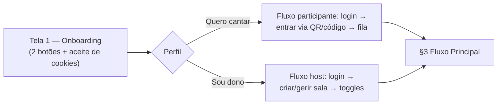

# Especificação Técnica — Karaokê Watch Party

## 1. Visão Geral

Aplicação web, **mobile-first**, hospedada na Vercel, cujo objetivo é facilitar, controlar, organizar e agilizar a dinâmica de karaokê ao vivo em ambientes com muitas pessoas (bares, restaurantes).

Modelo central: **watch party**. Uma "sala" possui uma única fila/playlist compartilhada, controlada por um dono, e reproduzida em um dispositivo de tela (TV/projetor) desacoplado do celular de quem controla.

Fase 1 (MVP) = cobrir o fluxo de watch party descrito abaixo. Qualquer coisa fora disso (hardware dedicado, apps nativos, monetização) fica para fases seguintes.

## 2. Papéis (Actors)

- **Dono da sala (host):** cria a sala, controla configurações, aprova entradas/músicas (conforme toggles), controla playback pelo celular.
- **Participante (guest):** entra na sala via QR code ou código, busca músicas no YouTube, adiciona à fila (sujeito a aprovação conforme config da sala).
- **Tela da sala (player device):** dispositivo burro que só exibe o player do YouTube e o estado da fila; não tem controle próprio, só reage a eventos em tempo real vindos do host/sala.

## 2.5 Tela 1 — Onboarding / Seleção de Perfil (MVP)

> **Status: requisito de MVP** — a primeira tela do app, exibida antes de qualquer login. É a tela de bifurcação que roteia entre os dois fluxos já previstos nesta especificação (participante e host — ver §2 e §3): ponto de entrada/roteamento, **não** uma landing page de marketing e **não** uma funcionalidade nova paralela.

### 2.5.1 Conteúdo obrigatório

A tela contém apenas dois elementos — nenhum outro elemento é permitido (sem hero de marketing, sem copy extensa, sem cards promocionais):

1. **Dois botões de escolha de perfil**, com o texto adaptado ao idioma detectado do usuário/navegador:
   - **"Quero cantar"** — perfil de usuário padrão / participante (cantor): login, entrar em sala via QR code/código, fila de músicas.
   - **"Sou dono"** — perfil de host / dono do estabelecimento: login, criação/gestão de sala, toggles de aprovação (entrada e fila).
2. **Solicitação de consentimento de cookies** (banner ou modal), seguindo padrão de LGPD/GDPR — opção de **aceitar antes de qualquer coleta**; sem aceite, nenhum dado do dispositivo é coletado.

### 2.5.2 Coleta de dados do dispositivo

Coleta transparente, vinculada ao consentimento da §2.5.1 e executada **independentemente de qual botão o usuário escolher**, desde que o cookie tenha sido aceito:

- **Idioma/localização do navegador** (`navigator.language`/locales) — usado para definir o idioma da UI, incluindo o texto dos dois botões.
- **Localização geográfica** — coletada e armazenada. Duas finalidades: **(a) descoberta de bares/salas próximas** (futuro) e **(b) requisito de presença física — o participante precisa estar geograficamente no bar para participar da fila** (comparação do GPS com as coordenadas do bar, dentro de um raio de tolerância; ver §2.5.4). **Sem consentimento, a participação na sala é bloqueada** (view-only liberado); para o host (dono), o consentimento não bloqueia nada.
- **Cookie de preferências do usuário** — persiste idioma escolhido e último modo selecionado ("quero cantar" / "sou dono") entre visitas.

Ordem garantida em qualquer fluxo: usuário **aceita cookies** → coleta de idioma/geolocalização + gravação do cookie de preferências → roteamento pelo botão escolhido.

> O consentimento de cookies (onde se inclui a geolocalização) é **mandatório para participação** (entrar na sala e adicionar músicas). Quem recusa pode navegar e visualizar a fila, mas não participa. Isso é uma decisão explícita de produto (a presença física é o coração da experiência de karaokê ao vivo), registrada no requisito de 2026-09-23.

### 2.5.4 Requisito — presença física (geo gate)

Para participar de uma sala de karaokê (entrar/confirmar mesa **e** adicionar música) é exigido que o usuário **esteja fisicamente no estabelecimento**:

- O bar registra **localização física** (coordenadas de GPS) e um **raio de presença** (`raio_permitido_metros`, default **150 m**, ajustável 50–1000).
- O participante fornece a localização sob consentimento (cookie `kf-geo`); a validação ocorre **no servidor** (server action lê o cookie e compara com as coordenadas do bar — distância haversine ≤ raio).
- **Host isento** (é o próprio bar). Participante **sem geo concedida**, **geonegada** ou **fora do raio** → bloqueado com erro amigável e CTA de "permitir localização novamente"; mantém **view-only** (fila/player/thumbnail).
- **Limitação honesta:** geolocalização de dispositivo não é prova criptográfica (GPS spoofing é possível). O gate é uma **trava de fricção/participação** — impede acesso remoto casual — não uma fronteira de segurança. Documentar nos termos de uso.
- O release deste requisito inclui: migration `bars` (coords + raio), geocode gratuito (Nominatim/OSM) com fallback de GPS do dispositivo no cadastro do bar, hint ao host sobre a finalidade do dado, e as perguntas 16–18 do questionário de validação.

### 2.5.3 Roteamento

A escolha do botão determina a rota seguinte:



- **"Quero cantar"** → tela/fluxo de usuário padrão (cantor): login, entrar em sala via QR code/código, fila de músicas.
- **"Sou dono"** → tela/fluxo de host (dono do estabelecimento): login, criação/gestão de sala, toggles de aprovação (entrada e fila).

> Privacidade: política de retenção, exclusão de conta/dados e demais pontos LGPD estão na §13.

## 3. Fluxo Principal

1. Usuário abre a Tela 1 (onboarding — §2.5), aceita os cookies e escolhe o perfil: **"Quero cantar"** (participante) ou **"Sou dono"** (host). A coleta de idioma/geolocalização e o cookie de preferências ocorrem logo após o aceite, antes do roteamento.
2. Usuário faz login.
3. Usuário cria uma sala (vira host) OU entra em uma sala existente escaneando QR code ou digitando um código.
4. Se a sala exigir aprovação de entrada, o host recebe e aprova/rejeita pedidos de entrada.
5. **Presença física (§2.5.4):** antes de entrar e de adicionar músicas, o participante precisa ter consentimento + geolocalização concedida e estar dentro do raio do bar (compara-se o GPS com as coordenadas do estabelecimento). Sem isso, participação bloqueada (view-only mantido); host isento.
6. Dentro da sala, qualquer participante busca músicas (via YouTube Data API) e adiciona à fila.
7. Se a fila exigir aprovação, o item entra como "pendente" até o host aprovar; senão, entra direto na fila.
8. A tela da sala (TV/projetor) reproduz a fila em sequência, tocando o próximo item automaticamente ao fim do atual.
9. O host controla playback (pular, pausar, reordenar, remover) pelo próprio celular, através da aplicação web — sem precisar tocar no dispositivo da TV.

## 4. Configurações da Sala (Room Settings)

Ambos os campos abaixo são toggles controlados pelo host, persistidos na sala:

| Campo                     | Valores              | Efeito                                                                                                                                                                                                                                                          |
| ------------------------- | -------------------- | --------------------------------------------------------------------------------------------------------------------------------------------------------------------------------------------------------------------------------------------------------------- |
| `entryMode`               | `open` \| `approval` | `open`: qualquer um com código/QR entra direto. `approval`: pedido de entrada fica pendente até o host aprovar.                                                                                                                                                 |
| `queueApprovalMode`       | `auto` \| `manual`   | `auto`: música entra direto na fila ao ser adicionada. `manual`: música fica pendente até o host aprovar.                                                                                                                                                       |
| `requireSongConfirmation` | `true` \| `false`    | `true`: ao adicionar música, um popup de confirmação (thumbnail + título + duração) é exibido antes de enviar à fila — o próprio usuário confirma/cancela. `false`: adiciona direto. Não substitui `queueApprovalMode` (aprovação do host); são complementares. |

## 5. Entidades de Dados

> Rascunho consolidado com o modelo **efetivamente implementado** na Fase 3.5 (ver `docs/flows/banco-de-dados.md` — ERD, RLS e migrations). **O host é um bar** (`bars`, 1:1 com `auth.users`); o bar tem **mesas** (etiquetas) e **1..N karaokês** (`rooms`, default **1** — multi-sala desabilitado no MVP, affordance na UI).

```
User (auth.users)
- id, email, authProvider, is_anonymous (jwt)
- anônimo: pode entrar como participante e pedir música; NÃO cria bar

Bar
- id, hostId (único — 1 host = 1 bar), code (6 chars, QR/código públicas)
- nome, cidade, endereco
- quantidadeMesas (1..999, default 1)
- latitude, longitude (localização física — gate de presença §2.5.4), raioPermitidoMetros (default 150)
- criadoEm

Mesa
- id, barId, numero (único por bar), rotulo (etiqueta opcional)
- mesa = etiqueta; a playlist é a do karaokê/room do bar

Room (karaokê = fila + player próprios)
- id, code, qrCodeUrl (legado; QR agora é do bar/mesa), barId, hostId
- entryMode: open | approval
- queueApprovalMode: auto | manual
- requireSongConfirmation: boolean
- youtubeApiKey (opcional; se nulo, usa a chave default)
- status: active | closed
- createdAt

RoomMember
- roomId, userId, status: pending | approved | rejected, joinedAt
- mesaNumero (etiqueta da mesa do participante — obrigatória p/ não-host)

QueueItem
- id, roomId, addedByUserId
- youtubeVideoId, title, thumbnailUrl, durationSeconds
- status: pending | approved | playing | played | rejected | skipped
- position (ordem na fila)
- addedAt

SongCache (mitigação de quota da YouTube API)
- query normalizada, resultados (videoId, title, thumb, duration), timestamp
- usado para evitar repetir search.list para termos já buscados recentemente/por outras salas

Consents (LGPD/GDPR — §2.5/§13)
- userId, termsVersion, cookiesPreferences, geolocation, acceptedAt
```

> **Acesso anônimo (Fase 3.5):** anonymous sign-in habilitado no Supabase Auth (Management API + `config.toml`). RLS dá leitura de `bars`/`mesas` a qualquer sessão autenticada (inclusive anônima); criação de bar (`create_bar`), preview e entrada (`get_entry_preview`/`join_room`) são RPCs `security definer`.

## 6. Integração com YouTube — Restrições e Estratégia

**Restrições confirmadas dos Termos de Serviço da YouTube API (válidas em 2026):**

- `search.list` custa 100 unidades por chamada; cota padrão diária é 10.000 unidades/projeto → ~100 buscas/dia no plano gratuito. Isso é insuficiente para uso em produção com múltiplas salas simultâneas.
- Não é permitido sobrepor overlays/elementos visuais sobre o player embutido do YouTube, incluindo seus controles — a UI do app (fila, letra, avatar de quem canta) deve ficar ao redor do player, nunca por cima.
- Uma mesma tela não pode ter mais de um player do YouTube autoplayando simultaneamente (favorável ao nosso modelo, que já é "um vídeo por vez").
- Autoplay sem gesto do usuário é bloqueado por navegadores mobile; a primeira reprodução no dispositivo da TV exige um toque inicial para destravar áudio.
- Não é permitido baixar vídeo/áudio, nem armazenar dados de visualização do usuário indefinidamente sem consentimento.

**Estratégia recomendada:**

1. Solicitar aumento de cota via formulário de auditoria do Google Cloud assim que houver tração real (não garantido, sem prazo definido). — *Roadmap.*
2. Implementar `SongCache` compartilhado entre salas para reduzir chamadas repetidas de busca. — ✅ **implementado (Fase 4)**: tabela `song_cache` com query normalizada em bucket, TTL 7 dias, escrita/leitura via service role; busca reusa o cache antes de chamar a API (`cached: true` no payload da rota).
3. Debounce nas buscas (disparo só após confirmação/pausa de digitação, não por tecla). — ✅ **implementado (Fase 4)**: campo único no topo de `/salas/[codigo]/buscar` com debounce ~500 ms + `AbortController` contra corridas de request.
4. Considerar um catálogo pré-indexado de músicas populares de karaokê, alimentado localmente, como fallback quando a cota de busca se esgotar. — *Roadmap* (TODO Fase 4/Roadmap).
5. Rotina de fallback amigável: se a cota estourar, avisar o usuário para tentar novamente mais tarde em vez de erro cru. — ✅ **implementado (Fase 4)**: `toFriendlyYouTubeError` ("A cota de buscas … acabou por hoje") quando a API devolve `quotaExceeded`; `NO_CREDENTIAL` também fallback friendly.
6. **Credencial injetada só no backend** — ✅ **implementado (Fase 4)**: rota `/api/youtube/search` resolve a chave via service role e nunca a devolve ao client (verificado por teste — a chave não aparece no payload).
7. **Cadeia de credenciais (Fase 4):** 1) chave própria do bar (`rooms.youtube_api_key`, colada no RoomSettings); 2) **OAuth da conta Google do host** (`youtube_oauth_tokens`, sem policies — só service role; rotas `/auth/youtube/authorize` + `/auth/youtube/callback`, `access_type=offline&prompt=consent`); 3) OAuth do app (conta dev via `YOUTUBE_APP_REFRESH_TOKEN` — coleta com `scripts/youtube-app-oauth.mjs`); 4) chave de dev `YOUTUBE_API_KEY`, somente quando setada (nunca em produção).

**Observação fora do escopo técnico:** execução pública de música com fins comerciais em estabelecimento (bar/restaurante) normalmente envolve licenciamento próprio (ex: ECAD no Brasil), responsabilidade do estabelecimento — deve constar nos termos de uso do produto.

## 7. Arquitetura do Dispositivo de Tela (Player Device)

Decisão para o MVP: **sem hardware/IoT dedicado**, usando qualquer navegador em modo quiosque (TV Box/Fire Stick).

- Rota dedicada e sem necessidade de login: `/player/[codigoDaSala]`.
- UI minimalista: player do YouTube (IFrame Player API) + informações da fila/próxima música.
- Dispositivos compatíveis: TV Box Android barato, Fire TV Stick, Chromecast com Google TV, notebook via HDMI, Smart TV com navegador — todos rodando essa mesma URL em modo quiosque (ex: app "Fully Kiosk Browser" no Android).
- Comunicação em tempo real entre o controller (celular do host) e o player (tela): canal via WebSocket / Firebase Realtime Database / Supabase Realtime, escopado por `roomId`.
- Eventos trafegados: `play`, `pause`, `skip`, `queueUpdated`, `reorder`.
- O player recebe eventos e manipula o objeto do IFrame Player já carregado (sem reload de página) para transições suaves entre músicas.
- Fase futura (não MVP): hardware dedicado (Raspberry Pi, appliance próprio) só se o modelo "navegador em kiosk" mostrar limitação real.

## 8. Stack Definida

- **Frontend/Framework:** Next.js (App Router), mobile-first, deploy na Vercel.
- **Estilo:** Tailwind CSS.
- **Backend/Banco/Tempo real:** Supabase (free tier obrigatório) — Postgres para dados de usuários/salas/fila, e **Supabase Realtime** (canais/broadcast ou replication de tabela) para sincronizar fila, controller e tela em tempo real. Firebase (Realtime DB/Firestore) fica como alternativa caso o free tier do Supabase Realtime se mostre insuficiente para o volume de mensagens necessário.
- **Autenticação (MVP):** Supabase Auth, com provedores OAuth **GitHub e Google** como login ativos e a estrutura desacoplada (config em `src/lib/auth/providers.ts`) já cobrindo **Spotify, Discord, Facebook e X** — botões renderizados desabilitados até as credenciais/processos externos ficarem prontos. **Spotify** fica indisponível enquanto a Web API do app exigir conta **Premium**; **Facebook e X** tendem a exigir processo de app review externo antes de produção, a ser iniciado com antecedência quando chegar a hora. Não implementar nenhum provedor como acoplamento fixo.
- **YouTube:** YouTube Data API v3 (busca) + YouTube IFrame Player API (playback embutido).
- **QR Code:** geração no backend/frontend ao criar a sala (ex: lib `qrcode`), leitura via câmera no navegador (ex: `@zxing/browser` ou `html5-qrcode`).

**Restrição transversal do projeto:** toda escolha de serviço (banco, auth, realtime, hosting) deve caber no **free tier**. Isso deve ser validado explicitamente durante a implementação — ex: limites de conexões simultâneas do Supabase Realtime no free tier, limite de linhas/armazenamento no Postgres gratuito, e limite de mensagens/eventos por segundo — antes de assumir que a solução escala para "muitas pessoas em um bar".

## 9. Requisitos Não-Funcionais

- Viewport mobile é prioridade absoluta de design; desktop é secundário.
- Uma sala deve suportar múltiplos participantes simultâneos adicionando à fila sem condição de corrida na ordenação.
- Estado da fila deve refletir em tempo real (idealmente < 2s de latência) em todos os clientes conectados à sala (controller e player).
- Sessão do player (tela) deve se manter estável por longos períodos (horas) sem exigir refresh manual.

## 10. Decisões Já Tomadas

- Tempo real e banco: **Supabase** (free tier), com **Firebase** como plano B se o free tier do Supabase Realtime não comportar o volume de eventos.
- Autenticação (MVP): **Supabase Auth** com OAuth de **GitHub e Google** ativos; Spotify, Discord, Facebook e X já construídos na camada (botões desabilitados até credenciais prontas) — ver seção 15 para processos externos/app review.
- Tela do projetor/TV: **navegador em modo quiosque** (TV Box/Fire Stick), sem hardware dedicado no MVP.
- Restrição global: toda a stack deve operar em **free tier**.
- Escala-alvo: protótipo com **1 sala e ~50 usuários simultâneos**, evoluindo para **10+ salas e ~5.000 usuários** (detalhes na seção 12).
- YouTube API: modelo **chave por host** com **cadeia de credenciais implementada na Fase 4**: chave do bar → **OAuth da conta Google do host** (cota sai do projeto do próprio host) → **OAuth do app** (conta dev, refresh token coletado por script) → chave default de dev (`YOUTUBE_API_KEY`, **somente em dev**). YouTube Premium não concede nenhum benefício de cota (é assinatura de consumo, sem relação com o Google Cloud/API).
- Letra de música: **não sincronizada** — o vídeo do YouTube é exibido como está.

## 11. Decisões Pendentes

Nenhuma pendência crítica de arquitetura no momento — os itens anteriores foram resolvidos e movidos para as seções 10 e 15.

## 15. Roadmap Futuro (fora do MVP)

- **Ativar provedores OAuth já construídos na camada de auth (MVP+)**: Discord, Facebook, X — criar os apps externos, obter credenciais e habilitar no Supabase. Spotify volta quando a conta tiver **Premium** (necessário para a Web API de login). Iniciar o processo de app review de Facebook e X com antecedência, pois normalmente não é aprovação instantânea.
- Reavaliar o modelo de chave de API do YouTube quando o número de hosts crescer: hoje é "chave por host com default do desenvolvedor via `.env.local`"; em escala maior, considerar pool de chaves rotativas ou aumento de cota oficial via auditoria do Google.

## 12. Escalonamento — de 1 sala/50 usuários para 10+ salas/5.000 usuários

Escala-alvo confirmada: protótipo com **1 sala e ~50 usuários simultâneos**; arquitetura deve suportar evolução para **10+ salas e ~5.000 usuários** sem reescrita estrutural.

O MVP (1 sala, 50 usuários) roda confortavelmente no free tier de qualquer um dos serviços cogitados. Os pontos que **vão quebrar primeiro** ao escalar, em ordem de prioridade:

1. **Cota de busca do YouTube (maior risco).** 100 buscas/dia é suficiente pra 1 sala de teste, mas inviável para 10 salas em bares distintos no mesmo dia. Ações, em ordem de implementação:
   - ✅ **Implementado (Fase 4) — cache de busca compartilhado** (`SongCache`, tabela `song_cache` com query normalizada e TTL 7 dias), reaproveitando resultados entre salas para o mesmo termo — inclusive **com reuso de cota** (o cache vale para a consulta ativa e futura; bucket ignora ordem das palavras/acentos).
   - ✅ **Implementado (Fase 4) — modelo de credenciais por host** com OAuth: cada dono pode conectar a própria conta Google (cota do projeto dele) ou colar a própria chave de API; quando nada configurado, o app cai no OAuth do app (conta dev) ou na chave default de dev (`YOUTUBE_API_KEY`, **só dev**).
   - ✅ **Implementado (Fase 4) — mitigação de abuso:** rate limit em memória (60 buscas/hora por `ip:userId`) na rota de busca, independente da cota do Google (evita um único usuário esgotar a cota do dia).
   - ⏳ *Roadmap:* pré-indexar um catálogo próprio de "clássicos de karaokê" (~500–1000 músicas) e iniciar a auditoria/ampliação de cota junto ao Google quando houver 10+ salas (não é aprovação instantânea).

2. **Conexões simultâneas do Supabase Realtime (free tier tem teto de conexões concorrentes).** Com 5.000 usuários, nem todos precisam de canal realtime aberto o tempo todo — só quem está com a tela do app ativa. Estratégia: desconectar/pausar o canal quando o app vai para background (mobile) e reconectar ao voltar; e escopar canais por sala (`room:{id}`), nunca um canal global, para não multiplicar tráfego desnecessário.

3. **Escritas de fila com concorrência (muita gente adicionando música ao mesmo tempo).** Usar `position` da fila como campo calculado no banco (ex: sequência do Postgres) em vez de calculado no client, evitando duas músicas caírem na mesma posição quando dois usuários adicionam ao mesmo tempo.

4. **Banco de dados (linhas/armazenamento no free tier do Supabase).** Rotina de limpeza: itens de fila com status `played`/`rejected` mais antigos que X dias podem ser arquivados/agregados, já que não precisam ficar na tabela "quente" indefinidamente.

5. **Multi-tenancy simples desde já.** Mesmo com 1 sala hoje, desenhar o schema já com `roomId` em toda tabela relevante (nunca assumir sala única implicitamente no código) evita retrabalho ao chegar em 10+ salas.

## 13. Segurança — pontos a corrigir/prever desde o MVP

- **Row Level Security (RLS) do Supabase ligado desde o dia 1**, mesmo no protótipo: um participante só pode ler/escrever na fila da sala em que está aprovado (`RoomMember.status = approved`), nunca em salas alheias.
- **Nunca expor a chave de API do YouTube no client.** Toda chamada de `search.list` deve passar por uma rota de servidor (API Route/Edge Function) que injeta a chave no backend — o frontend nunca deve carregar a chave do YouTube diretamente, senão qualquer pessoa pode extraí-la do bundle e consumir a cota livremente (ou pior, usá-la fora do seu app). — ✅ **implementado (Fase 4)** em `/api/youtube/search` (teste MSW garante que a chave não aparece no payload).
- **Rate limiting por usuário/IP na rota de busca**, independente da cota da própria YouTube API — evita que um único participante mal-intencionado esgote a cota do dia sozinho. — ✅ **implementado (Fase 4)**: 60/h por `ip:userId`, janela deslizante em memória, resposta `429` com `Retry-After`.
- **Validação de entrada na sala:** código de sala deve ter tamanho/entropia suficiente pra não ser adivinhado por força bruta (ex: 6 caracteres alfanuméricos, não sequenciais); QR code deve apontar para uma URL assinada/com token de curta duração, não só o código puro, se quiser reforçar contra fraude.
- **Autorização de ações de host** (aprovar entrada, aprovar música, pular, remover) sempre validada no backend (RLS/policy), nunca só escondendo o botão na UI — qualquer participante pode inspecionar a rede e tentar chamar o endpoint direto.
- **Moderação básica de conteúdo:** como a busca é livre no YouTube, considerar um filtro simples de categoria/idade (ex: usar `safeSearch=strict` no `search.list`) para evitar que vídeos impróprios sejam tocados publicamente em um ambiente comercial. — ✅ **implementado (Fase 4)**: `safeSearch=strict` + `videoEmbeddable=true` no `search.list` (só vídeos embutíveis no player).
- **Presença física** (requisito 2026-09-23 — §2.5.4): a participação na sala exige consentimento + geolocalização concedida e dentro do raio do bar, validado **no servidor** (cookie `kf-geo` × coords do bar). Impede usuários remotos de pedir música. Limitação honesta: GPS de dispositivo não é prova criptográfica (spoofing) — é trava de fricção, não fronteira de segurança.
- **LGPD:** já que o Supabase vai guardar dados de usuários (login social, e-mails) e a geolocalização é coletada como finalidade de produto (presença), definir desde já política de retenção e um caminho de exclusão de conta/dados.

## 14. Padrões de UX/UI recomendados

**Para o controller (celular do host/participante):**

- Fluxo de entrada em 1-2 toques: abrir QR → nome da sala aparece → confirmar entrada (sem formulários longos).
- Busca de música como campo único e persistente no topo, resultados em lista com thumbnail + título + duração, botão "Adicionar à fila" grande o suficiente pra ambiente de bar (uso com uma mão, pouca luz, possivelmente sob efeito de álcool — alvo de toque generoso, texto com bom contraste).
- Feedback imediato ao adicionar música: estado visual claro de "pendente de aprovação" vs "na fila" vs "tocando agora".
- Para o host: painel de aprovação (entrada de participantes e fila) como lista com ações rápidas (aprovar/rejeitar) sem sair da tela principal — modal ou drawer, não navegação para outra página.
- Indicador visual de "quem está cantando agora" e "próximo da fila" sempre visível, mesmo rolando a lista.

**Para a tela do projetor/TV (player device) — a lista de fila:**

- Layout pensado para visão a distância: vídeo do YouTube ocupando a maior parte da tela, sem overlays sobre o player (respeitando a restrição da seção 6), e uma faixa lateral ou inferior fixa mostrando a fila.
- A fila na TV deve mostrar só o essencial e em fonte grande/legível a distância: posição, título da música e (se fizer sentido) nome/apelido de quem pediu — sem thumbnails pequenas que ninguém enxerga do outro lado do salão.
- Destaque visual forte para "próxima música" (ex: linha maior, cor de destaque) — é a informação mais útil para quem está na fila esperando a vez.
- Estado vazio bem definido: quando a fila esvazia, tela deve exibir algo convidativo (ex: QR code grande da sala + "escaneie para adicionar uma música"), transformando o momento de silêncio em call-to-action para mais gente entrar/participar, em vez de tela em branco.
- Transição entre músicas sem tela preta/loading perceptível — pré-carregar o próximo vídeo do IFrame Player enquanto o atual ainda toca, se a API permitir.

**Geral:**

- Tema escuro por padrão (ambiente de bar/balada, tanto no controller quanto na tela) para não ofuscar o ambiente nem cansar os olhos com luz do celular no escuro.
- Todo o app pensado mobile-first (conforme já definido), com a tela do projetor sendo a única exceção "desktop-like" da experiência.

## 16. Futuro / Pós-MVP — Coleta de dados de donos via OAuth (qualificação comercial)

> **Status: roadmap / pós-MVP.** Este requisito não faz parte do MVP atual (que usa apenas OAuth Google e GitHub — ver §8) e **não deve travar ou atrasar a entrega do MVP**.

**Requisito de dados:** coletar, no momento do cadastro do estabelecimento, dados dos donos/gerentes via OAuth das plataformas de redes sociais:

- **Instagram** (Meta)
- **Facebook** (Meta)
- **WhatsApp Business** (Meta)
- **X (Twitter)**

**Finalidade:** cruzar os dados sociais obtidos (alcance, engajamento, base de seguidores) com os dados operacionais levantados no questionário de validação (`questionario-donos-estabelecimento.md`) para:

- **qualificar leads comerciais** (identificar estabelecimentos com maior potencial),
- mensurar o **potencial de cada estabelecimento** (tamanho e engajamento de público, capacidade de divulgação/influência local),
- priorizar a **expansão comercial/monetização** com base em dados, não em achismo.

**Relação com o MVP:** o design de autenticação já é desacoplado por config de providers (ver §8 e §15), de modo que esses provedores possam ser adicionados no futuro sem retrabalho. Este item é explicitamente um requisito de **dados/roadmap** — não gera interface, campo obrigatório ou bloqueio no cadastro do host do MVP.

> **Observação operacional:** todos os provedores Meta (Instagram, Facebook, WhatsApp Business) e o X exigem processo de **app review externo** antes de produção — iniciar com antecedência assim que a expansão comercial for decidida (consistente com §15).

## 17. Futuro / Pós-MVP — Rede social entre usuários (cantores) e OAuth de streaming

> **Status: visão de produto de longo prazo (pós-MVP)**. Não é escopo do MVP e não altera o modelo central de watch party (§1), que permanece como infraestrutura base.

**Visão:** a aplicação deverá evoluir para uma **rede social compartilhada entre os usuários finais (os cantores)**, na qual eles podem registrar e compartilhar:

- o **histórico de músicas cantadas** (por elas e pelos outros participantes),
- os **bares/casas que frequentaram**, representados por um **badge/selo de presença** ("conquista") com a identidade (logo/nome) do estabelecimento.

**Manifesto da rede social (item pendente do roadmap — ainda não escrito):** antes de lançar a camada social, deve ser produzido um **manifesto dirigido aos usuários** explicando:

- o **propósito** da rede social (o que ela é e o que não é),
- **como os dados deles são usados e protegidos** (LGPD — alinhado à §13),
- **por que vale a pena participar** (benefício real para o cantor, não apenas vitrine dos bares).

> Status do manifesto: **rascunho disponível em [`MANIFEST.md`](./MANIFEST.md) (v0.1 — 2026-09-21)** — artigo 6 é íntimo do autor, **concluído com dados reais do histórico de escuta do YouTube Music (Google Takeout, 8.216 eventos em 2025→2026), extraídos por ferramenta pessoal executada fora do repositório**; documento ainda **em validação** (revisão de donos e cantores).

**OAuth com plataformas de música/streaming (requisito técnico futuro):** para viabilizar a camada social — autenticar usuários por histórico de escuta/canto e sincronizar as músicas cantadas — será necessário OAuth com apps de música/streaming, **no mínimo Spotify e Deezer**, além do OAuth do YouTube já usado hoje para o fluxo de conteúdo. Requisito técnico associado à **criação da rede social**, não ao MVP de watch party; manter o design de auth desacoplado (§8) para absorver esses provedores sem retrabalho.
